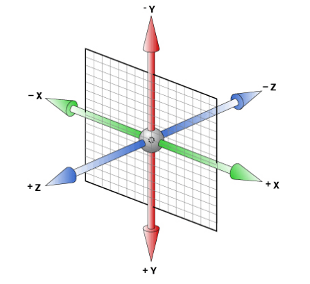

# css层叠样式表
- [验证工具](http://jigsaw.w3.org/css-vallidator/)
- [参考手册](http://css.doyoe.com/)；[手册2](http://css.cuishifeng.cn/index.html)
- [MDN手册](https://developer.mozilla.org/en-US/docs/Web/CSS/Reference)；[W3C手册](https://www.w3.org/TR/CSS22/about.html)
- [兼容性测试](https://caniuse.com/#search=word-wrap)


注释：/\*...\*/

property-value pairs        名值对

三大要点：
1. 简写代码
2. 易于维护
3. 重复使用

三大特性：
1. [继承](https://www.cnblogs.com/thislbq/p/5882105.html)，一般text font line开头的元素和color具有继承性
2. 层叠
3. 优先级，内部样式表和外部样式表之间没有优先级，后出现的样式优先级更高

三大重点：
1. 盒模型
2. 浮动
3. 定位

### 权重

  一般选择最后出现的规则

  样式优先顺序：读者重要声明，作者重要声明，作者声明，读者声明，用户代理

  带有!important声明的读者样式权重最高

  0 0 0 0 内联样式特殊性都是1000 每个id加100；每个类、伪类、属性加10；每个元素、伪元素加1。 *  0，继承 0。256进制

  【：not】否定伪类在优先级计算中不会被看做是伪类，但是，会把:not里面的选择器当普通选择器计数。这句话有点不好理解，其实就是忽略掉:not，其他伪类(如:hover)参与css优先级的计算，但是「:not」不参与计算。

### 选择器

类的第一个字符不能是数字，在HTML中多个类用空格隔开

#### 关系选择器
|选择器|说明||
|-|-|-|
|div,h2 {...}|同时选择|
|div.class {...}|并列选择|不加空格|
|div h2 {...}|后代选择器|
|.div > h2|子元素选择器|直接孩子|
|.div + p|相邻元素|紧跟类div后面的段落|
|.div ~ p|同父兄弟元素|类div后拥有共同父元素的所有兄弟元素p|
|\* {...}|通配符|
#### 伪类选择器
##### 链接伪类
|选择器|说明||
|-|-|-|
|a:link {...}|未点击|
|a:visited {...}|已点击|
|a:focus {...}|可以接受键盘输入或者能以某种方式激活的元素|比如被聚焦的input|
|a:hover {...}|悬停|
|a:active {...}|被输入激活的元素|正在被点击|

注意：
- a:hover必须跟在a:link和a:visited后面
- a:active必须跟在a:hover后面
`img:hover .arr {...}`  鼠标经过类img时，后代类arr的样式

##### 结构（位置）伪类
|选择器|说明||
|-|-|-|
|:lang()|静态伪类|语言选择器。类似\|=|
|p:first-child {...}|父元素的第一个p元素|必须要满足第一个和p元素|
|:last-child {...}|父元素的最后一个元素|
|:nth-child(n) {...}|父元素的第n个子元素|
|:nth-last-child(n) {...}|父元素的倒数第n个子元素|
|E:not(s) {...}|不包含s选择符的元素E|
##### 目标伪类

`:target` 目标伪类选择器：可用于选取当前活动的目标元素。比如：当点击A链接时，地址B的样式。

```
:target {
    color: red;
    font-size: 30px;
}
```

#### 伪元素

伪元素必须放在出现该伪元素的选择器后面

伪元素必须有 `content`

|选择器|说明|
|-|-|
|::first-letter {...}|首字母样式|
|::first-line {...}|首行样式|
|::before {...}|第一个子元素之前|
|p::after {...}|p元素的最后一个子元素之后|
#### 属性选择器
|选择器|说明||
|-|-|-|
|[class]|指定属性的元素||
|[class=value]|指定属性和值的元素||
|[class~=value]|包含指定值的元素||
|[class^=value]|以指定值开头的每个元素||
|[class$=value]|以指定值结尾的每个元素||
|class\*=value]|包含指定词汇的每个元素||
|[class\|=value]|带有指定词汇开头的属性值的元素||
### 插入样式
代入样式的三种方法：
1. 行内样式表：`<p style="color: #ccc"></p>`
2. 内部样式表：`<style rel="stylesheet"></style>

在内部样式表插入样式：`@impot url{...} screen`(指定设备)

必须放在样式表开头，放在其他内容后会被忽略

3. 外部样式表：`<link style="text/css" />
#### ico
```
<link rel="shortcut icon" href="http://example.com/favicon.ico" type="image/vnd.microsoft.icon" />
```

ico文件 image/vnd.microsoft.icon（或者亦可出于兼容性原因使用image/x-icon。然而最好使用IANA注册的MIME类型，因为多数主流浏览器现在支持它）

### 指定设备类型
```
@media screen and(min-device-width: 481px) {
    #guarantee {...}
}
@media screen and(max-device-width: 480px){
    #guarantee {...}
    @media print {
        body {...}
    }
}
```
### font

| 属性        | 值                                                          | 描述                                                       |
| ----------- | ----------------------------------------------------------- | ---------------------------------------------------------- |
| font        | style / variant / weight / stretch / size / height / family | 简写不能变更顺序，必须有**`font-size`**和**`font-family`** |
| font-family | serif sans-serif cursive fantasy monospace                  |                                                            |


无衬线用于计算机屏幕，有衬线用于报纸文字，等宽用于代码示例，手写字体用于标题，装饰性文字

1. 普遍使用14px+
2. 用偶数字号，老式浏览器对奇数有bug
3. 字体有先后顺序，符号用英文的，多个用逗号隔开
4. 英文字体必须在中文字体前面
5. 字体是中文，或者有特殊符号：空格，#，$等，需要加英文引号
6. 尽量使用系统默认字体

可以通过escape()来测试属于什么字体。

#### 常用字体表
|字体名称|英文名称|Unicode编码|
|-|-|-|
|宋体|SimSun|\5B8B\4F53|
|新宋体|NSimSun|\65B0\5B8B\4F53|
|黑体|SimHei|\9ED1\4F53|
|微软雅黑|Microsofa YaHei|\5FAE\8F6F\96C5\9ED1|
|楷体GB2312|KaiTi_GB2312|\6977\4F53_GB2312|
|隶书|LiSu|\96B6\4E66|
|幼圆|YouYuan|\5E7C\5706|
|华文细黑|STXihei|\534E\6587\7EC6\9ED1|
|细明体|MingLiU|\7EC6\660E\4F53|
|新细明体|PMingLiU|\65B0\7EC6\660E\4F53|

为了照顾不同电脑的字体安装问题，我们尽量只用宋体和微软雅黑中文字体

在 CSS 中设置字体名称，直接写中文是可以的。但是在文件编码（GB2312、UTF-8 等）不匹配时会产生乱码的错误。xp 系统不支持 类似微软雅黑的中文。_**尽量使用英文名称或Unicode编码**_
#### 添加字体

```
@font-face {	一般放在上面
    font-family:"字体名"
    src:url("文件位置"),
    url("文件位置");
}
```
#### 添加[字体图标](http://icomoon.io)
```
@font-face {
    font-family: 'icomoon';
    src:  url('fonts/icomoon.eot?7kkyc2');
    src:  url('fonts/icomoon.eot?7kkyc2#iefix') format('embedded-opentype'),
    url('fonts/icomoon.ttf?7kkyc2') format('truetype'),
    url('fonts/icomoon.woff?7kkyc2') format('woff'),
    url('fonts/icomoon.svg?7kkyc2#icomoon') format('svg');
    font-weight: normal;
    font-style: normal;
}
```
### color

| 属性    | 值                              | 描述                                |
| ------- | ------------------------------- | ----------------------------------- |
| color   | transparent，#000，rgb()256进制 | 透明度安全色：20% 51,16进制33的倍数 |
| opacity | 0.0~1.0                         | 不透明度                            |

### text

| 属性        | 值                                            | 描述                                                         |
| ----------- | --------------------------------------------- | ------------------------------------------------------------ |
| line-height |                                               | 指定最小距离，原始数字值指定了一个缩放因子，后代元素会继承这个缩放因子而不是计算值(0.9em)。行距比字号大7.8像素左右 |
| text-align  | center / left / right                         | 对齐仅用作块元素                                             |
| text-shadow | 水平偏移  垂直偏移  模糊距离 外延值  阴影颜色 | 可以设定多组效果，每组参数以逗号分隔；第一个阴影在最上面，以此类推 |

##### 火焰文字效果
```
text-shadow: 0 0 5px #fff, 0 0 20px #fefcc9, 10px -10px 30px #feec85, -20px -20px 40px #ffae34, 20px -40px 50px #ec760c, -20px -60px 60px #cd4606, 0 -80px 70px #973716, 10px -90px 80px #451b0e;
```
| 属性         | 值                              | 描述                       |
| ------------ | ------------------------------- | -------------------------- |
| unicode-bidi | normal / embed  / bidi-override | 重新排序 / 强调direction值 |


### background

**background-position:**   仅规定一个关键字，那么第二个的值是 center_

**(相对于左上角x，y轴)只给一个百分数意味着垂直定位于50%，(容器宽度-照片宽度)*百分比=像素值**

**background-size:**_指定一个尺寸，另一个为width height自动

cover：等比缩放，超出部分剪裁；contain：等比缩放，不会超出

可以设置多个背景图片，用逗号隔开；前面的背景图会覆盖后面的背景图，避免背景色覆盖背景图，背景色定义在最后一组

### border

| 属性          | 值   | 描述                                                        |
| ------------- | ---- | ----------------------------------------------------------- |
| border-radius |      | 参数间以`/`分隔，第一个参数表示水平半径，第二个表示垂直半径 |

### boxes
根据盒子布局的稳定性，建议 width > padding > margin

- **border-radius:**     _**如果提欧共三个值，第一个用于上，第二个用于左-右，第三个用于下**_

_**可点击图像可能有边框，边框设为none**_

- **padding:**   _不可以是负数_
- **margin:** 0 auto;    在ie6中可能有双倍边距的bug
- **box-shadow:**        外部阴影可以影响其他盒子

_**box-shadow 添加一个或多个阴影。该属性是由逗号分隔的阴影列表，每个阴影由 2-4 个长度值、可选的颜色值以及可选的 inset 关键词来规定。省略长度的值是 0。**_

- **box-sizing:** _content-box / border-box_
   - content-box：盒子大小为 width + padding + border；默认值，其让元素维持W3C的标准Box Mode
   - border-box：盒子大小为width；就是说 padding 和 border 是包含到width里面的
## 布局

_**浮动用来布局，定位用来做特效**_

		浮动布局、凝胶布局、绝对布局、表格显示布局
### 文本对齐
- **vertical-align:**     _垂直对齐  inherit  baseline  sub  super  top  middle  bottom  text-bottom_

应用于行内元素（行内，行内块）和表单元格

baseline在css2的文档中有这么一句解释，翻译过来也就是一个inline-block元素，如果里面没有inline元素，或者overflow不是visible，则该元素的基线就是其margin底边缘，否则，其基线就是元素里面最后一行内联元素的基线。

#### 盒子错位

盒子A  里面有 文本B、 浮动元素C

盒子的对齐方式为基线对齐，没有文本的盒子，基线为盒子内容区底部，有文本的盒子基线为最下方文本的基线，_**父盒子A里有文本B但是font-size: 0;（文本B不显示了）并且有浮动元素C，当浮动元素C有正常流父元素D时，基线为浮动元素C的父元素D的内容区底部，当浮动元素C没有父元素D时，基线为父盒子A的内容区顶部。**_当同时有浮动元素C的父元素D和文本时，以下面的基线为准（基线可超出父盒子A的内容区底部）。为需要对齐的盒子设置**vertical-align**，即可解决

### 浮动

让元素在某元素后面浮动，就把元素移动到那个元素下面

`.id { float：right / left / none }`    _多个同级元素在同一行显示需要都设置float_

_**float可以让元素默认转换为 inline-block（元素的大小取决于定义的大小或者内容的多少）**_

_**块元素不会考虑浮动元素的右边界，内联元素会避开 一般用于多个块元素在同行显示（意思是块元素会隐藏进浮动元素，内联元素会包围浮动元素，不会隐藏进去）**_

_**浮动会使元素脱离正常流，隐藏进正常流元素给浮动元素加个父元素设置 height 可以取消隐藏，因为父元素在正常流中有占位。**_

_**特别注意：浮动元素需要和正常流父元素搭配使用**_

解决包裹问题，设置外边距

所有浮动元素必须有一个宽度，不能设为auto（系统自定义）

```
top / bottom / left / right：200px;
```

`clear: left / right / both / none`元素某边不允许有浮动内容（只能指定左右两边)

### 定位

相对定位，绝对定位，固定定位，正常流；子绝父相

**z-index: 1;**       _值越大，显示越高，可通过工具检测值（适用于定位元素）_

### 剪裁

`clip:rect(top,right,bottom,left);`      四个数值都是从上边边缘和左边边缘算起的_

文本回绕

### 布局

流体（适应页面）、冻结（固定）、凝胶（内容固定，外边距随机）

### 溢出和隐藏
```
display: none/block/inline-block/table/table-cell/table-caption;
```

元素隐藏后不保留原有位置

_**解决inline-block元素因换行产生的空白：1.调整HTML换行；2.使用负外边距，但是需要调整 font-size；3.父元素设置font-size：0；4. 运用jQuery （Safari：letter-spacing： -4px。根据不同字体调整）**_

- **overflow:**     _溢出  visible / scroll / hidden / auto_
- **visibility:**    _元素可见性  visible / hidden / collapse   元素隐藏后保留原有位置_

####溢出显示省略号
1. `white-space: nowrap;`  文字一行显示不换行
2. `overfolow: hidden;`  溢出部分隐藏
3. `text-overflow: ellipsis;`  超出的部分以省略号显示

使用 __text-indent__ 时，文本是先变成省略号再缩进，所以可能会把省略号剪裁掉。

### 文本

基线：大写字母“X”的底部

- **vertical-align:**      _baseline / sub / super / top / middeen / bottom / text-bottom_  垂直对齐文本，应用于行内元素和表单元格
- **text-overflow:**    _clip / ellipsis_  文本溢出**overflow需要设置为非visible**
- **cursor:** url()   _default, pointer, move, text;
- **resize:**     _none / both / vertical / horizontal_
```
<a href="#">shopcmd</a> |  
<a href="#">首页</a>
```

“|”后面换行会合成一个空格空格 前面也需要加个空格

### 伸缩盒

| 属性            | 值                                                           | 描述         |
| --------------- | ------------------------------------------------------------ | ------------ |
| flex            |                                                              | 缩写         |
| flex-grow       |                                                              | 扩展比率     |
| flex-shrink     |                                                              | 收缩比率     |
| flex-basis      |                                                              | 基准值       |
| flex-flow       |                                                              | 缩写         |
| flex-direction  | row、column-reverse                                          | 主轴排列方式 |
| flex-wrap       | nowrap                                                       | 主轴是否换行 |
| justify-content | flex-start、flex-end、center、space-between、space-around    | 主轴对齐方式 |
| align-items     | flex-start、flex-end、center、baseline、stretch              | 单行侧轴对齐 |
| align-content   | flex-start、flex-end、center、space-between、space-around、stretch | 多行侧轴对齐 |
| align-self      | flex-start、flex-end、center、baseline、stretch              | 单独侧轴对齐 |
| order           |                                                              | 排列顺序     |

flex-grow 计算方式：剩余空间 * 比率占比 = 扩展宽度

flex-shrink 计算方式：a.basis / (a.basis * a.shrink + b.basis * b.shrink) * 差额空间 = 收缩宽度，比率占比和基准值有关

alingn-content 只作用于多行容器，和 align-items 的却别是：前者是容器整体对齐方式，后者是容器的每一行的对齐方式。

flex 设置*文本溢出显示省略号*，需要先显式设置：min-width: 0; 因为 flex 默认 min-width: auto; ，没有设置：width，默认最小宽度为文本宽度，所以 基准值 basis 为文本宽度，就不会溢出隐藏（<https://www.cnblogs.com/liyan-web/p/11217330.html>）

### 过渡

**`transition`:要过渡的属性  花费时间  运动曲线  何时开始;**

_如果有多组属性变化，需要用逗号隔开_

|属性|描述|
|-|-|
|transition|简写属性，用于在一个属性中设置四个过渡属性。|
|transition-property|规定应用过渡的 CSS 属性的名称，逗号分隔。|
|transition-duration|定义过渡效果花费的时间。默认是 0。|
|transition-timing-function|规定过渡效果的时间曲线。默认是 "ease"。|
|transition-delay|规定过渡效果何时开始。默认是 0。|

要所有的属性都变化过渡，写一个all

时间的单位西续写 s秒 ms毫秒

|值|说明|等同于|
|-|-|-|
|linear|线性过渡|贝塞尔曲线(0.0, 0.0, 1.0, 1.0)|
|ease|平滑过渡|贝塞尔曲线(0.25, 0.1, 0.25, 1.0)|
|ease-in|由慢到快|贝塞尔曲线(0.42, 0, 1.0, 1.0)|
|ease-out|由快到慢|贝塞尔曲线(0, 0, 0.58, 1.0)|
|ease-in-out|由慢到快再到慢|贝塞尔曲线(0.42, 0, 0.58, 1.0)|
|step-start||steps(1, start)|
|step-end||steps(1, end)|
```
steps(<integer>[, [ start | end ] ]?):
```

接受两个参数的步进函数。第一个参数必须为正整数，指定函数的步数。第二个参数取值可以是start或end，指定每一步的值发生变化的时间点。第二个参数是可选的，默认值为end。

```
cubic-bezier(<number>, <number>, <number>, <number>)：
```

特定的贝塞尔曲线类型，4个数值需在[0, 1]区间内

### 2D变形

transform:matrix(a,b,c,d,e,f);搞不懂 https://www.cnblogs.com/Ivy-s/p/6786622.html

#### 2D平移
```
transform: translate(-50%,-50%);
           translatex();
           translatey();
```
#### 2D缩放
```
transform: scale(0.8,1);
           scalex();
           scalex();
```
#### 2D旋转

    原点：`transform-origin` 如果提供两个，第一个用于横坐标，第二个用于纵坐标；如果只提供一个，该值将用于横坐标，纵坐标默认为50%。

```
transform: rotate(45deg);
```

单位是：deg度数；正值为顺时针，负值为逆时针。

#### 倾斜

```
transform: skew(30deg,0deg);
```

第二个参数不写默认为0。

X正值：下边往右拉伸，上边往左拉伸，倾斜30度；

Y正值：右边往下拉伸，左边往上拉伸，倾斜30度；负数方向相反。

### 3D变形


x左边是负的，右边是正数

y上面是负数，下面是正数

z里面是负数，外面是正数

- maerix3d():     以一个4*4矩阵的形式指定一个3D变换

#### 3D旋转
|名值对|说明|
|-|-|
|transform:rotateX(180deg); |前后翻着旋转|
|transform:rotateY(180deg);|左右翻着旋转|
|transform:rotateZ(180deg); |像时钟一样旋转|
|transform:rotateX(45deg) rotateY(180deg) rotateZ(90deg) ；|分开写只显示下面的代码，简写可一起显示|
#### 透视
- transform: oerspective();     指定透视距离

#### 3D移动
```
transform:translate3d(X，Y，Z); 
translatex()： 
translatey()： 
translatez()：
```
- backface-visibility      属性定义当元素不是正面对向屏幕时是否可见。

### 框架

### 解决img下方空白

在HTML5与CSS3中，DIV标签中的图片也就是IMG标签的默认vertical-align属性为baseline，文字分为顶线，中线，基线，底线。图片的下边缘是基线，所以在下方会留出基线和底线这一段距离的空白

1. display：block
2. vertical-align: middle/bottom/top；
3. 负外边距
4. 父元素font-size：0；
5. 父元素line-height: 0；

### input空间和button上下不对齐的原因

button在高度计算上始终使用了Quirks模式。在Quirks模式下，边框的计算是在元素的宽度内的，而不像标准模式一样计算在外部（button的高度包含边框的高度

由于【button元素】在浏览器中属性默认为inline-block，因此代码中空格会被显示为的空白

### inline-block和float的区别

1. float元素会脱离文档流，周围元素会环绕这个元素，需清除浮动；
2. 可以给inline-block的父元素设置text-align: center 让元素水平居中；
3. float元素top对齐，inline-block元素可以通过vetical-align设置垂直对齐方式；
4. inline-block会产生元素换行空白
5. ie浏览器兼容问题

inline-block的优点：可以控制水平对齐和垂直对齐

float的优点：可以让元素环绕，低版本ie支持比较好，不用处理空白

### 盒子水平居中

浏览器垂直方向默认靠上对齐

- margin: 0 auto;      盒子必须有宽度
- position: absolute;   left: 50%;    margin-left: -(box/2)     子绝父相

### 外边距重叠

只有普通文档流中快框的垂直外边距才会发生外边距合并。*行内框、浮动框或绝对定位之间的外边距不会合并*

1. 全部为正值，外边距取最大值
2. 不全是正值，外边距为两个值的和
3. 没有正值，外边距取最小值

#### 解决外边距合并
- 上下级：float   position: absolute;   display: inline-block;  overflow: hidden;      设置BFC
- 父子级：父元素设置border或padding        父元素设置BFC

如果元素的margin和他的父元素的margin-top折叠在一起，盒模型border-top的边界定义和它的父元素相同

margin-top绝不会和他的块级父元素的margin-bottom折叠

### 清除浮动
1. 在浮动元素后：添加空白标签设置属性 ：clear: both;   *这个方法有个非常大且致命的bug，margin失效*
2. 为父元素：添加属性：overflow: hidden;（触发bfc：5、6，父元素不能设置 height）
3. 为父元素：添加伪元素：.clarfix:after{content: ""; display: block; height: 0; clear: both; visibility: hidden;} .clearfix{\*zoom: 1;}       IE6、7专属。触发haslayout
4. 为父元素：用双伪元素清除浮动： 
   - .clearfix:before, .clearfix:after{content: ""; display: table;}  *display: table;可以触发BFC清除浮动*
   - .clearfix:after{clear: both;}
   - .clearfix{\*zoom: 1;}
### BFC

浅析css中的BEC、IFC、GFC和FFC

block formatting context （块级格式化上下文）规定了内部的block-level box如何布局，并且与这个区域外部毫不相干。是一个独立的渲染区域

一般用于自适应两栏式布局，解决高度塌陷，处理外边距合并，清除浮动。

#### 创建条件
1. 浮动元素(`float: left|right`)
2. 定位元素(`position: absolute|fixed`)不包含relative
3. `overflow`特性不为visible的元素（除非该值已经传播到viewport）
4. 行内块元素(`display: inline-block`)
5. 表格的单元格(`display: table-cells,td,th`)
6. 表格的标题(`display: tabel-captions,caption`)
7. 表格元素创建的匿名框

**_注意，"display:table" 本身并不产生"block formatting contexts"。但是，它可以产生匿名框，其中包含"display:table-cell" 的框会产生块格式化上下文。总之，对于"display:table" 的元素，产生块格式化上下文的是匿名框而不是"display:table"。_**

**_注意，是这些元素创建了块格式化上下文，它们本身不是块格式化上下。_**

#### bfc布局规则
1. 内部的box会在垂直方向，一个接一个得放置。
2. box垂直方向的距离由margin决定。属于同一个bfc的两个相邻box的margin会发生重叠
3. 每个元素的margin box的左边，与包含块border box 的左边相接处（对从左向右的格式化，否则相反）。及时存在浮动也是如此。
4. bfc的区域不会与float box重叠
5. bfc就是页面上的一个隔离的独立容器，容器里面的子元素不会影响到外面的元素。反之亦是如此
6. 计算bfc的高度时，浮动元素也参与计算

### BEM命名规范
#### 什么是BEM命名规范

bem是块（block）、元素（element）、修饰符（modifier）的简写，由 Yandex 团队提出的一种前端 CSS 命名方法论。

BEM 是一个简单又非常有用的命名约定。让你的前端代码更容易阅读和理解，更容易协作，更容易控制，更加健壮和明确，而且更加严密。

#### BEM命名模式
```
 .block {}
 .block__element {}
 .block--modifier {} 
```

 .block 代表了更高级别的抽象或组件

 .block__element 代表.block的后代，用于形成一个完整的.block的整体

 .block--modifier代表.block的不同状态或不同版本。

 使用两个连字符和下划线而不是一个，是为了让你自己的块可以用单个连字符来界定
```
 .sub-block__element {}.sub-block--modifier {}
```
### css书写顺序
1. 位置属性(position, top, right, z-index, display, float等)
2. 大小(width, height, padding, margin)
3. 文字系列(font, line-height, letter-spacing, color- text-align等)
4. 背景(background, border等)
5. 其他(animation, transition等)

- -ms-（私有属性）；//IE
- -moz-（私有属性）；//Firefox 
- -webkit-（私有属性）；//Safari 和 Chrome 
- -o-（私有属性）；// Opera

如：-moz-column-count:4;（分成4块显示） // Firefox

先写带有浏览器私有标志的，后写W3C标准的。

参考网址：[web规范](http://nec.netease.com/standard)

### 布局流程
1. 确定版心（可视区或者网页主体），常见宽度960，980，1000，1200
2. 分析页面中的行模块，和行模块中的列模块
3. 制作html结构
4. css初始化，运用盒子模型原理，通过div + css控制网页模块

html需要设置最小尺寸，浏览器放大或缩小时会改变html尺寸

### 浏览器标准模式和兼容模式区别
1. width不同

在严格模式中：width是内容宽度，元素真正的宽度 = margin-left + border-left-width + padding-left + width + padding-right + border-right- width +  margin-right;

在兼容模式中：width则是元素的实际宽度，内容宽度 = width - ( padding-left + padding-right + border-left-width + border-right-width)

2. 兼容模式下可设置百分比的高度和行内元素的高宽

在standards模式下，给span等行内元素设置wdith和height都不会生效，而在兼容模式下，则会生效。

在standards模式下，一个元素的高度是由其包含的内容来决定的，如果父元素没有设置高度，子元素设置一个百分比的高度是无效的。

3. 用margin:0 auto设置水平居中在ie下会失效

使用margin:0 auto在standards模式下可以使元素水平居中，但在兼容模式下却会失效（用text-align属性解决）

body{text-align:center};#content{text-align:left}

4. 兼容模式下table中的字体属性不能继承上层的设置，white-space:pre会失效，设置图片的padding会失效

|代码|说明|
|-|-|
|caption|有标题的控件|
|icon|图标标签|
|menu|菜单|
|message-box|对话框|
|small-caption|小控件|
|status-bar|窗口状态条|