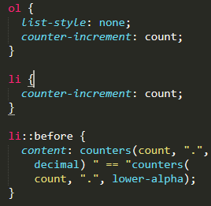
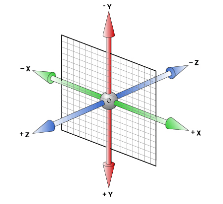
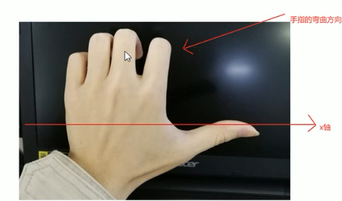

# css语法

- [验证工具](http://jigsaw.w3.org/css-validator/) / [验证]( https://validator.w3.org/unicorn/ )；[验证2](http://www.cssstats.com/)
- [参考手册](http://css.doyoe.com/)；[手册2](http://css.cuishifeng.cn/index.html)
- [MDN手册](https://developer.mozilla.org/en-US/docs/Web/CSS/Reference)；[W3C手册](https://www.w3.org/TR/CSS22/about.html)
- [兼容性测试](https://caniuse.com/#search=word-wrap)
- [代码压缩](http://tool.chinaz.com/Tools/CssFormat.aspx)


注释：/\*...\*/

property-value pairs        名值对

三大要点：
1. 简写代码
2. 易于维护
3. 重复使用

三大特性：
1. [继承](https://www.cnblogs.com/thislbq/p/5882105.html)，一般text font line开头的元素和color具有继承性
2. 层叠
3. 优先级，内部样式表和外部样式表之间没有优先级，后出现的样式优先级更高(html 相反，是先出现的级别更高)，长江后浪推前浪，就近优先

三大重点：
1. 浮动
2. 定位
3. 盒模型

### 权重

  一般选择最后出现的规则

  样式优先顺序：读者重要声明，作者重要声明，作者声明，读者声明，用户代理

  分号前带有!important声明的读者样式权重最高

  0 0 0 0 内联样式特殊性都是1000 每个id加100；每个类、伪类、属性加10；每个元素、伪元素加1。 *  0，继承 0。256进制

  【：not】否定伪类在优先级计算中不会被看做是伪类，但是，会把:not里面的选择器当普通选择器计数。这句话有点不好理解，其实就是忽略掉:not，其他伪类(如:hover)参与css优先级的计算，但是「:not」不参与计算。

### 插入样式

代入样式的三种方法：

1. 行内样式表：`<p style="color: #ccc"></p>`
2. 内部样式表：`<style rel="stylesheet"></style>`

在内部样式表插入样式：`@impot url{...} screen`(指定设备)

必须放在样式表开头，放在其他内容后会被忽略

3. 外部样式表：`<link style="text/css" />`

### @规则

1. @charset            设置样式编码

   - @charset 'UTF-8';

2. @import              导入其他样式文件

   - @import 'reset.css';

3. @media              媒体查询（用于移动端）

   ```
   @media screen and(min-device-width: 481px) {
       #guarantee {...}
   }
   @media screen and(max-device-width: 480px){
       #guarantee {...}
       @media print {
           body {...}
       }
   }
   ```

4. @font-face          添加自定义字体

   ```
   @font-face {	一般放在上面
       font-family:"字体名"
       src:url("文件位置"),
       url("文件位置");
   }
   ```

5. 

### 选择器

类的第一个字符不能是数字，在HTML中多个类用空格隔开

#### 关系选择器
|选择器|说明||
|-|-|-|
|div,h2 {...}|同时选择|
|div.class {...}|并列选择|不加空格|
|div h2 {...}|后代选择器|
|.div > h2|子元素选择器|直接孩子|
|.div + p|相邻元素|紧跟类div后面的段落|
|.div ~ p|同父兄弟元素|类div后拥有共同父元素的所有兄弟元素p|
|\* {...}|通配符|
#### 伪类选择器
##### 链接伪类
|选择器|说明||
|-|-|-|
|a:link {...}|未点击|
|a:visited {...}|已点击|
|a:focus {...}|可以接受键盘输入或者能以某种方式激活的元素|比如被聚焦的input|
|a:hover {...}|悬停|
|a:active {...}|被输入激活的元素|正在被点击|

注意：
- a:hover必须跟在a:link和a:visited后面
- a:active必须跟在a:hover后面
  `img:hover .arr {...}`  鼠标经过类img时，后代类arr的样式
- a 和 a:hover 属于同一属性，设置样式时看权重

##### 结构（位置）伪类
|选择器|说明||
|-|-|-|
|:lang()|静态伪类|语言选择器。类似\|=|
|p:first-child {...}|父元素的第一个子元素p元素|必须要满足第一个和p元素。下同|
|p:first-of-type {...}|父元素的第一个p元素|第一个 p 元素，甭管第几位。下同|
|:last-child {...}|父元素的最后一个子元素||
|:only-child|唯一一个子元素|父元素只有一个子元素|
|:nth-child(n) {...}|父元素的第n个子元素||
|:nth-last-child(n) {...}|父元素的倒数第n个子元素|父元素的孙子span是倒数第一个子元素，孙子q是倒数第二个子元素|
|E:not(s) {...}|不包含s选择符的元素E||
n 可以是关键词：even、odd；也可以是公式：2n + 1、n + 4。

s 可以是元素 或者属性值

##### 目标伪类

`:target` 目标伪类选择器：可用于选取当前活动的目标元素。比如：当点击A链接时，地址B的样式。

```
:target {
    color: red;
    font-size: 30px;
}
```

#### 伪元素

伪元素必须放在出现该伪元素的选择器后面

伪元素必须有 `content`，否则伪元素就不起作用

属于行内元素

|选择器|说明|
|-|-|
|::first-letter {...}|首字母样式|
|::first-line {...}|首行样式|
|::before {...}|第一个子元素之前|
|p::after {...}|p元素的最后一个子元素之后|
#### 属性选择器
|选择器|说明||
|-|-|-|
|[class]|指定属性的元素||
|[class=value]|指定属性和值的元素||
|[class~=value]|包含指定值的元素||
|[class^=value]|以指定字符串开头的每个元素||
|[class$=value]|以指定字符串结尾的每个元素||
|class\*=value]|包含指定字符串的每个元素||
|[class\|=value]| 以指定字符串开头并用连接符"-"分隔的元素，或者属性值仅为val ||
### ico

[转换 ico 图标]( http://www.bitbug.net/)

```
<link rel="shortcut icon" href="http://example.com/favicon.ico" type="image/vnd.microsoft.icon" />
```

ico文件 image/vnd.microsoft.icon（或者亦可出于兼容性原因使用image/x-icon。然而最好使用IANA注册的MIME类型，因为多数主流浏览器现在支持它）

某些浏览器特别是ie，不支持本地协议的图标（即网页通过”file:///“协议打开），必须通过服务器环境打开	

### 布局属性
### display

`display`:  none / inline / block / inline-block / flex

### position

**_标准流在下面，浮动在中间，定位元素在上面_**

相对定位，绝对定位，固定定位，粘性定位，正常流；

_**定位的盒子一般需要单写宽度**_

子绝父相

`sticky` : 在父元素内相当于相对定位，阈值超过父元素边界，相当于固定定位

HTML中定位元素位置靠后，会覆盖位置靠前的元素

absolute element 和 fixed element 未设置height，同时设置 top bottom时，element 会水平充满可用空间；同样可以充满垂直空间

- 当页面放大以增加文本大小时，用`absolute`或`fixed`值定位的元素可能遮挡其他内容 ，[解决]( https://developer.mozilla.org/en-US/docs/Web/CSS/position )
- 包含`fixed`或`sticky`内容的滚动元素可能会导致性能和可访问性问题  方案是[`will-change: transform`](https://developer.mozilla.org/en-US/docs/Web/CSS/will-change)在定位的元素上添加元素以在其自己的图层中渲染 

**z-index: 1;**       _值越大，显示越高，可通过工具检测值（适用于定位元素）_

### float

目的：多个块级元素一行内显示

显示：类似行内块，大小取决于定义的大小或者内容的多少

不影响前面的元素

`.id { float：right / left / none }`  

_**块元素会隐藏进浮动元素，内联元素会包围浮动元素，不会隐藏进去**_

_**特别注意：浮动元素需要和正常流父元素搭配使用，子盒子浮动参照父盒子对齐**_

解决包裹问题（内联元素会包裹浮动元素），设置外边距

所有浮动元素必须有一个宽度，不能设为auto（系统自定义）

```
top / bottom / left / right：200px;
```

`clear:`  left / right / both / none元素某边不允许有浮动内容（只能指定左右两边)

### overflow 和 visibility

```
display: none/block/inline-block/table/table-cell/table-caption;
```

元素隐藏后不保留原有位置

_**解决inline-block元素因换行产生的空白：1.调整HTML换行；2.使用负外边距，但是需要调整 font-size；3.父元素设置font-size：0；4. 运用jQuery （Safari：letter-spacing： -4px。根据不同字体调整）**_

- **overflow:**     _溢出  visible / scroll / hidden / auto_
- **visibility:**    _元素可见性  visible / hidden / collapse   元素隐藏后保留原有位置_

## 盒子属性

根据盒子布局的稳定性，建议 width > padding > margin

### width 和 height

width: 100%;      和父元素一样宽

- 仅适用于块元素
- 加了浮动和定位的盒子需要添加 `width: 100%`，或者给宽度

`width: calc(100% - 190px);`

用于动态计算长度值，' + - * / ' 运算符前后需要加空格，100%为父级宽度；

### padding 和 margin

盒子居中对齐：`margin: 0 auto;`在ie6中可能有双倍边距的bug，或者`-margin`

- **padding:**   _不可以是负数_，内联元素：dir：ltr，边框会在水平方向占有位置，垂直方向不会撑开盒子，覆盖前后文本
- **margin:**   必须是块级元素，内联元素：dir：ltr，边框会在水平方向占有位置，垂直方向没有效果
- **margin:** 0 auto;    在ie6中可能有双倍边距的bug

### border

_**可点击图像可能有边框，边框设为none**_

| 属性                 | 值   | 描述                                           |
| -------------------- | ---- | ---------------------------------------------- |
| `border-image-slice` |      | 值用来表示切片的厚度，由1--4个值觉定，上右下左 |


为内联元素设置边框

- dir：ltr，边框会在水平方向占有位置，垂直方向会覆盖前后文本，上面完全覆盖，下面透明状态
- 没有文本的话，width=边距+边框，height=边距+边框+字体高度。

虽然外边距，边框和内边距的填充不会进入线框（行内或行内元素）计算，但它们仍然围绕内联框呈现。**如果“line-height”小于内容高度，本行内容会压到上面一行**。

因为用户代理应按文档顺序呈现框。这将导致后续行上的边框在前一行的边框和文本上绘制。

### background

**`background-position:`**   仅规定一个值，那么第二个的值是 center ；规定两个值，分别为 X 轴和 Y 轴；三个值或四个值 ，数值为前一个值的偏移量；（设置为百分比时，基数为：盒子宽度 - 背景宽度）

百分比： **(container width - image width) * (position x%) = (x offset value)** ；同理 Y。

**`background-size:`**_指定一个尺寸，另一个为width height自动

- cover：等比缩放，超出部分剪裁；
- contain：等比缩放，不会超出

**`background-image:`**    多个背景图片，用逗号隔开；前面的背景图会覆盖后面的背景图，避免背景色覆盖背景图，背景色定义在最后一组

url 后面需要加单引号，

从安全角度来讲是要加上的...
否则容易被xss
因为`""`意味着是字符串...但是不加引号的话..传过来的万一是`);url("http://www.xss.xss")`就把cookie什么的可能泄露出去了

多组背景也用逗号隔开，前面的会覆盖后面的。

适用于内联元素

### box-sizing

- `box-sizing:`    _content-box / border-box_
  - content-box：盒子大小为 width + padding + border；默认值，其让元素维持W3C的标准Box Mode
  - border-box：盒子大小为width；就是说 padding 和 border 是包含到width里面的

## 文本属性

### color

| 属性      | 值                              | 描述                                                         |
| --------- | ------------------------------- | ------------------------------------------------------------ |
| `color`   | transparent，#000，rgb()256进制 | 透明度安全色：20% 51,16进制33的倍数。使用RGB代码的百分比颜色值，取值为0时也不能省略百分号，**必须写为0%**。 |
| `opacity` | 0.0~1.0                         | 不透明度                                                     |

rgba()，支持 ie9+

background-color：#000\9;      /* 仅支持 ie9 以下 */

filter: alpha(opcity=30);             /* 透明度 0~100 （等同于 0.0~1.0）  */

### font

谷歌默认最小字体：12px

```
 .small-font{
            font-size: 12px;
            -webkit-transform-origin-x: 0;
            -webkit-transform: scale(0.90);
        }
```


```
表单元素并不继承父级 font 
```

| 属性          | 值                                                          | 描述                                                       |
| ------------- | ----------------------------------------------------------- | ---------------------------------------------------------- |
| `font`        | style / variant / weight / stretch / size / height / family | 简写不能变更顺序，必须有**`font-size`**和**`font-family`** |
| `font-family` | serif sans-serif cursive fantasy monospace                  |                                                            |


无衬线用于计算机屏幕，有衬线用于报纸文字，等宽用于代码示例，手写字体用于标题，装饰性文字

1. 普遍使用14px+
2. 用偶数字号，老式浏览器对奇数有bug
3. 字体有先后顺序，符号用英文的，多个用逗号隔开
4. 英文字体必须在中文字体前面
5. 字体是中文，或者有特殊符号：空格，#，$等，需要加英文引号
6. 尽量使用系统默认字体，中文推荐使用宋体和微软雅黑

可以通过escape()来测试属于什么字体。

#### 常用字体表
|字体名称|英文名称|Unicode编码|
|-|-|-|
|宋体|SimSun|\5B8B\4F53|
|新宋体|NSimSun|\65B0\5B8B\4F53|
|黑体|SimHei|\9ED1\4F53|
|微软雅黑|Microsofa YaHei|\5FAE\8F6F\96C5\9ED1|
|楷体GB2312|KaiTi_GB2312|\6977\4F53_GB2312|
|隶书|LiSu|\96B6\4E66|
|幼圆|YouYuan|\5E7C\5706|
|华文细黑|STXihei|\534E\6587\7EC6\9ED1|
|细明体|MingLiU|\7EC6\660E\4F53|
|新细明体|PMingLiU|\65B0\7EC6\660E\4F53|

为了照顾不同电脑的字体安装问题，我们尽量只用宋体和微软雅黑中文字体

在 CSS 中设置字体名称，直接写中文是可以的。但是在文件编码（GB2312、UTF-8 等）不匹配时会产生乱码的错误。xp 系统不支持 类似微软雅黑的中文。_**尽量使用英文名称或 Unicode 编码**_
#### 字体格式

不同浏览器所支持的字体格式是不一样的，我们有必要了解一下有关字体格式的知识。

- TureType(.ttf)格式
  - .ttf字体是Windows和Mac的最常见的字体，是一种RAW格式，支持这种字体的浏览器有IE9+、Firefox3.5+、Chrome4+、Safari3+、Opera10+、iOS Mobile、Safari4.2+；

- OpenType(.otf)格式
  - .otf字体被认为是一种原始的字体格式，其内置在TureType的基础上，支持这种字体的浏览器有Firefox3.5+、Chrome4.0+、Safari3.1+、Opera10.0+、iOS Mobile、Safari4.2+；

- Web Open Font Format(.woff)格式
  - woff字体是Web字体中最佳格式，他是一个开放的TrueType/OpenType的压缩版本，同时也支持元数据包的分离，支持这种字体的浏览器有IE9+、Firefox3.5+、Chrome6+、Safari3.6+、Opera11.1+；

- Embedded Open Type(.eot)格式
  - .eot字体是IE专用字体，可以从TrueType创建此格式字体，支持这种字体的浏览器有IE4+；

- SVG(.svg)格式
  - .svg字体是基于SVG字体渲染的一种格式，支持这种字体的浏览器有Chrome4+、Safari3.1+、Opera10.0+、iOS Mobile Safari3.2+；

#### 字体图标

1. 设计
2. [上传](<https://icomoon.io/app/#/select>)，设计的 svg 或下载的 selection.json 
3. 下载(generate font)
4. 使用，使用的时候用单引号

```
@font-face {
    font-family: 'icomoon';
    src:  url('fonts/icomoon.eot?7kkyc2');
    src:  url('fonts/icomoon.eot?7kkyc2#iefix') format('embedded-opentype'),
    url('fonts/icomoon.ttf?7kkyc2') format('truetype'),
    url('fonts/icomoon.woff?7kkyc2') format('woff'),
    url('fonts/icomoon.svg?7kkyc2#icomoon') format('svg');
    font-weight: normal;
    font-style: normal;
}
/* format  作用是提前告知浏览器这个文件的格式，不识别的格式浏览器就不会加载，可以提高性能的优化 */
.icomoon {
    font-family: "icomoon",sans-serif;
    font-size: 16px;
    font-style: normal;
    
    /* 抗锯齿优化 */
    -webkit-font-smoothing: antialiased;
    -moz-osx-font-smoothing: grayscale;
}
```
- [icomoon字库]( http://icomoon.io)
- [阿里icon font字库](http://www.iconfont.cn/)
- [fontello](http://fontello.com/)
- [Font-Awesome](http://fortawesome.github.io/Font-Awesome/)
- [Glyphicon Halflings](http://glyphicons.com/)
- [Icons8](https://icons8.com/)

### text

基线：大写字母“X”的底部

| 属性            | 值                              | 描述                                                         |
| --------------- | ------------------------------- | ------------------------------------------------------------ |
| `line-height`   |                                 | 指定最小距离。指定一个 __%__ 或 __em__，后代元素会继承计算值；指定一个数字，后代会继承这个数字。 |
| `text-align`    | center / left / right           | 对齐仅用作块元素                                             |
| `text-overflow` | _clip / ellipsis_               | 文本溢出overflow需要设置为**_非visible_**                    |
| `unicode-bidi`  | normal / embed  / bidi-override | 重新排序 / 强调direction值                                   |

line-height一般设置比font-size大7 8个字号就好

line-height == height 垂直居中，**line-height越大，文本越往下偏移**，先确定上间距。line-height > height时，**下对齐**，可以向上溢出

CSS有条规则，要求关闭text-decoration，而使用边框建立链接下划线

### vertical-align

`vertical-align`:     _baseline / sub / super / top / middeen / bottom / text-bottom_ / number  垂直对齐文本，应用于**_行内元素和表单元格_**

- 可以用数字进行微调，一般用于调整背景图片
- 盒子默认**上对齐**，行内元素默认**基线对齐**，img 为基线对齐
- 应用于行内元素（行内，行内块）和表单元格

baseline在css2的文档中有这么一句解释，翻译过来也就是一个inline-block元素，如果里面没有inline元素，或者overflow不是visible，则该元素的基线就是其margin底边缘，否则，其基线就是元素里面最后一行内联元素的基线。

```
盒子A  里面有 文本B、 浮动元素C

盒子的对齐方式为基线对齐，没有文本的盒子，基线为盒子内容区底部，有文本的盒子基线为最下方文本的基线，父盒子A里有文本B但是font-size: 0;（文本B不显示了）并且有浮动元素C，当浮动元素C有正常流父元素D时，基线为浮动元素C的父元素D的内容区底部，当浮动元素C没有父元素D时，基线为父盒子A的内容区顶部。当同时有浮动元素C的父元素D和文本时，以下面的基线为准（基线可超出父盒子A的内容区底部）。为需要对齐的盒子设置vertical-align，即可解决

```

## 其他属性

### counter

 `counter-increment`: <custom-ident> <integer>;     名称或名称-添加的值对之间用空格分隔，默认值是 1

`counter-reset`: ; 默认值是 0

`counters( <custom-ident>, <string>, <counter-style>? )`;

用计数器多个值，赋值嵌套父子元素：

```
<ol>
    <li>
      <ol>
        <li></li>
        <li></li>
        <li></li>
      </ol>
    </li>
    <li></li>
  </ol>
```

- 常用，父元素设置 counter-reset，子元素设置 counter-increment
  1. 父元素为一层，子元素为两层，以此类推
  2. 每一级都参与计数，不管他是否显示
  3. counter 变换值的基数为上一个元素（不分父子级）
  4. counters 中，reset 才能调用 string
  5. 前一个元素为 reset ，后一个元素为 increment 时，把前一个元素移下来，并且把最后一个值加上 increment 的增加值
  6. 前一个为 increment ，后一个为 reset 时，把前一个元素移下来，后面加上 string，再跟上 reset 的重置值

| css                                             | 显示                                            |
| ----------------------------------------------- | ----------------------------------------------- |
|  |  |

- 父子元素都设置 counter-increment 时，
  1. 不区分父子级，合并为单计数序列
  2. 每一级都参与计数，不管他是否显示

| css                             | 显示                             |
| ------------------------------- | -------------------------------- |
|  |  |

- 父子元素都设置 counter-reset
  1. counters 中，reset 才能调用 string，
  2. 每多一层，多一个值，不管是否显示，中间用 string 隔开

| css                                             | 显示                                            |
| ----------------------------------------------- | ----------------------------------------------- |
|  |  |

- 父元素设置 counter-increment，子元素设置 counter-reset

| css                                                          | 显示                                                         |
| ------------------------------------------------------------ | ------------------------------------------------------------ |
|  |  |

### border-radius

| 属性            | 值   | 描述                                                        |
| --------------- | ---- | ----------------------------------------------------------- |
| `border-radius` |      | 参数间以`/`分隔，第一个参数表示水平半径，第二个表示垂直半径 |

**矩形正半圆，值为直径的一半（圆的半径）**

### box-shadow

- `box-shadow:`        外部阴影可以影响其他盒子

box-shadow 添加一个或多个阴影。该属性是由 _**逗号**_ 分隔的阴影列表，每个阴影由 2-4 个长度值、可选的颜色值以及可选的 inset 关键词来规定。省略长度的值是 0。

（小米的影子）

### text-shadow

| 属性          | 值                                                        | 说明                                                         |
| ------------- | --------------------------------------------------------- | ------------------------------------------------------------ |
| `text-shadow` | 水平偏移  垂直偏移  模糊距离 外延值（影子大小）  阴影颜色 | 可以设定多组效果，每组参数以逗号分隔；第一个阴影在最上面，以此类推 |

##### 火焰文字效果

```
text-shadow: 0 0 5px #fff, 0 0 20px #fefcc9, 10px -10px 30px #feec85, -20px -20px 40px #ffae34, 20px -40px 50px #ec760c, -20px -60px 60px #cd4606, 0 -80px 70px #973716, 10px -90px 80px #451b0e;
```

### cursor

**cursor:** url()   _default, pointer, move, text，not-allowed;

### resize

`resize`:     _none / both / vertical / horizontal_

### transition

**`transition`:要过渡的属性  花费时间  运动曲线  何时开始;**

过渡需要写在元素本身，因为例如：过渡到 hover 时，如果 transition 写在 hover 上，移开鼠标时属性会瞬间恢复，如果写在元素本身，则移开时会同样过渡恢复

_如果有多组属性变化，需要用逗号隔开_

| 属性                       | 描述                                         |
| -------------------------- | -------------------------------------------- |
| transition                 | 简写属性，用于在一个属性中设置四个过渡属性。 |
| transition-property        | 规定应用过渡的 CSS 属性的名称，逗号分隔。    |
| transition-duration        | 定义过渡效果花费的时间。默认是 0。           |
| transition-timing-function | 规定过渡效果的时间曲线。默认是 "ease"。      |
| transition-delay           | 规定过渡效果何时开始。默认是 0。             |

过渡的属性一般为距离（如：线粗细，间距）、颜色、文本阴影、可见性、垂直对齐。

要所有的属性都变化过渡，写一个all

时间的单位必须写 s秒 ms毫秒

##### timing-function 

| 值          | 说明           | 等同于                             |
| ----------- | -------------- | ---------------------------------- |
| linear      | 线性过渡       | cubic-bezier(0.0, 0.0, 1.0, 1.0)   |
| ease        | 平滑过渡       | cubic-bezier(0.25, 0.1, 0.25, 1.0) |
| ease-in     | 由慢到快       | cubic-bezier(0.42, 0, 1.0, 1.0)    |
| ease-out    | 由快到慢       | cubic-bezier(0, 0, 0.58, 1.0)      |
| ease-in-out | 由慢到快再到慢 | cubic-bezier(0.42, 0, 0.58, 1.0)   |
| step-start  | 步进函数       | steps(1, start)                    |
| step-end    | 一步一步显示   | steps(1, end)                      |

```
steps(<integer>[, [ start | end ] ]?):
jumP-start, jump-end, jump-none, jump-both
```

接受两个参数的步进函数。第一个参数必须为正整数，指定函数的步数。第二个参数取值可以是start或end，指定每一步的值发生变化的时间点。第二个参数是可选的，默认值为end。

ie 苹果 欧鹏等浏览器不支持 jump- 关键字的 steps

步进函数可以用作打字机效果

__timing-function 作用于每两个关键帧之间，而不是整个动画 __

__step-start在变化过程中，都是以下一帧的显示效果来填充间隔动画，所以跳过0% __

__step-end与上面相反，都是以上一帧的显示效果来填充间隔动画，所以跳过100% __ 

[过渡曲线]( https://www.cnblogs.com/lcspring/p/10806951.html )

[贝塞尔曲线在线取值]( https://cubic-bezier.com/#.17,.67,.83,.67 )

```
cubic-bezier(<number>, <number>, <number>, <number>)：
```

特定的贝塞尔曲线类型，两个坐标的4个数值需在[0, 1]区间内

### transform

缩写：transform：translate(x, y) rotate(deg) scale(x, y)；

缩写时，旋转和移动的位置不一样时，结果也不一样。先旋转在移动会改变坐标轴方向（比如一个图片的z轴正方向是正前方，旋转之后图片的正前方还是z轴正方向 ）

只能转换由盒模型定位的元素，不能定位行内元素

`transform-origin: x y;`                                        原点（默认元素的中心点（50% 50%））

如果提供两个，第一个用于横坐标，第二个用于纵坐标；如果只提供一个，该值将用于横坐标，纵坐标默认为50%。

#### 2D transform

`transform:matrix(a,b,c,d,e,f);`搞不懂 https://www.cnblogs.com/Ivy-s/p/6786622.html

##### 2D translate

```
transform: translate(-50%,-50%);
           translatex();
           translatey();
```

最大的优点是不会影响其他元素布局

单位为百分比时，是相对于元素本身

对行内元素没有效果

###### 水平垂直居中

```
position: absolute;
top: 50%;
left: 50%;
transform: translate(-50%, -50%);
```


##### 2D rotate

```
transform: rotate(45deg);
```

单位是：deg度数；正值为顺时针，负值为逆时针。

##### 2D scale

```
transform: scale(0.8,1);
           scalex();
           scaley();
```

如果两个参数一样，可以只写一个参数

缩放时，边框阴影等都会一起缩放

###### 水平垂直居中放大（width，height，scale）

- 水平垂直居中时用 translate，放大用 wdith，height 时，会向四周扩散
- 水平垂直居中时用 translate，放大用 scale 时，会根据 translate 作用之前的位置向四周扩散
- 水平垂直居中时用 -margin，放大用 scale 时，会向四周扩散
- 水平垂直居中时用 -margin，放大用 wdith，height 时，会向右下方扩散

##### 倾斜

```
transform: skew(30deg,0deg);
```

第二个参数不写默认为0。

X正值：上边往左拉伸，下边往右拉伸，倾斜30度；

Y正值：左边往上拉伸，右边往下拉伸，倾斜30度；负数方向相反。

#### 3D变形



x左边是负的，右边是正数

y上面是负数，下面是正数

z里面是负数，外面是正数

- `maerix3d(): ;`    以一个4*4矩阵的形式指定一个3D变换

缩写：transform：perspective()  translate3d(x, y)  rotate3d(deg)  scale3d(x, y)；   透视距离要放在前面 否则没有效果

##### 转换类型

默认子元素不开启 3D 模式，父盒子转换时，一定要开启子盒子的 3D 模式

`transform-style: ;`    /*  **_flat   preserve-3d_ ***/      

##### 透视

使网页产生 3D 效果


缩放比例与d /（d - Z）成比例  d 为透视值，z为轴距离

**表示用户和z=0平面之间的距离，使具有三维位置变换的元素产生透视效果。** 

- `perspective：;  `   指定透视距离
- `perspective-origin: ;    `          透视点位置

这两个值作用于被透视元素的父元素，透视值越大，视角越远，元素显得越小（进大远小）。子元素透视时父元素一定要有宽度，不然会有背面阴影效果

- transform：perspective（）；另一种透视方法作用于元素本身

一般把 perspective  写在父盒子上，用 Z 轴调整大小

透视矩阵计算如下:

1. 从单位矩阵开始。
2. 通过计算透视原点的X和Y值来平移
3. 乘以从perspective()转换函数得到的矩阵，其中长度由perspective属性的值提供
4. 通过计算出的负的透视原点的X和Y值来转换

##### 3D旋转

| 名值对                                                       | 说明                                                         |
| ------------------------------------------------------------ | ------------------------------------------------------------ |
| `transform:rotateX(180deg);`                                 | 前后翻着旋转                                                 |
| `transform:rotateY(180deg);`                                 | 左右翻着旋转                                                 |
| `transform:rotateZ(180deg);`                                 | 像时钟一样旋转                                               |
| `transform:rotateX(45deg) rotateY(180deg) rotateZ(90deg) ；` | 分开写只显示下面的代码，简写可一起显示，旋转各轴的顺序不同，结果就不一样 |
| `transform:rotate3d(x, y, z, a)`                             | x,y,z 定义选中轴，a 定义旋转角度，                           |

从矢量的末端向原点看，旋转是顺时针的。



左手法则：大拇指与其他四个手指成90度，四指弯曲，大拇指与坐标轴平行，指向正轴方向(X右，Y下，Z前)，其他四指弯曲的方向就是正度数旋转的方向

##### 3D移动

```
transform:translate3d(X，Y，Z); 
translatex()： 
translatey()： 
translatez()：
```

##### 背面可见性

- `backface-visibility`      属性定义当元素不是正面对向屏幕时是否可见。

### animation

多个动画用逗号隔开

| 属性                      | 描述         | 值                         |
| ------------------------- | ------------ | -------------------------- |
| @keyframes                | 规定动画     |                            |
| animation-name            | 动画名称     |                            |
| animation-duration        | 持续时间     |                            |
| animation-timing-function | 时间函数     |                            |
| animation-delay           | 推迟时间     |                            |
| animation-iteration-count | 播放次数     | number，infinite           |
| animation-direction       | 是否反向运动 | normal，reverse，alternate |
| animation-fill-mode       | 结束状态     | forwrads，backwards        |
| animation-play-state      | 动画状态     | running，paused            |

```css
@keyframes {
    0% {
        width: 40px;
        opacity: 1;
    }
    100%{
        width: 70px;
        opacity: 0;
    }
}
```

伪元素动画支持的不好

练习：百度浏览器首页动画

### 剪裁

`clip:rect(top,right,bottom,left);`      -_四个数值都是从上边边缘和左边边缘算起的_

`clip-pash: polygon ();` __*inset circle ellipse polygon path*__

文本回绕

### 渐变色

linear-gradient(direction, color-stop1, color-stop2, ...)

例：

```
/* 兼容ie10+ */
background-image: linear-gradient(to right,#ff9000 0,#ff5000 100%);
/* background: linear-gradient(45deg,transparent 52px,#ff5000 0) top left */
/* X 轴方向为0度，正度数为逆时针 */

/* ie6+ 专属 */
filter: progid:DXImageTransform.Microsoft.gradient(startColorstr='#ffff9000', endColorstr='#ffff5000', GradientType=1);
```


## 布局

### 伸缩盒

兼容性：ie10+

| 属性              | 值                                                           | 描述         |
| ----------------- | ------------------------------------------------------------ | ------------ |
| `flex`            |                                                              | 缩写         |
| `flex-grow`       |                                                              | 扩展比率     |
| `flex-shrink`     |                                                              | 收缩比率     |
| `flex-basis`      |                                                              | 基准值       |
| `flex-flow`       |                                                              | 缩写         |
| `flex-direction`  | row、column-reverse                                          | 主轴排列方式 |
| `flex-wrap`       | nowrap                                                       | 主轴是否换行 |
| `justify-content` | flex-start、flex-end、center、space-between、space-around    | 主轴对齐方式 |
| `align-items`     | flex-start、flex-end、center、baseline、stretch              | 单行侧轴对齐 |
| `align-content`   | flex-start、flex-end、center、space-between、space-around、stretch | 多行侧轴对齐 |
| `align-self`      | flex-start、flex-end、center、baseline、stretch              | 单独侧轴对齐 |
| `order`           |                                                              | 排列顺序     |

flex-grow 计算方式：剩余空间 * 比率占比 = 扩展宽度

flex-shrink 计算方式：a.basis / (a.basis * a.shrink + b.basis * b.shrink) * 差额空间 = 收缩宽度，比率占比和基准值有关

flex-basis 和width有关，如：box-sizing: content-box; basis 是内容宽度（width），和边框无关。但是差额空间和剩余空间要减去padding 和 border 等。

align-content 只作用于多行容器，和 align-items 的区别是：前者是容器整体对齐方式，后者是容器的每一行的对齐方式。

flex 设置*文本溢出显示省略号*，对于一个设置了flex属性设置为1的div容器，需要先显式设置：min-width: 0; 保证内容不超过外层容器

flex 默认 min-width: auto; ，没有设置：width，默认最小宽度为文本宽度，所以 基准值 basis 为文本宽度，就不会溢出隐藏（文本为伸缩的盒子的子元素）（<https://www.cnblogs.com/liyan-web/p/11217330.html>）

# 疑难解答

### inline-block和float的区别

1. float元素会脱离文档流，周围元素会环绕这个元素，需清除浮动；
2. 可以给inline-block的父元素设置text-align: center 让元素水平居中；
3. float元素top对齐，inline-block元素可以通过vetical-align设置垂直对齐方式；
4. inline-block会产生元素换行空白
5. ie浏览器兼容问题

inline-block的优点：可以控制水平对齐和垂直对齐

float的优点：可以让元素环绕，低版本ie支持比较好，不用处理空白

### 盒子水平居中

浏览器垂直方向默认靠上对齐

- margin: 0 auto;      盒子必须有宽度
- position: absolute;   left: 50%;    margin-left: -(box/2)     子绝父相（如果父盒子没有高度，relative 无法垂直居中）

### 外边距重叠

只有普通文档流中快框的垂直外边距才会发生外边距合并。*行内框、浮动框或绝对定位之间的外边距不会合并*

1. 全部为正值，外边距取最大值
2. 不全是正值，外边距为两个值的和
3. 没有正值，外边距取最小值

#### 解决外边距合并
- 上下级：float   position: absolute;   display: inline-block;  overflow: hidden;      设置BFC
- 父子级：父元素设置border或padding        父元素设置BFC

如果元素的margin和他的父元素的margin-top折叠在一起，盒模型border-top的边界定义和它的父元素相同

margin-top绝不会和他的块级父元素的margin-bottom折叠

### 清除浮动

本质：解决父元素因为子元素浮动引起高度为 0 的问题

1. 在浮动元素后：添加空白标签设置属性 ：clear: both;   *这个方法有个非常大且致命的bug，margin失效*

2. 为父元素：添加属性：overflow: hidden;（触发bfc：5、6，父元素不能设置 height）

3. 为父元素：添加伪元素：

4. ```
   .clearfix:after {
   	content: ""; 
   	display: block; 
   	height: 0; 
   	clear: both; 
   	visibility: hidden;
   } 
   .clearfix {
   	\*zoom: 1;
   }       /*IE6、7专属。触发haslayout*/
   ```

5. 为父元素：用双伪元素清除浮动： 
   ```
   .clearfix:before,
   .clearfix:after {
   	content: ""; 
   	display: table;
   }  /*display: table;可以触发BFC清除浮动*/
   .clearfix:after {
   	clear: both;
   }
   .clearfix {
   	\*zoom: 1;
   }
   ```
## BFC

浅析css中的BEC、IFC、GFC和FFC

block formatting context （块级格式化上下文）规定了内部的block-level box如何布局，并且与这个区域外部毫不相干。是一个独立的渲染区域

容器里面的子元素不会影响到外面的元素。反之也如此

用途：

- 自适应两栏式布局
  - 普通流体元素BFC后，为了和浮动元素不产生任何交集，顺着浮动边缘形成自己的封闭上下文
- 解决高度塌陷
- 处理外边距合并
- 清除浮动。

#### 创建条件
1. 浮动元素(`float: left|right`)
2. 定位元素(`position: absolute|fixed`)不包含relative
3. `overflow`特性不为visible的元素（除非该值已经传播到viewport）
4. 行内块元素(`display: inline-block,flex`)
5. 表格的单元格(`display: table-cells,td,th`)
6. 表格的标题(`display: tabel-captions,caption`)
7. 表格元素创建的匿名框

注意：_"display:table" 本身并不产生"block formatting contexts"。但是，它可以产生**匿名框**，其中包含"display:table-cell" 的框会产生**块格式化上下文**。总之，对于"display:table" 的元素，产生**块格式化上下文的是匿名框**而不是"display:table"。_

#### bfc布局规则
1. 内部的 box 会在垂直方向，一个接一个得放置。
2. box 垂直方向的距离由 margin 决定。属于同一个 bfc 的两个相邻 box 的 margin 会发生重叠
3. 每个元素的 margin-box 的左边，与包含块 border-box 的左边相接处（对从左向右的格式化，否则相反）。即使存在浮动也是如此。
4. bfc的区域不会与float-box重叠，紧贴浮动边缘。（不会外边距塌陷）
5. bfc就是页面上的一个隔离的独立容器，容器里面的子元素不会影响到外面的元素。反之亦是如此
6. 计算bfc的高度时，浮动或者定位元素也参与计算

## BEM命名规范
#### 什么是BEM命名规范

bem是块（block）、元素（element）、修饰符（modifier）的简写，由 Yandex 团队提出的一种前端 CSS 命名方法论。

BEM 是一个简单又非常有用的命名约定。让你的前端代码更容易阅读和理解，更容易协作，更容易控制，更加健壮和明确，而且更加严密。

#### BEM命名模式
```
 .block {}
 .block__element {}
 .block--modifier {} 
```

 .block 代表了更高级别的抽象或组件

 .block__element 代表.block的后代，用于形成一个完整的.block的整体

 .block--modifier代表.block的不同状态或不同版本。

 使用两个连字符和下划线而不是一个，是为了让你自己的块可以用单个连字符来界定
```
 .sub-block__element {}.sub-block--modifier {}
```
## css 命名规范

- __网站头部__:                head/header(头部) top（顶部）
- __导航__：                     nanv 导航具体区分：topnav(顶部导航)、mainnav(主导航)、mininav(迷你导航)、textnav(导航文本)、subnav(子导航/二级导航)
- __旗帜、广告和商标__：logo（旗帜）、brand(商标)、banner(标语)
- __搜索__：                     sreach(搜索)、sreachbox([搜索框](https://www.baidu.com/s?wd=%E6%90%9C%E7%B4%A2%E6%A1%86&tn=24004469_oem_dg&rsv_dl=gh_pl_sl_csd))、sreachbtn(搜索按钮)、sreachinput（搜索输入框）
- __注册和登录__：           login(登录)、regsiter(注册)、userbox(用户名/通行证的文本框)、password(密码)
- __布局、分栏和框__：    layout(布局)、big[div](https://www.baidu.com/s?wd=div&tn=24004469_oem_dg&rsv_dl=gh_pl_sl_csd)(大div)、leftdiv(左分栏)、rightdiv(右分栏)、leftfloat(左浮动)、rightfloat(右浮动)、mainbox()、subpage(子页面/二级页面)
- **页脚/底部**：              foot/footer(页脚/底部)、copyright(版权信息)、sitemap(网站地图)
- __其他__：                      content(内容)、skin(皮肤)、title(标题)、from(表单)、pic(图片)、news(新闻)、shop(购物区)、list(列表/清单)、newslist(新闻列表)、downloadlist(下载列表)、piclist(图片列表)、dropmenv(下拉菜单)、cor/corner(圆角)、[homepage](https://www.baidu.com/s?wd=homepage&tn=24004469_oem_dg&rsv_dl=gh_pl_sl_csd)(首页)、crumb(当前位置导航)

可以使用"in"的写法做子 div 的命名，写法 in + 父 div,这样可以避免前面命名过了后面 div 不知道怎么去命名。比如 intop、inbox、infrom、inlogin等等。

## 私有属性

- -ms-（私有属性）；//IE
- -moz-（私有属性）；//Firefox 
- -webkit-（私有属性）；//Safari 和 Chrome 
- -o-（私有属性）；// Opera

如：-moz-column-count:4;（分成4块显示） // Firefox

先写带有浏览器私有标志的，后写W3C标准的。

参考网址：[web规范](http://nec.netease.com/standard) [说明]( https://blog.csdn.net/qq_36060786/article/details/79311244 )

## 浏览器标准模式和兼容模式区别
1. width不同

在严格模式中：width是内容宽度，元素真正的宽度 = margin-left + border-left-width + padding-left + width + padding-right + border-right- width +  margin-right;

在兼容模式中：width则是元素的实际宽度，内容宽度 = width - ( padding-left + padding-right + border-left-width + border-right-width)

2. 兼容模式下可设置百分比的高度和行内元素的高宽

在standards模式下，给span等行内元素设置wdith和height都不会生效，而在兼容模式下，则会生效。

在standards模式下，一个元素的高度是由其包含的内容来决定的，如果父元素没有设置高度，子元素设置一个百分比的高度是无效的。

3. 用margin:0 auto设置水平居中在ie下会失效

使用margin:0 auto在standards模式下可以使元素水平居中，但在兼容模式下却会失效（用text-align属性解决）

body{text-align:center};#content{text-align:left}

4. 兼容模式下table中的字体属性不能继承上层的设置，white-space:pre会失效，设置图片的padding会失效

|代码|说明|
|-|-|
|caption|有标题的控件|
|icon|图标标签|
|menu|菜单|
|message-box|对话框|
|small-caption|小控件|
|status-bar|窗口状态条|

## css精灵图

新建单位改为 像素

分辨率  72 （基本上一像素就是一点）

颜色 RGB 8位

背景  改成背景色

打开需要放入的背景图，用ps移动十字架选中图片，拉到新建图片上(移动到新建图片的上面标题上会自动跳到新建图片上，不要松手，继续移动到图片上合适的位置松手即可)。最后把背景取消，保存为 png 格式

## 框架