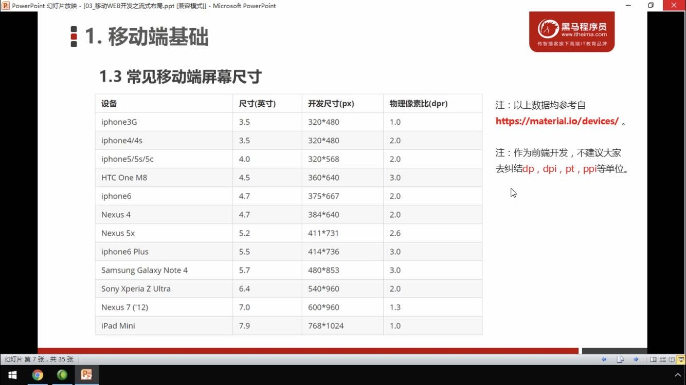

_**浮动用来布局，定位用来做特效**_

## 布局流程

```
浮动布局、凝胶布局、绝对布局、表格显示布局
流体（适应页面）、冻结（固定）、凝胶（内容固定，外边距随机）
```

1. 依次确认内容，块颜色，间距，边框
2. 确定版心（可视区或者网页主体），常见宽度960，980，1000，1200
3. 分析页面中的行模块，和行模块中的列模块
4. 制作 html 结构，
5. css 初始化，运用盒子模型原理，通过 div + css 控制网页模块
6. margin 不算做盒模型宽度

html需要**设置最小尺寸**，浏览器放大或缩小时会改变html尺寸

对齐是排版最重要的因素, **别让什么都居中**

开发时，最后压缩代码后所有的空格都会被清除

### html

```
<a href="#">shopcmd</a> |  
<a href="#">首页</a>
```

“|”后面换行会合成一个空格空格 前面也需要加个空格

- p，dt 和 h1里面不可以放块级元素，
- a 元素里可以放块元素

### html页面权重

- title 最高
- 标题次之
  - h1 一半用作页面标题或 logo
  - h2 一般用作页面副标题
  - h3 一般用作板块标题
  - h4 一般用作板块标题之后的副标题

### `display`: [布局]( https://developer.mozilla.org/en-US/docs/Web/CSS/display#Guides_and_Examples  )

### 浮动盒子一排放不下

浮动盒子宽度和版心盒子一样宽，因为加上边距导致换行，为浮动的小盒子们加一个父元素，宽度设置比版心款就可以在同一行放下（子盒子可以比父盒子宽），

### 分布式两栏布局

一个盒子定位，另一个盒子自适应宽度，自适应盒子的 margin 留下另一个盒子的宽度

### logo 优化

给 logo h1标签提高权重表示重要，再给一个链接，给链接一个文字（网站名称），必要时候显示

h1 h2 等加文字是为了搜索引擎优化

#### css不可用时，logo背景图片不显示，显示文字

1. 把文字缩进溢出盒子，再隐藏，（淘宝）
2. font-size：0；                           （京东）
3. 高度为0，设置 padding-top 等

### 导航栏 （浮动）

``` css
a {
	width: 200px;
	height: 50px;
	/* background-color: orange; */
	display: inline-block;  /* 把a 行内元素转换为行内块元素 */
	text-align: center;  /* 文字水平居中 */
	line-height: 50px;  /* 我们设定行高等于盒子的高度，就可以使文字垂直居中 */
	color: #fff;
	font-size: 22px;
	text-decoration: none;  /* 取消下划线 文本装饰 */
}
a:hover {  /* 鼠标经过 给我们的链接添加背景图片*/
	background: url(images/h.png) no-repeat; 
}
```


### 轮播图 (绝对定位)


轮播盒子，两个链接左右两边定位，有序列表是下方的定位点，无序列表的可点击链接是图片

### tab 栏切换

tab 栏盒子，分两块，tab 和 item 都用 ul

### 电梯导航 （固定定位）

```
position: fixed;
left: 50%; （页面中间）
margin: ；（偏移版心的一半 + 自己的宽度）
```

楼层区不给高度

### 图片边框

图片的边框一般用伪元素定位上去

### 滑动门

1. a 设置 背景左侧，padding撑开合适宽度。    
2. span 设置背景右侧， padding撑开合适宽度 剩下由文字继续撑开宽度。
3. 之所以a包含span就是因为 整个导航都是可以点击的。

```html
<li>
  <a href="#">
    <span>导航栏内容</span>
  </a>
</li>
```

```css
a {
  display: inline-block;
  padding-left: 16px;
  height: 33px;
  float: left;
  line-height: 33px;
  margin:0  10px;
  background: url(./images/to.png) no-repeat left ;
}
span {
  padding-right: 16px;
  height: 33px;
  display: inline-block;
  color:#fff;
  background: url(./images/to.png) no-repeat       right ;
  text-decoration: none;
}
a:hover,
a:hover span {
  background-image:url(./images/ao.png);
}
```

### css 三角形

~~~css
 div {

 	width: 0; 
    height: 0;
    line-height:0；
    font-size: 0;
	border-top: 10px solid red;

	border-right: 10px solid green;

	border-bottom: 10px solid blue;

	border-left: 10px solid #000; 

 }

~~~

1. 我们4个边框都要写， 只保留需要的边框颜色，其余的不能省略，都改为 transparent 透明就好了
2. 为了照顾兼容性 低版本的浏览器，加上 font-size: 0;  line-height: 0;
3. 边框可以设置不一样宽，如显示左边框：5，0，5，7
4. 三角形盒子定位时 - margin 一半是 border-width，因为底边的宽度是由左右两个边框的宽度相加的

### 浮动盒子去除最右边的外边距

div > ul > li

div 定宽，最右边的浮动 li 有多余的右外边距导致不能同行显示。把 ul 设置宽度大于 div 且大于整行 li 的和，就会同行显示，div 设置 overflow：hidden；。 

### 淘宝连续盒子

margin负值，position： relative，z-index

多个连续的浮动盒子都有边框，盒子连接处的边框是不连接的双倍（两个挨着的边框），盒子设置 - margin 边框的宽度，前面的盒子移动边框的宽度，后面的盒子依然挨着（浮动的盒子是紧挨着的），后面的盒子再移动边框的宽度。两个边框就重叠起来，变成一个边框了。双排的话也要上浮动

负 margin 盒子设置 hover 时，会有一边的边框被压住，同时设置相对定位，可使盒子浮动上来同时占有位置.本来就是相对定位就设置层级

### input空间和button上下不对齐的原因

button在高度计算上始终使用了Quirks模式。在Quirks模式下，边框的计算是在元素的宽度内的，而不像标准模式一样计算在外部（button的高度包含边框的高度

由于【button元素】在浏览器中属性默认为inline-block，因此代码中空格会被显示为的空白

### 解决img下方空白

在HTML5与CSS3中，DIV标签中的图片也就是IMG标签的默认vertical-align属性为baseline，文字分为顶线，中线，基线，底线。图片的下边缘是基线，所以在下方会留出基线和底线这一段距离的空白

1. display：block
2. vertical-align: middle / bottom / top；      _推荐_
3. 负外边距
4. 父元素font-size：0；
5. 父元素line-height: 0；

### 图片居中

1. 图片的父元素设置：{ display：flex；align-items：center；justify-align：space-around；}
2. 图片的父元素设置：{ display：table-cell；vertical-align：middle；text-align：center；}
3. 绝对定位，（在不清楚盒子尺寸的情况下，可以设置：上下左右 0，margin：auto；，或者左上 50%，transform：translate（-50%，-50%）；

行内块元素不能直接 `margin: auto;`

### 解决 webkit 最小字体限制

html{
    -webkit-text-size-adjust: none; // 或 100%
}

### 因换行产生的空白间隙

- 设置font-size: 0; 用于消除换行符、tab（制表符）、空格等字符造成的影响，但需注意以下几点：

1. IE6，IE7浏览器当设置font-size：0时，换行符、tab（制表符）、空格始终存在1px的空隙；
2.  最新版本的Safari浏览器，Chrome浏览器不支持font-size: 0;；

　　　解决方法如下：

1. 针对IE6、7浏览器，使用word-spacing 修复 IE6、7 中始终存在的 1px 空隙，减少单词间的空白（即字间隔），即： word-spacing:-1px;；
2. 使用webkit的私有属性，让字体大小不受设备终端的调整，可定义字体大小小于12px, html{-webkit-text-size-adjust:none;}

　　　css代码如下：

```
html{
    -webkit-text-size-adjust: none;
    /* 使用webkit的私有属性，让字体大小不受设备终端的调整，可定义字体大小小于12px */
}
div {
    font-size: 0;              /* 所有浏览器 */
    
    *word-spacing: -1px;
    /* 使用word-spacing 修复 IE6、7 中始终存在的 1px 空隙，减少单词间的空白（即字间隔） */
 }
span {
    font-size: 12px;
    letter-spacing: normal; 
    /* 设置字母、字间距为0 */
    
    word-spacing: normal; 
    /* 设置单词、字段间距为0 */
 }
```


### 溢出显示省略号

1. `white-space: nowrap;`  文字一行显示不换行
2. `overfolow: hidden;`  溢出部分隐藏
3. `text-overflow: ellipsis;`  超出的部分以省略号显示

使用 __text-indent__ 时，文本是先变成省略号再缩进，所以可能会把省略号剪裁掉。

### 图标字体位置偏下

设置行高小于盒子高度，位置会往上移

## 移动端

### 常见尺寸



### 常见布局方案

- 单独移动端页面（主流），域名前加 m（mobile）可以打开移动端

  1. 流式布局
     - 盒子的宽设置为 百分比 布局
     - 需要设置 max- 和 min-
  2. flex 弹性布局（推荐）
  3. lss + rem + 媒体查询布局
  4. 混合布局

- 响应式页面兼容移动端（三星官网）

  - 制作麻烦，耗费很大精力调试_**兼容性**_

  1. 媒体查询
  2. bootstarp

### 移动端 css 初始化

推荐：[normalize.css](http://necolas.github.io/normalize.css)

### logo

移动端有时候 logo 盒子大于图片，要设置 max-width 而不是 width

`max-width: 100%;`

