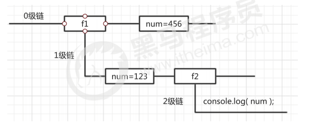
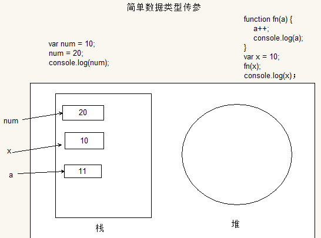
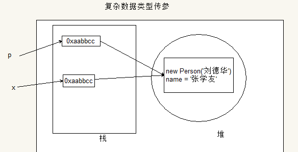
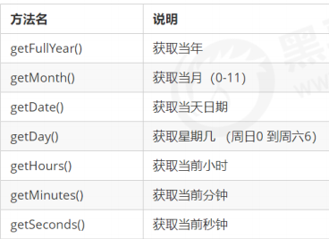
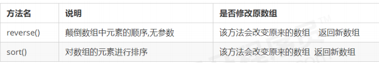
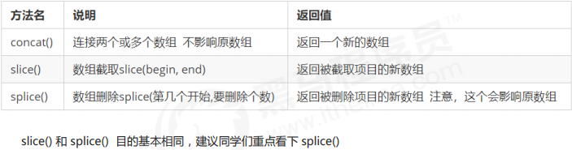
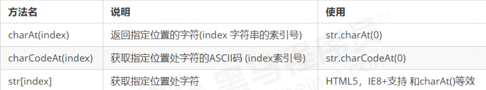
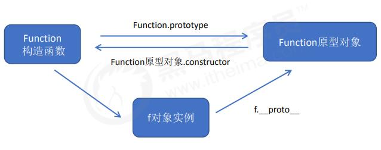

# JS基本概念

客户端脚本语言

后端：服务器端脚本语言

从语言特性上讲，JS是一个基于原型继承的语言

### JS 引擎机制

js 是单线程。所有的任务需要排队处理，当前任务结束，才能执行下一个任务。（比如我们对某个 DOM 元素进行添加和删除操作，不能同时进行。 应该先进行添加，之后再删除）

利用多核 CPU 的计算能力，HTML5 提出 Web Worker 标准，允许 JavaScript 脚本创建多个线程。

1. 所有同步任务都会在主线程上形成一个 执行栈
2. 在主线程外有一个 task queue ，只要异步任务有了运行结果，就在 task queue 中放置一个事件，进入等待状态。所以异步任务执行顺序按照运行速度排列，越快越先执行
3. 当前执行栈所有同步任务执行结束后，系统会读取 task queue，这些异步任务结束等待状态，进入执行栈，开始执行
4. 主线程不断重复第三步，获取任务，执行任务。这种机制被称为事件循环（ event loop）。

JS 的异步是通过回调函数实现的。一般而言，异步任务有三种类型：

1. 普通事件，如 click、resize 等
2. 资源加载，如 load、error 等
3. 定时器，包括 setInterval、setTimeout 等

异步任务相关回调函数添加到任务队列中（任务队列也称为消息队列）

他们的本质区别： 这条流水线上各个流程的执行顺序不同。

注意：

1. **[JSON](<https://blog.csdn.net/u014071328/article/details/77672189>)**格式的语法（ + - {} [] 等）是引擎直接解释，效率高。

   （使用`String() Array()`等会调用构造器(Builder或Buffer)再解释，多加一层对象包裹）

2. 使用正则表达式，写的速度更快。

3. 尽可能的少 定义、使用 全局变量

### 组成

ECMAScript，由ECMA-262定义，提供核心语言功能

语法、类型、语句、关键字、保留字、操作符、对象。

### 联入

```html
<script type=”text/javascript”>     </script>
<script type=”text/javascript” src=”ecma.js”> </script>
```

属性：async 异步脚本，立即下载，不影响其他加载，加载顺序不一定

```html
<script type=”text/javascript” src=”url” async=”async></script>
<!-- type 默认载入，可以不写 -->
```

defer 延迟脚本，立即下载，延迟到页面加载和显示后执行，加载顺序不一定

```html
   <script type=”text/javascript” src=”url” defer></script>
```

### 注释

- //开头，用于一行代码上
- /\*……*/多行，用于函数或一段代码上
- /**……\*/，用于系统

一般放在页面内容后面，</body>之前，按先后执行

浏览器在不支持或不启用脚本时用<noscript></noscript>可以包含除<script>的所有HTML元素

### 兼容XHTML

```js
   <script type=”text/javascript”>
    //<![CDATA[
    …]
    //]]>
  </script>
```

### 兼容老版本浏览器

```html
<script>
	<!-- js 代码 -->
</script>
```

防止老版本浏览器把JavaScript源代码当作页面内容显示出来

## 语法

代码块用“{ }“包裹，代码用” ；“分割

\+ - * / 前后加空格

使用代码块 

```js
    if （test） {
    test = false;
    }
```

### 标识符

指开发人员为变量、属性、函数、参数取的名字。

第一个字符是：字母，下划线 _，美元字符 $。 后面可以有数字 一般采取驼峰式

不能用：关键字、保留字、true、false、null、undefined

1. 关键字

   |            |      |         |          |           |         |        |
   | ---------- | ---- | ------- | -------- | --------- | ------- | ------ |
   | break      | case | catch   | continue | debugger* | default | delete |
   | do         | else | finally | for      | function  | if      | in     |
   | instanceof | new  | return  | switch   | this      | throw   | try    |
   | typeof     | var  | void    | while    | with      |         |        |

2. 保留字

   |          |           |         |             |           |           |
   | -------- | --------- | ------- | ----------- | --------- | --------- |
   | abstract | boolean   | byte    | char        | class     | const     |
   | enum     | export    | extends | final       | float     | goto      |
   | int      | interface | long    | native      | package   | private   |
   | short    | static    | super   | synchroized | throws    | transient |
   | let      | yield     |         | eval        | arguments |           |


### 严格模式

“use strict” 切换为严格模式

```js
    function doSomething() {
    “use strict”;
    //函数体
    }
```

### JS 异常

语法错误，代码块无法加载

```js
   var a=19;
    document.write(a;
```

运行错误，错误代码后的内容不显示，不影响其他代码块，ps:不影响其他script标签里的内容。其他script标签内容可以引用错误代码后的内容

## 输出消息的五种方法

模态对话框：在用户单击“OK”按钮之前，页面上是不能进行其他任何操作的

- **window.alert()** 弹出对话框（父对象是 window 时 可以省略）
- **confirm()** 弹出带取消对话框，用于if
- **prompt()** 接受用户信息
- **console.log()** 在网页中控台输出消息，同行输出多个用 `,` 隔开
  - `console.dir()`可以显示一个对象的所有属性和方法
  - console.log、dir 等的发放输出对象时会显示该对象在内存中的最新状态；内存地址上是原始值，不能修改，所以输出对象的值已经被修改成最新的值。（动态建议使用：debug）
- **document.write()** 在页面输出消息，可输入HTML标签，加载后会覆盖页面

## 作用域

JavaScript（es6前）中的作用域有两种：

- 全局作用域

  - 作用于所有代码执行的环境(整个 script 标签内部)或者一个独立的 js 文件。

  - 严格模式需要在函数外声明变量

    省略var操作符会创建全局变量，只要调用过一次，就可以在函数外访问。会因为变量不会马上有定义导致不必要的混乱。未声明在严格模式中会抛出 ReferenceError 错误

    ```js
        var text = "1";   // 全局变量
    	function test() {
            message = "hi"; // 全局变量
        }
        Test ();
    ```

- 局部作用域（函数作用域）

  - 在函数内定义的变量属于该函数中的局部变量。函数退出后就会被销毁，节省内存空间

    形参实际上是局部变量

    ```js
        function test() {
            var message = "hi"; // 局部变量
        }
        Test ();  
    ```

作用域链：在内部函数可以访问外部函数变量的这种机制，用链式查找决定哪些数据能被内部函数访问

采取就近原则的方式来查找变量最终的值。



## 预解析

- 预解析：在当前作用域下, JS 代码执行之前，浏览器会默认把带有 var 和 function 声明的变量在内存中
  进行提前声明或者定义。
- 代码执行： 从上到下执行JS语句。

变量提升： _变量的声明会被提升到当前作用域的最上面，变量的赋值不会提升。_

```js
console.log(num); // 结果是 undefined
var num = 10; 

// 等同于
var num;
consoloe.log(num);
num = 10;
```

函数提升：_函数的声明会被提升到当前作用域的最上面，但是不会调用函数。_

```js
fn();
function fn() {
console.log('打印');
}

// 等同于
function fn() {
console.log('打印');
}
fn();
```

特殊情况：

1. 变量，函数同名，函数优先级高，覆盖变量
2. 同名变量，第一个生效
3. 同名函数，后面覆盖前面

## 变量(保存一个值)

在 __stack（栈）__内存中开辟一个空间存放变量值，名字就叫变量名。

```js
// 改变变量值是新开辟一个空间存放值，名字也指向它，原空间的值是不可变的
var str = '';
for (var i = 0; i < 100000; i++) {
 str += i;
}
console.log(str); // 在大量拼接字符串时，会有效率问题，因为需要不断开辟空间
```

### var 操作符

```
声明： `var mess`在 环境/上下文 中指定一个变量的名字。有var和变量名

初始化： `var mess=1,age=3;`给一个声明后尚未初始化的变量一个有意义的初始值。有var,变量名和值

赋值： `mess=1;mess=2;`销毁一个变量原来的值，并赋予一个新值，相当于改变了一个变量的状态。有变量名和值
```

注意：**应注意区分初始化和赋值，在初始化之前不允许对变量进行赋值操作（意思就是声明的时候就要初始化，赋值就要销毁原来的变量）,变量初始化之后不改变数据类型**

定义多个变量，用逗号隔开

```js
var message = “hi”,
    found = false,
    age = 29;
```

### 特殊情况

| 情况                       | 说明             | 结果      |
| -------------------------- | ---------------- | --------- |
| var are; console.log(are); | 不初始化         | undefined |
| console.log(are);          | 不声明，不初始化 | 报错      |
| are = 10; console.log(are) | 不声明           | 10        |

定义多个变量，用逗号隔开

```js
    var message = “hi”,
        found = false,
        age = 29;
```

## 操作符

用于操作数据值：算术操作符、位操作符、关系操作符、相等操作符

### 一元操作符

只能操作一个值

#### 递增、递减

```js
++age;     age=age+1
age--;     age=age-1
```

**前置**

```js
Var age=34;
Var dse=2
Var cde = --age + dse      //等于35
Var esd = age + dse       //等于35
```

**后置**

```js
Var age=34;
Var dse=2
Var cde= age-- + age      //第一个等于 34 第二个等于 33
Var esd = age + dse       //等于35
```

#### 一元加、减

```js
var num = 25;
num = +num;      //仍然是25
var num = 25;
num = -num;      //值为-25
```

其他数据类型运用Number()转化为数值变量，如数字值或NaN

### 位操作符

数值以64位格式储存。位操作符将64位转换位32位操作，再将值转换为64位。NaN和Infinity会被转化成0，非数值用Number()函数转换

有符号整数：前31位表示数值，第32位为符号位，0为正，1为负

无符号整数：32位数值，只有正数。

正数用纯二进制格式，负数用二进制补码:1 求绝对值 2 求反码 3 加1

1. 按位非(NOT)

   由波浪线（~）表示，结果是返回数值的反码。一位操作数

   ```js
   var num1=25;
   var num2=~num1;         //输出-26
   ```

   本质：操作数的负值减1。

2. 按位与(AND)

   由和号字符表示(&)。两位操作数

   将两个数的每一位对齐，同为1时返回1，否则返回0。

3. 按位或(OR)

   由竖线符号表示（|）。两位操作数

   至少有一位是1，返回1 ，否则返回零

4. 按位异或(XOR)

   由一个插入符号表示（^）。两位操作数

   只有一位是1，返回1，两位都是1或0，返回0

5. 左移

   由两个小于号表示（<<），一位操作数

   所有位向左移动指定位数，不会影响符号位，空白用0填充。

6. 有符号右移

   由两个大于号表示（>>）,一位操作数

   所有位向右移动指定位数，不会影响符号位，空白用0填充。

7. 无符号右移

   由三个大于号表示（>>>）

   所有位向右移动指定位数，（包括符号位），空白用0填充。

### 布尔操作符

#### 逻辑非

(NOT)：由一个叹号（!）表示，将操作数转换成布尔值，再对其求反。

1. 对象，非空字符串，非0数值（包括Infinity），返回false
2. undefined，null，空字符串，数值0，NaN，返回true

```js
alert(!false);      //true
```

同时使用两个逻辑非操作符，相当于模拟Boolean()转型函数行为。

```js
alert(!!false);     //false
```

#### 逻辑与

(AND)：由两个和号(&&)表示，有两个操作数。

同为true,返回true；否则返回false。

有一个数不是布尔值，结果不一定返回布尔值

1. 第一个操作数为 true，返回第二个操作数
2. 第二个操作数为 false，返回第一个操作数

属于**短路操作**

#### 逻辑或

(OR)：由两个竖线符号表示（||），有两个操作数

同为false，返回false，否则返回true。

有一个数不是布尔值，结果不一定返回布尔值

1. 第一个操作数是 true，返回第一个操作数
2. 第一个操作数是 false，返回第二个操作数

属于**短路操作**

#### 短路操作

短路运算的原理：当有多个表达式（值）时,左边的表达式值可以确定结果时,就不再继续运算右边的表达式（即使它是错误的）;

- 逻辑与

  1. 语法：表达式1 && 表达式2
  2. 如果第一个表达式为真，则返回 表达式2
  3. 否则返回 表达式1

  ```js
  console.log( 123 && 456 ); // 456
  ```

- 逻辑或

  1. 语法：表达式1 || 表达式2
  2. 如果第一个表达式为真，则返回 表达式1
  3. 否则返回 表达式2

  ```js
  console.log( 123 || 456 || 789 ); // 123
  ```

### 乘性操作符

#### 乘法

由一个星号表示(*),计算两个数值的乘积。

1. 超过表示**范围**用Infinity或-Infinity
2. 有一个是NaN，结果是NaN
3. ……**Infinity** 与 **0** 相乘，结果是 **NaN**……
4. **Infinity** 与 **非0** 相乘，结果是 **Infinity**
5. 如果有操作数不是数值，则调用 **Number()**

#### 除法

由一个斜线符号表示(/)

1. 超过表示范围用 Infinity 或 -Infinity
2. 有一个是 NaN，结果是 NaN
3. ……**Infinity** 被 **Infinity** 除，结果是 **NAN**……
4. ……**0** 被 **0** 除，结果是 **NaN**……
5. **非0数** 被 **0** 除，结果是 **Infinity**
6. **Infinity** 被 **非Infinity数** 除，结果是 **Infinity**
7. **非Infinity数** 被 **Infinity** 除，结果是 **0**
8. 如果有操作数不是数值，则调用 **Number()**

#### 求模

（余数）由一个百分号表示(%)

1. 都是数值正常计算
2. ……任何数 被 **0** 除，结果是 **NaN**……
3. ……**Infinity** 被任何数 除，结果是 **NaN**……
4. **非Infinity数** 被 **Infinity**除，结果是 **被除数**
5. 有一个不是数值，调用Number()

### 加性操作符

"(",")"括号可以改变算术顺序

#### 加法

1. 两个都是数值，有一个是NaN，结果是NaN
2. -Infinity 加 -Infinity，结果是 -Infinity
3. \- 0加 - 0，结果是 - 0
4. 有一个操作数是字符串，将另一个操作数调用 String() 函数,拼接起来

#### 减法

1. 有一个是NaN，返回NaN
2. **Infinity** 减 **Infinity**，结果是 **NaN**
3. 0-0，结果是0
4. 有一个是其他类型，调用Number()函数
5. 有一个是对象，调用对象的valueOf()方法，如果没有，调用toString()方法

### 关系操作符

**"<" ">" "<=" ">="**

1. 两个数都是字符串，比较两个字符串每个字符的(字符编码值)，位置越靠后越大
2. 只有一个是数值，将另一个转换为数值
3. 有一个是对象，先调用valueOf()方法，没有则调用toString()方法
4. 有一个是布尔值，先转化为数值

### 相等操作符

#### == 和 !=

（比较前强制转型）

1. 有一个操作数是布尔值，比较前转换为数值
2. 有一个是字符串，另一个是数值，先将字符串转换为数值
3. 有一个是对象，另一个不是，先调用valueOf()

比较中

1. 不能将null和undefined转换为其他值
2. null和undefined是相等的
3. NaN 不等于任何数
4. 两个都是对象，是同一个对象，返回true，否则返回false

__*不要直接判断两个浮点数是否相等*__

#### ===和 !==

在比较之前不转换操作数

### 条件操作符

也叫三元运算符

```js
var max = (num1 > num2) ? num1 : num2;
```

如果 num1 大于 num2（关 系表达式返回 true），则将 num1 的值赋给 max；如果 num1 小于或等于 num2（关系表达式返回 false）， 则将 num2 的值赋给 max。

### 赋值操作符

由等于号表示(=)

复合赋值操作。使用它们不会带来任何性能的提升。

```js
var num = 10;
num = num + 10;
var num = 10;
num += 10; 
```

1. *=
2. /=
3. %=
4. +=
5. -=
6. <<=
7. \>>=
8. \>>>=

### 逗号操作符

用于声明多个变量

```js
var num1=1, num2=2, num3=3;
```

用于赋值，会返回表达式中的最后一项

```js
var num = (5, 1, 4, 8, 0); // num 的值为 0
```

### 优先级

从最高（21）到最低（1）优先顺序排列

| 优先顺序 | 操作员类型                                                   | 关联性 | 操作符           |
| :------- | :----------------------------------------------------------- | :----- | :--------------- |
| 21       | [`圆括号`](https://developer.mozilla.org/en-US/docs/Web/JavaScript/Reference/Operators/Grouping) | 不适用 | `( … )`          |
| 20       | [`属性访问器`](https://developer.mozilla.org/en-US/docs/Web/JavaScript/Reference/Operators/Property_Accessors#Dot_notation) | 左到右 | `… . …`          |
|          | [`需计算的属性访问器`](https://developer.mozilla.org/zh-CN/docs/Web/JavaScript/Reference/Operators/Property_Accessors#%E6%8B%AC%E5%8F%B7%E8%A1%A8%E7%A4%BA%E6%B3%95) | 左到右 | `… [ … ]`        |
|          | [`new`](https://developer.mozilla.org/en-US/docs/Web/JavaScript/Reference/Operators/new) （带有参数列表） | 不适用 | `new … ( … )`    |
|          | [`函数调用`](https://developer.mozilla.org/en-US/docs/Web/JavaScript/Guide/Functions) | 左到右 | `… ( … )`        |
|          | [可选链接](https://developer.mozilla.org/en-US/docs/Web/JavaScript/Reference/Operators/Optional_chaining) | 左到右 | `?.`             |
| 19       | [`new`](https://developer.mozilla.org/en-US/docs/Web/JavaScript/Reference/Operators/new) （没有参数列表） | 右到左 | `new …`          |
| 18       | [后缀增量](https://developer.mozilla.org/en-US/docs/Web/JavaScript/Reference/Operators/Arithmetic_Operators#Increment) | 不适用 | `… ++`           |
|          | [后缀递减](https://developer.mozilla.org/en-US/docs/Web/JavaScript/Reference/Operators/Arithmetic_Operators#Decrement) |        | `… --`           |
| 17       | [`逻辑非`](https://developer.mozilla.org/en-US/docs/Web/JavaScript/Reference/Operators/Logical_Operators#Logical_NOT) | 右到左 | `! …`            |
|          | [按位非](https://developer.mozilla.org/en-US/docs/Web/JavaScript/Reference/Operators/Bitwise_Operators#Bitwise_NOT) |        | `~ …`            |
|          | [一元加](https://developer.mozilla.org/en-US/docs/Web/JavaScript/Reference/Operators/Arithmetic_Operators#Unary_plus) |        | `+ …`            |
|          | [一元减](https://developer.mozilla.org/en-US/docs/Web/JavaScript/Reference/Operators/Arithmetic_Operators#Unary_negation) |        | `- …`            |
|          | [前缀增量](https://developer.mozilla.org/en-US/docs/Web/JavaScript/Reference/Operators/Arithmetic_Operators#Increment) |        | `++ …`           |
|          | [前缀递减](https://developer.mozilla.org/en-US/docs/Web/JavaScript/Reference/Operators/Arithmetic_Operators#Decrement) |        | `-- …`           |
|          | [`typeof`](https://developer.mozilla.org/en-US/docs/Web/JavaScript/Reference/Operators/typeof) |        | `typeof …`       |
|          | [`void`](https://developer.mozilla.org/en-US/docs/Web/JavaScript/Reference/Operators/void) |        | `void …`         |
|          | [`delete`](https://developer.mozilla.org/en-US/docs/Web/JavaScript/Reference/Operators/delete) |        | `delete …`       |
|          | [`await`](https://developer.mozilla.org/en-US/docs/Web/JavaScript/Reference/Operators/await) |        | `await …`        |
| 16       | [求幂](https://developer.mozilla.org/en-US/docs/Web/JavaScript/Reference/Operators/Arithmetic_Operators#Exponentiation) | 右到左 | `… ** …`         |
| 15       | [乘法](https://developer.mozilla.org/en-US/docs/Web/JavaScript/Reference/Operators/Arithmetic_Operators#Multiplication) | 左到右 | `… * …`          |
|          | [除](https://developer.mozilla.org/en-US/docs/Web/JavaScript/Reference/Operators/Arithmetic_Operators#Division) |        | `… / …`          |
|          | [余](https://developer.mozilla.org/en-US/docs/Web/JavaScript/Reference/Operators/Arithmetic_Operators#Remainder) |        | `… % …`          |
| 14       | [加法](https://developer.mozilla.org/en-US/docs/Web/JavaScript/Reference/Operators/Arithmetic_Operators#Addition) | 左到右 | `… + …`          |
|          | [减法](https://developer.mozilla.org/en-US/docs/Web/JavaScript/Reference/Operators/Arithmetic_Operators#Subtraction) |        | `… - …`          |
| 13       | [按位左移](https://developer.mozilla.org/en-US/docs/Web/JavaScript/Reference/Operators/Bitwise_Operators) | 左到右 | `… << …`         |
|          | [按位右移](https://developer.mozilla.org/en-US/docs/Web/JavaScript/Reference/Operators/Bitwise_Operators) |        | `… >> …`         |
|          | [按位无符号右移](https://developer.mozilla.org/en-US/docs/Web/JavaScript/Reference/Operators/Bitwise_Operators) |        | `… >>> …`        |
| 12       | [少于](https://developer.mozilla.org/en-US/docs/Web/JavaScript/Reference/Operators/Comparison_Operators#Less_than_operator) | 左到右 | `… < …`          |
|          | [小于或等于](https://developer.mozilla.org/en-US/docs/Web/JavaScript/Reference/Operators/Comparison_Operators#Less_than__or_equal_operator) |        | `… <= …`         |
|          | [大于](https://developer.mozilla.org/en-US/docs/Web/JavaScript/Reference/Operators/Comparison_Operators#Greater_than_operator) |        | `… > …`          |
|          | [大于等于](https://developer.mozilla.org/en-US/docs/Web/JavaScript/Reference/Operators/Comparison_Operators#Greater_than_or_equal_operator) |        | `… >= …`         |
|          | [`in`](https://developer.mozilla.org/en-US/docs/Web/JavaScript/Reference/Operators/in) |        | `… in …`         |
|          | [`instanceof`](https://developer.mozilla.org/en-US/docs/Web/JavaScript/Reference/Operators/instanceof) |        | `… instanceof …` |
| 11       | [等于](https://developer.mozilla.org/en-US/docs/Web/JavaScript/Reference/Operators/Comparison_Operators#Equality) | 左到右 | `… == …`         |
|          | [不等于](https://developer.mozilla.org/en-US/docs/Web/JavaScript/Reference/Operators/Comparison_Operators#Inequality) |        | `… != …`         |
|          | [全等于](https://developer.mozilla.org/en-US/docs/Web/JavaScript/Reference/Operators/Comparison_Operators#Identity) |        | `… === …`        |
|          | [不全等](https://developer.mozilla.org/en-US/docs/Web/JavaScript/Reference/Operators/Comparison_Operators#Nonidentity) |        | `… !== …`        |
| 10       | [按位与](https://developer.mozilla.org/en-US/docs/Web/JavaScript/Reference/Operators/Bitwise_Operators#Bitwise_AND) | 左到右 | `… & …`          |
| 9        | [按位异或](https://developer.mozilla.org/en-US/docs/Web/JavaScript/Reference/Operators/Bitwise_Operators#Bitwise_XOR) | 左到右 | `… ^ …`          |
| 8        | [按位或](https://developer.mozilla.org/en-US/docs/Web/JavaScript/Reference/Operators/Bitwise_Operators#Bitwise_OR) | 左到右 | `… | …`          |
| 7        | [空位合并运算符](https://developer.mozilla.org/en-US/docs/Web/JavaScript/Reference/Operators/Nullish_coalescing_operator) | 左到右 | `… ?? …`         |
| 6        | [逻辑与](https://developer.mozilla.org/en-US/docs/Web/JavaScript/Reference/Operators/Logical_Operators#Logical_AND) | 左到右 | `… && …`         |
| 5        | [逻辑或](https://developer.mozilla.org/en-US/docs/Web/JavaScript/Reference/Operators/Logical_Operators#Logical_OR) | 左到右 | `… || …`         |
| 4        | [有条件的](https://developer.mozilla.org/en-US/docs/Web/JavaScript/Reference/Operators/Conditional_Operator) | 右到左 | `… ? … : …`      |
| 3        | [赋值](https://developer.mozilla.org/en-US/docs/Web/JavaScript/Reference/Operators/Assignment_Operators) | 右到左 | `… = …`          |
|          |                                                              |        | `… += …`         |
|          |                                                              |        | `… -= …`         |
|          |                                                              |        | `… **= …`        |
|          |                                                              |        | `… *= …`         |
|          |                                                              |        | `… /= …`         |
|          |                                                              |        | `… %= …`         |
|          |                                                              |        | `… <<= …`        |
|          |                                                              |        | `… >>= …`        |
|          |                                                              |        | `… >>>= …`       |
|          |                                                              |        | `… &= …`         |
|          |                                                              |        | `… ^= …`         |
|          |                                                              |        | `… |= …`         |
| 2        | [`yield`](https://developer.mozilla.org/en-US/docs/Web/JavaScript/Reference/Operators/yield) | 右到左 | `yield …`        |
|          | [`yield*`](https://developer.mozilla.org/en-US/docs/Web/JavaScript/Reference/Operators/yield*) |        | `yield* …`       |
| 1        | [展开运算符](https://developer.mozilla.org/zh-CN/docs/Web/JavaScript/Reference/Operators/Spread_operator) | n/a    | `...` …          |
| 0        | [逗号/序列](https://developer.mozilla.org/en-US/docs/Web/JavaScript/Reference/Operators/Comma_Operator) | 左到右 | `… , …`          |

## 流程控制

流程控制语句通常使用一或多个关键字来完成给定任务

有三种结构：**顺序结构**、**分支结构**和**循环结构**


### if 分支语句

常用于范围判断，适用于分支少的语句

```js
if (condition1) statement1 else if (condition2) statement2 else statement3
```

最常用的分支语句，条件可以是任意表达式，自动调用 Boolean()转换函数将这个表达式的结果转换为一个布尔值。结果是true，执行语句1，结果是false，执行语句2。

```js
if (i > 25) {
    alert("Greater than 25.");
} else if (i < 0) {
    alert("Less than 0.");
} else {
    alert("Between 0 and 25, inclusive.");
} 
```

### switch 分支语句

是分支语句，也是在其他语言中普遍使用的一种流控制语句,

一般用于判断确定的值（通常是个变量），适用于分支较多的语句

```js
switch (expression) {
 case value: statement
 break;
 case value: statement
 break;
 case value: statement
 break;
 case value: statement
 break;
 default: statement   // 可以写在任何值前面，只有找不到匹配项时，才会跳到 default 上
} 
```

```js
switch (a) {
	case '1':
		b = prompt('存鸡毛钱') - 0;
		c += b;
		a = prompt();  // 判断到 值1 会把 break 之前的代码依次输出
	case '2':
		b = prompt('取鸡毛钱') - 0;
		c -= b;
		a = prompt();
}
```

### do-while 后测试循环语句

是一种后测试循环语句，即只有在循环体中的代码执行之后，才会测试出口条件

```js
do {
    statement
} while (expression); 
var i = 0;
do {
    i += 2;
} while (i < 10);
alert(i); 
```

后测试循环语句最常用于循环体中的代码至少要被执行一次的情形

### while 循环语句

前测试循环语句，也就是说，在循环体内的代码被执行之前，就会对出口条件求值。

**注意：必须要有退出条件，否则会成为死循环**

```js
while(expression) statement
var i = 0;
while (i < 10) {
    i += 2;
} 
```

### for 循环语句

for 语句也是一种前测试循环语句，但它具有在执行循环之前初始化变量和定义循环后要执行的代码的能力，在 for 循环的变量初始化表达式中，也可以不使用 var 关键字。该变量的初始化可以在外部执行

```js
for (initialization; expression; post-loop-expression) statement
var count = 10;
for (var i = 0; i < count; i++){
    alert(i);
}

// 里面的条件可以不相关
for (var t = 1; i < 36; t++)
```

执行过程：初始化变量 》 执行条件表达式（true 继续执行，否则结束循环） 》 执行循环体语句 》 执行操作表达式

这个 for 循环语句与下面的 while 语句的功能相同。使用 while 循环做不到的，使用 for 循环同样也做不到。也就是说，for 循环只是把与循环有关 的代码集中在了一个位置。

```js
var count = 10;
var i = 0;
while (i < count){
    alert(i);
    i++;
}
```

ECMAScript 中不存在块级作用 域，因此在循环内部定义的变量也可以在外部访问到

```js
var count = 10;
for (var i = 0; i < count; i++){
    alert(i);
}
alert(i); //10 
```

#### 断点调试

```
断点调试的流程：
1、浏览器中按 F12--> sources -->找到需要调试的文件-->在程序的某一行设置断点
2、Watch: 监视，通过watch可以监视变量的值的变化，非常的常用。
3、摁下F11，程序单步执行，让程序一行一行的执行，这个时候，观察watch中变量的值的变化。
```

### for-in语句

是一种精准的迭代语句，可以用来枚举（遍历）对象的属性

```js
for (变量 in 对象名) 代码  // 变量一般用“k”或“key”

for (var k in obj) {
	console.log(k); // 这里的 k 是属性名
	console.log(obj[k]); // 这里的 obj[k] 是属性值
}
```

使用 for-in 循环来显示了 BOM 中 window 对象的所有属性。每次执行循环 时，都会将 window 对象中存在的一个属性名赋值给变量 propName。这个过程会一直持续到对象中的 所有属性都被枚举一遍为止。与 for 语句类似，这里控制语句中的 var 操作符也不是必需的。但是， 为了保证使用局部变量，我们推荐上面例子中的这种做法

**在使用 for-in 循环之前，先检测确认该对象的值不是 null 或 undefined**

### label语句

可以在代码中添加标签，以便将来使用

```js
label: statement
start: for (var i=0; i < count; i++) {
    alert(i);
} 
```

定义的 start 标签可以在将来由 break 或 continue 语句引用。加标签的语句一般都 要与 for 语句等循环语句配合使用

### break和continue语句

用于在循环中精确地控制代码的执行。break 语句会立即退出循环， 强制继续执行循环后面的语句。而 continue 语句虽然也是立即跳出本次循环，继续下一次循环

```js
var num = 0;
for (var i=1; i < 10; i++) {
    if (i % 5 == 0) {
        break;
    }
    num++;
}
alert(num); //4
```

for 循环会将变量 i 由 1 递增至 10。在循环体内，有一个 if 语句检查 i 的值是否 可以被 5 整除（使用求模操作符）。如果是，则执行 break 语句退出循环。另一方面，变量 num 从 0 开 始，用于记录循环执行的次数。在执行 break 语句之后，要执行的下一行代码是 alert()函数，结果 显示 4。也就是说，在变量 i 等于 5 时，循环总共执行了 4 次

### with语句

将代码的作用域设置到特定的对象中。

```js
with (expression) statement; 
```

主要是为了简化多次编写同一个对象的工作

```js
var qs = location.search.substring(1);
var hostName = location.hostname;
var url = location.href; 
```

使用 with 语句

```js
with(location){
 var qs = search.substring(1);
 var hostName = hostname;
 var url = href;
} 
```

## 数据类型

JavaScript 是一种弱类型或者说动态语言。这意味着不用提前声明变量的类型，在程序运行过程中，类型会
被自动确定 

**返回数据类型**

*typeof()* 返回数据类型:`typeof(...) / typeof ...`

### 区别

- 简单类型：在存储时变量中存储的是值本身，因此叫做值类型
- 复杂类型：在存储时变量中存储的仅仅是地址（引用），因此叫做引用类型。

堆栈空间分配区别：（JavaScript中实际上没有堆栈的概念）

1. 栈（操作系统）：由操作系统自动分配释放存放函数的参数值、局部变量的值等。其操作方式类似于数据结构中的栈；**简单数据类型存放到栈里面**
2. 堆（操作系统）：存储复杂类型(对象)，一般由程序员分配释放，若程序员不释放，由垃圾回收机制回收。**复杂数据类型存放到堆里面**

- 值类型变量的数据直接存放在变量（栈空间）中

- 引用类型变量（栈空间）里存放的是地址，真正的对象实例存放在堆空间中

  ```js
  function Person(name) {
      this.name = name;
  }
  
  function f1(x) { // x = p 
      x.name = "张学友";  // 3.把堆里的 name 改为“张学友”，   
  }
  
  var p = new Person("刘德华");
  // 1.在堆里存放函数，同时在栈里生成一个地址指向这个堆，p变量指向这个地址
  console.log(p.name);    // 1.此时 name 是“刘德华”
  f1(p); // 2.x = p = Person；把 p 在栈里的地址（Person）赋值给 x ，指向堆里同一个对象
  console.log(p.name);    // 4.因为 x、p 指向同一地址，所以 name 一起改变 \u
  ```

  ```js
  var a = {
      name = "mu";
  }
  var b = a;
  a.name = "mumu";
  console.log(b); //b 和 a 指向同一个地址 b = a
  
  a = {
      name = "haha";
  }
  // a 整个对象改变，因为复杂数据类型的大小具有不确定性，所以开辟一个新的内存块储存对象，
  
  console.log(b); // 因为内存块不同，b 不变
  ```

### 简单数据类型

| 简单数据类型 | 说明                                                 | 默认值    |
| ------------ | ---------------------------------------------------- | --------- |
| undefined    | 变量未初始化：`var x;`，或者接受的函数没有明确返回值 | undefined |
| null         | 值为空：`var x=null;`                                | null      |
| boolean      | 布尔值类型：true、false，等价于 0 和 1               | false     |
| number       | 数字型：包括整数和浮点数                             | 0         |
| string       | 字符串                                               | ""        |

如果变量用于保存对象，将变量初始化为null

#### boolean

```js
var x=true;   var x=false;
```

#### number

浮点数：最高精确小数点后17位，（注意：不要测试特定的浮点数值`0.1+0.2 == 0.3`）

```js
var x=2;
```

进制： 十进制，八进制（前面加0，严格模式下无效），十六进制（前面加0x）

八进制：标准模式下，变量为数字，看作八进制；变量为**字符串，忽略前导 0 **，看作十进制。

科学记数法：3.125e+5 = 312500 / 0.000003 = 3e-6（符合为正数时可省略）

- 最大值和最小值

  ```
  conlose.log(Number.MAX_VALUE); // 1.7976931348623157e+308
  console.log(Number.MIN_VALUE); // 5e-324
  ```

- 无穷大：Infinity

- 非数值：NaN ，（不等于任何值），`IsNaN() `判断是不是非数值

#### string

```js
var x="2";
x = x+”4”;         //输出”24”
```

转义字符

| 代码 | \ '    | \ "    | \ &  | \\   | \n     | \r     | \t            | \b     | \f     |
| ---- | ------ | ------ | ---- | ---- | ------ | ------ | ------------- | ------ | ------ |
| 输出 | 单引号 | 双引号 | 和号 | 斜杠 | 换行符 | 回车符 | 制表符（Tab） | 退格符 | 换页符 |

#### 类型转换

**基数（进制）声明全部说的是字符串**

- boolean()   
  | 数据类型  | 结果为 ture             | 结果为 false |
  | --------- | ----------------------- | ------------ |
  | string    | 非空字符串              | 空字符串     |
  | number    | 任何非0数值，包括无穷大 | 0和NaN       |
  | Object    | 任何对象                | null         |
  | undefined | N/A（不适用）           | undefined    |

- string

  - 数字转字符串**不用声明转换前的进制**，会自动识别
  - 转换前先转换为十进制

  1. .toString()    

     用来转换数字，

     不支持null和undefined

     注意：`.toString`前面不能直接写10进制数字，八进制和十六进制或者变量等可以

     ```js
     var num = 1;
     alert(num.toString(10)); // 后面可以写转换后的基数（进制），
     ```

  2. String()

     几乎所有值都可以 ,有toString()方法，调用该方法, 

     Null返回”null”,undefined返回”undefined”

     ```js
     var num = 1;
     alert(String(num));
     ```

  3. "+" 拼接字符串

     ```js
     var num = 1;
     alert(num + "");
     // 效率最高，但是不支持 Symbol('123') 类型转换
     ```

- numer

  string 转 number 默认忽略前导 0

  处理整数字符串转换为 10 进制数字

  1. Number()

     | undefined | null | boolean,true and false | number               | string                                                       | 对象                                                 |
     | --------- | ---- | ---------------------- | -------------------- | ------------------------------------------------------------ | ---------------------------------------------------- |
     | NaN       | 0    | 1 and 0                | 不变（识别进制写法） | 纯数字转化为数值，（保留符号-+及小数） 。包含其他字符，转化为NaN 。空字符串和空格转化为0 | 调用valueOf()方法，如果结果是NaN，调用toString()方法 |

  2. parseInt() （重点）

     **Null、Undefined**转换为NaN

     从第一个字符（首位是空格时会忽略）开始到第一个非数字字符结束，（认识符号，不认识小数，认识整数格式（各种进制）） 。**空字符串和第一个字符非数字**的字符串返回NaN

     ```js
     var str = "0x329382";
     alert(parseInt(str, 16));  // 后一个参数为被转换前的基数（进制）
     // 没有字母转换（包括没有16进制写法），不带基数速度最快
     ```

  3. parseFloat()（重点）

     和parseInt()类似，区别：1 识别有效浮点数字字符，2 只解析10进制

  4. （ - * / ）隐式转换

     ```js
     var str = 12;
     str -= 0;
     // 速度和 Number 差不多
     ```

### 复杂数据类型

引用值heap（堆）

**判断对象类型**

instanceof 运算符

```js
var arr = [1, 23];
console.log(arr instanceof Array); // true
```

#### new

使用`new`操作符可以创建引用类型，

基本类型和引用类型的区别：

- 基本类型在执行代码的**瞬间**会创建基本包装类型，方法执行完毕，对象被立即销毁，（不能为正在运行的基本类型添加属性和方法）

  ```js
  var s1 = "some text";
  alert(s1.substring(0)); //some text
  s1.color = "red";
  alert(s1.color);    //undefined
  ```

- 引用类型在执行流离开当前作用域前**一直保存**在内存中

  ```js
  var s2 = new String("another text");
  s2.color = 'blue';
  alert(s2.color);    //blue
  ```

#### Object

对象有时候被叫做关联数组

`typeof Object` 返回的是 function 

对象：是一组无序的相关属性和方法的集合，所有的事物都是对象，例如字符串、数值、数组、
函数等。

- 属性：事物的特征，在对象中用属性来表示（常用名词），属性包含一个键（名）和一个值
- 方法：事物的行为，在对象中用方法来表示（常用动词），是储存对象属性的函数
  - javascript的方法可以分为三类：
    1. 类方法
    2. 对象方法
    3. 原型方法

对象分三种：自定义对象 、内置对象、 浏览器对象（前面两种对象是JS 基础 内容，属于 ECMAScript； 第三个浏览器对象属于JS 独有的）

##### 自定义对象

1. 创建对象

   1. new Object()  在初始化大数组时，性能更加优异

      ```js
      var o = new Object ();  // new操作符后面跟创建的对象类型的名称，
      o.name = "x8";
      o.play = function() {
          alert("看电影");
      }
      //使用 new 会调用构造器，多加一层对象包裹，但是更符合对象化继承的概念
      ```

   2. 字面量 

      ```js
      var star = {
          name: 'pink',  // 注意冒号和逗号
          sayHi: function() {
              alert('大家好啊~');
          }
      }// 可以直接写属性和方法，用“:”连接属性和值，
      ```

   3. ##### 构造函数创建
      对象的属性和方法封装成的函数叫构造函数，用来初始化对象，这个过程叫做`对象实例化`

      ```js
      function Person(name, age, sex) {
          this.name = name;  // 2. this指向对象   3. 给对象添加属性和方法 
          this.age = age;
          this.sex = sex;
          this.sayHi = function() {
          alert('Hi！我的名字叫：' + this.name + '，年龄：' + this.age + '，性别：' + this.sex);
          }
      }  // 4. 返回对象 不需要return
      var bigbai = new Person('大白', 100, '男');  // 1. 创建空对象
      var smallbai = new Person('小白', 21, '男');
      console.log(bigbai.name);
      console.log(smallbai.name);
      ```

      - 构造函数约定首字母大写。
      - 函数内的属性和方法前面需要添加 this ，表示当前对象的属性和方法。
      - 必须用 new 来调用构造函数，来创建对象
      - 构造函数中不需要 return 返回结果。

2. 调用

   - 获取属性值：

     1. 对象 . 属性

        ```js
        console.log(star.name); // 调用 name 属性
        ```

        - 原理是：在对象的 keys 中找字符串为 name 的 key
        - 点后面跟的不是变量。

     2. 对象 [ ' 属性 ' ]

        ```js
        console.log(star['name']); // 括号里的属性名是字符串必须加引号
        ```

        - [ ]运算符可以使用字符串变量的内容作为属性名，点运算符不能

          ```js
          var obj = {
              s = 12,
          }
          for (var k in obj) {
              obj[k]    // 12
              obj.k     // undefined
          }
          var ss = 's';
          console.log(data[ss])   // 12
          ```

        -  [ ]运算符可以用纯数字作为属性名，点运算符不能

        - [ ]运算符可以用js关键字和保留字作为属性名，点运算符不能

   - 方法调用：

     对象 . 方法名 ();   `star.sayHi(); `          方法名后面要加括号

3. 特殊情况

   Object有的属性和方法会存在更具体的对象里

   - **.constructor**：保存着用于创建当前对象的函数。对于前面的例子而言，构造函数   （constructor）就是 Object()。
   - **.hasOwnProperty(propertyName)**：用于检查给定的属性在当前对象实例中（而不是在实例的原型中）是否存在。其中，作为参数的属性名（propertyName）必须以字符串形式指定（例如：   o.hasOwnProperty("name")）。
   - **.isPrototypeOf(object)**：用于检查传入的对象是否是传入对象的原型
   - **.propertyIsEnumerable(propertyName)**：用于检查给定的属性是否能够使用 for-in 语句来枚举。   与 hasOwnProperty()方法一样，作为参数的属性名必须以字符 串形式指定。
   - **.toLocaleString()**：返回对象的字符串表示，该字符串与执行环境的地区对应。
   - **.toString()**：返回对象的字符串表示。
   - **.valueOf()**：返回对象的字符串、数值或布尔值表示。通常与 toString()方法的返回值 相同。
   - **Object.keys()**：方法会返回一个由一个给定对象的自身可枚举属性组成的数组，数组中属性名的排列顺序和正常循环遍历该对象时返回的顺序一致 

```js
// 添加对象的语句会提到 console 语句的前面
console.log(obj);
   obj.a = [2];

// 等同于
   obj.a = [2];
console.log(obj);
```

##### 内置对象

Math、Date、Array、基本包装类型

1. Math

   Math 不是构造器，它的属性和方法都是静态的。

   ```js
   Math.PI // 圆周率,不加括号
   Math.floor() // 向下取整
   Math.ceil() // 向上取整
   Math.round() // 四舍五入版 就近取整 
   Math.abs() // 绝对值
   Math.max()/Math.min() // 求最大和最小值
   Math.random() // 随机数
   
   // 这些方法必须带 “()"，否则得到的是函数本身而非结果
   ```

   四舍五入：注意：-0.5 结果是 -0，0.5 结果是 1

   随机数：[0，1) === 左闭右开区间。即从0（包含0）到...1但不包括1（排除1）。

   ```js
   // 两个数之间的随机数
   function getRandomArbitrary(min, max) {
       return Math.floor(Math.random() * (max - min)) + min // 不包含最大值
       return Math.floor(Math.random() * (max - min + 1)) + min // 包含这两个数
   }
   ```

2. Date

   日期是构造函数，需要实例化

   Date 对象是基于1970年1月1日（世界标准时间）起的毫秒数(1000ms = 1s)

   ```js
   var now = new Date(); // 不写参数，就返回当前时间；写参数就返回输入的时间
   ```

   基本方法：

   **获取指定时间的时间戳：**

   ```js
   // 实例化Date对象
   var now = new Date("2020-6-22 00:00:00");
   // 1. 用于获取对象的原始值的2种方法
   console.log(now.valueOf())
   console.log(now.getTime())
   // 2. 简单写可以这么做 (最常用)
   var now = + new Date();
   // 3. HTML5中提供的方法，有兼容性问题
   var now = Date.now();  // 此时的时间戳
   // 4. 精确到 seconds
   var now = Date.parse(new Date() + ' GMT +8')
   ```

   **时间戳转换小时，会比本地时间早八小时（相差八个时区）**

   ```js
    $.renderDateTime = function (jsondate) {
       var timeStamp = parseInt(jsondate.replace(/\D/igm, ""));
       timeStamp = timeStamp + 8 * 60 * 60 * 1000; //（本地时间）东八区加上8小时
       var date = new Date(timeStamp);
   
       var year = date.getFullYear();
       var month = date.getMonth() + 1;
       var day = date.getDate();
       var hour = date.getHours();
       var minute = date.getMinutes();
       var second = date.getSeconds();
       return year
           + "-" + (month < 10 ? "0" + month : month)
           + "-" + (day < 10 ? "0" + day : day)
           + " " + (hour < 10 ? "0" + hour : hour)
           + ":" + (minute < 10 ? "0" + minute : minute)
           + ":" + (second < 10 ? "0" + second : second);
   };
   
   链接：https://juejin.im/post/5caee550e51d456e3b70185b
   来源：掘金
   ```

3. Array

   保存多个值

   **创建：**

   1. 利用 new Array 创建

      ```js
      var 数组名 = new Array(varlue, value1) ； // A 要大写，值可以直接写在小括号里
      var arr = new Array(); // 创建一个新的空数组
      ```

   2. 利用数组字面量创建数组（常用）

      ```js
      //1. 使用数组字面量方式创建空的数组
      var 数组名 = []；
      //2. 使用数组字面量方式创建带初始值的数组
      var 数组名 = ['小白','小黑','大黄','瑞奇'];
      ```

   索引 (下标) ：用来访问数组元素的序号（数组下标从 0 开始）。数组可以通过索引来访问、设置、   修改对应的数组元素，

   访问：我们可以通过“数组名[索引]”的形式来获取数组中的元素

   ```js
   // 定义数组
   var arrStus = [1,2,3];
   // 获取数组中的第2个元素
   alert(arrStus[1]); 
   ```

   数组的长度：“数组名.length”

   ```js
   var arrStus = [1,2,3];
   alert(arrStus.length); // 3
   ```

   **新增数组元素：**

   1. 修改数组索引新增数组元素（ 常用）

      - 可以通过修改数组索引的方式追加数组元素
      - 不能直接给数组名赋值，否则会覆盖掉以前的数据

      ```js
      var arr = ['red', 'green', 'blue', 'pink'];
      arr[4] = 'hotpink';
      console.log(arr);
      ```

   2. 修改 length 长度新增数组元素

      ```js
      var arr = ['red', 'green', 'blue', 'pink'];
      arr.length = 7;  // 索引号是 4，5，6 的空间没有给值，就是声明变量未给值，默认值就是    undefined。
      ```

   **基本方法**

   - **修改数组元素**   

   - **索引查找：**

   - **转换为字符串**

   - **数组排序：**

   - **截取数组：**

     slice()：从第几个索引号开始，到第几个索引号结束（左闭右开，不包括结束位置）

     splice()：从第几个索引号开始（负值是倒数 == arr.length - n），删除的个数（从删除的第一个数字算起，往后算）

     ```js
     arr.splice(-2, 0, 'a', 'b');
     // 从 arr.length - 2 的位置算起，删除 0 个元素，并且在 arr.length - 2 的前面添加（任意多个） 'a','b'（不管正负值，前面都是 0 方向）
     ```

   - `map()`：创建一个新数组，其结果是该数组中的每个元素是调用一次提供的函数后的返回值。

     ```js
     var map = arr.map(function callback(currentValue[, index[, array]]) {
      // Return element for new_array 
     }[, thisArg])
     
     // 示例
     const map = arr.map(x => x * 2);
     ```

     - `currentValue`：数组中正在处理的当前元素
     - index：数组中正在处理的当前元素的索引   （可选）
     - `map` 方法调用的数组  （可选）
     - thisArg：执行 `callback` 函数时值被用作`this`  （可选）
     - 返回值：一个由原数组每个元素执行回调函数的结果组成的新数组

   关于返回值：push() 的返回值的意思是：`console.log(arr.push(3,2));`

   **判断是否为数组：**

   ```js
   Array.isArray(arr) // H5新增 Array.isArray() 可以检测 iframes，优于 instanceof
   ```

4. 基本包装类型

   把简单的数据类型包装成复杂数据类型，

   - String

     **空格也占位置**

     `'123'[0] == ['123'][0]`

     ```js
     var str = "hi!";
     // 1. 把简单数据类型包装成 临时复杂数据类型
     var temp = new String("hi!");
     // 2. 把临时变量的值给 str
     str = temp;
     // 3. 销毁这个临时变量
     temp = null;
     ```

     基本方法：

     - 查找索引

     - 查找字符（重点）<a href="https://tool.oschina.net/commons?type=4">ASCII 编码对照表</a>           

     - 字符串操作方法（重点）

     - replace()方法

       ```js
       // 于在字符串中用一些字符替换另一些字符
       replace(被替换的字符串， 要替换为的字符串)；
       ```

     -  split()方法

       ```js
       // 以将字符串切分为数组。在切分完毕之后，返回的是一个新数组
       var str = 'a,b,c,d';
       console.log(str.split(',')); // 返回的是一个数组 [a, b, c, d]
       ```

     - 其他

       ```js
       toUpperCase() //转换大写 
       toLowerCase() //转换小写
       ```

   - Number

   - boolean

##### 浏览器对象

- 

##### 构造函数对象化

可以不使用`new`实现对象化，比如使用`function`作为一个基类：

```js
function foo () {  //没有对象化
  var name = 'name'
}
foo.prototype.getName = function () { console.log(1) }
var t = foo()  // undefined，不是想要继承getName方法的对象
```

解决方法：

1. ```js
   // 在 function 中添加代码
   function foo()
   {
      // 如果用户没有使用new进行调用 则静默调用new
      if ( !(this instanceof foo) )
         return new foo();
   
      // 构造函数逻辑如下...
   }
   ```

2. ```js
   // 更通用代码
   function foo()
   {
      // 如果用户没有使用new进行调用 则静默调用new
      if ( !(this instanceof arguments.callee) )  // 在这里不再使用foo来判定，而是通过callee来进行
      throw new Error("作为函数调用的构造函数");
   }
   ```

##### 拷贝对象

- 浅拷贝（只拷贝一层，拷贝对象的属性和方法的地址）

  1. ```js
     var obj = {
         name: 'add';
         age: {
             agg: 2;
         }
     }
     var b = {};
     for (var k in obj) {
         b[k] = obj[k];
     }
     ```

  2. `Object.assign(接受对象, 被拷贝对象)`    ES6

     ```js
     var obj = {
         name: 'add'，
         age: {
             agg: 2，
         }
     }
     var b = {}
     Object.assign(b, obj);
     ```

- 深拷贝 

  1. ```js
     var obj = {
         name: 'add'，
         age: {
             agg: 2，
         }
     }
     var o = {}
     // 封装函数
     function copy(newo, old) { // 两个参数为接受的函数和被拷贝的函数
         for (var k in old) {
             // 获取属性值
             var item = old[k];
             // 判断值是否为数组
             if（item instanceof Array) {
     	        newo[k] = []; 
                 // 再次调用这个函数，把 item 数组的每一项赋值给 newo[k] 数组
                 copy(newo[k], item)  
             } else if (item instanceof Object) {
     	        newo[k] = {};  // 这个值存储对象
                 copy(newo[k], item)
             } else {
                 // 属于简单数据类型
                 newo[k] = item;
             }
         }
     }
     copy(o, obj)
     ```

  2. 

#### 函数

- 函数：就是封装了一段可被重复调用执行的代码块
- 所有函数都是 Function 的实例(对象) 
- 函数也属于对象

函数在使用时分为两步：声明函数和调用函数。

声明：使用 `function` （必须小写）关键字来声明，后跟一组参数以及函数体

通常我们将函数名命名为**动词**

**注意：函数后面不加分号**

在自动执行函数前加分号：避免压缩时前一个脚本没有写最后一个分号而导致压缩后脚本不能使用，所以要在开始加一个分号

`(function(){})()`：闭包模拟作用域块

```js
function functionName(arg0, arg1,...,argN) {
 statements
} 
```

示例：

```js
function sayHi(name, message) {
 alert("Hello " + name + "," + message);
}
        sayHi("Nicholas", "how are you today?");
```



- 形参
  - 在函数名称后面的小括号中添加一些参数
- 实参
  - 在调用该函数时，传递的相应的参数

**注意：不要忘记添加小括号**

没有函数签名的概念,在 ECMAScript 中定义了两个名字相同的函数，则该名字只属于后定义的函数

##### 参数

它是当前函数的一个内置对象，存储了传递的所有实参。参数都必须是字符串格式

通过 arguments 对象来访问这个参数数组，从而获取传递给函数的每一个参数

- 具有 length 属性
- 按索引方式储存数据
- 不具有数组的 push , pop 等方法

1. arguments 对象的长度是由传入的参数个数决定的，不是由定义函数时的 命名参数 的个数决定的
2. 没有传递值的命名参数将自动被赋予 undefined 值
3. ECMAScript 中的所有参数传递的都是值，不可能通过引用传递参数。
4. 重写 arguments 的值会导致语法错误

函数可以作为参数或者返回值传递

##### 调用

this 指向函数的调用者

1. 普通函数

   - ```js
     function b(){ }
     window.b(); // 调用函数
     
     // this 指向 window
     ```

2. 对象的方法

   - ```js
     var o = {
         say: function() {}
     }
     o.say();
     
     // this 指向 对象
     ```

3. 构造函数

   - ```js
     function Hi(){ }
     new Hi();
     
     // 构造函数或者原型对象 this 指向 实例对象
     ```

4. 绑定事件函数

   - ```js
     // 事件触发就调用
     btn.onclick = function {}
     
     // this 指向 函数调用者
     ```

5. 定时器函数

   - ```js
     // 每个一秒调用一次
     window.setInterval(function() {}, 1000)
     
     // this 指向函数的调用者 window
     ```

6. 立即执行函数

   - ```js
     (function () {
     })()
     
     // this 指向 window
     ```

##### 关键字

1. return  返回函数值

   ```js
   var result = 0;
     function sum(num1, num2) {
         console.log(num1 + num2);
         return num1 + num2;  // return 语句之后结束大括号之前的任何代码 都永远不会执行
     }
     console.log(sum(5, 10)); // 调用函数并输出函数值，未指定返回值的函数,返回的是 undefined 值
   ```

   - 函数在任何时候都可以通过 return 语句后跟要返回的值来实现返回值 

2. this

   -  全局作用域或者普通函数中this指向全局对象window（注意定时器里面的this指向window）

     ```js
     var a = 1;
     function b(){
         console.log(a);
     }
     window.b(); // 普通函数中调用是指向 window 的，但是平时都省略掉了
     ```

   - 方法调用中谁调用this指向谁

   - 构造函数中this指向构造函数的实例

##### 匿名函数

普通函数是语句，匿名函数是表达式

```js
// 这是函数表达式写法，匿名函数后面跟分号结束
var fn = function(){
    console.log(this);   // this 指向 window
}；
// 匿名函数调用必须写到函数体下面
window.fn();
```

##### 回调函数

回调：将这个函数作为参数传到另一个函数里面，当那个函数执行完之后，再执行传进去的这个函数，     （干了某件事，再回头调用这个函数）

```js
// 里面的调用函数是回调函数，属于异步任务，会在主线程执行完后再执行
window.setTimeout(调用函数, [延迟的毫秒数]);
// 
element.onclick = function(){}； 
// 或者 
element.addEventListener(“click”, fn);  // 回调函数不加括号
```

##### 立即执行函数

- ```js
  // 声明一个匿名函数，用括号包起来，后面的括号调用这个函数
  (function (j) {
  })(i)
  // 或者
  (function (j) {}(i))
  // 或者...
  ```

  - 为什么不能直接写 function 
    - JS引擎规定，如果function出现在行首，一律解析成语句。因此JS引擎看到行首是function关键字以后，认为这一段都是函数定义，不应该以原括号结尾，所以就报错了。
  - 参数：（`i`就是一个全局变量，`i`代表的是实参，`j`是`i`在立即执行函数中的形参）
    - 如果立即执行函数中需要全局变量，全局变量会被作为一个参数传递给立即执行函数

作用：

1. 不必为函数命名，避免了污染全局变量
2. 内部形成了一个单独的作用域，可以封装一些外部无法读取的私有变量
3. 封装临时变量

使用场景：

1. 你的代码在页面加载完成之后，不得不执行一些设置工作，比如时间处理器，创建对象等等。
2. 所有的这些工作只需要执行一次，比如只需要显示一个时间
3. 但是这些代码也需要一些临时的变量，但是初始化过程结束之后，就再也不会被用到

##### 闭包

一个作用域可以访问另外一个函数内部的局部变量。

- 闭包（closure）指有权访问另一个函数作用域中变量的函数

  ```js
  function fn1(){ // fn1 就是闭包函数
     var num = 10;
     function fn2(){
         console.log(num); // 10
     }
     fn2()
  }
     fn1();
  ```

  - 闭包作用：延伸变量的作用范围。

##### 递归函数

- 如果一个函数在内部可以调用其本身，那么这个函数就是递归函数。

  ```js
  function fn() {
      if(a > b) {
          return;
      }
      fn();
  }
  fn();
  ```

  - 递归函数的作用和循环效果一样
  - 由于递归很容易发生“栈溢出”错误（stack overflow），所以必须要加退出条件 return。

##### 基本点

funName.name = funName

```js
  var a = 1;
    function b(){
        a = 2;  // 把函数变量a()重新赋值成数字变量，因为 a() 是局部变量,所以 a 也是局部变量
        console.log(a);
        //有函数，a不变；没函数，a变2
        function a(){};
    }
    b();// 调用函数，会输出函数的 模态对话框
    console.log(b()); // 1. 调用函数，会输出函数的模态对话框。2. 输出函数结果为 undifinde 。因为函数没有返回值，?:如果后面没有（）会输出这个函数的代码
    console.log(a);//输出1
```

```js
var a = 0,
    b = 0;
function A(a) {
    // 执行变量A，因为函数未调用所以略过，执行alert
    A = function(b) {   // 如果这个函数是普通声明的函数，就不可以在父函数外调用
        alert(a + b++);
    }
    alert(a++); 
}
// 调用函数A，然后执行函数内的代码
A(1);
// 调用匿名函数，
A(2);
```

```js
// 这个函数返回一个匿名函数
function compose(f, g) {
    return function(x) {
        return f(g(x))
    }
}
function toUp(str) {
    return str.toUpperCase()
}
function add(str) {
    return str + '!'
}
// 调用第一个函数，f=add(),g=toUp()，p = 返回值
var p = compose(add, toUp);
// 调用匿名函数，x = 'time'
p('time');   //TIME!
```

```js
var arr = [];
for (var i = 0; i < 2; i++) {
    arr[i] = function() {
        // 在循环的时候，因为函数没有调用，所有变量 i 保持不变
        console.log(i);
    }
}
// 调用函数的时候整个循环 i = 2 已经结束，
arr[0]();
arr[1]();
```

## 事件侦听器

#### 操作事件

1. 传统注册方式方式

   - on 开头。 

   - 监听只会在冒泡阶段生效

   - 同一个元素且同一个事件，只能传统注册一次侦听器（设置一个处理函数），后面注册的事件会覆盖前面的

     - 同一个元素且同一个事件，可以传统注册和方法注册一起使用，不能多次传统注册

   - ```js
     // 方法1
     function hei() {
         alert("hei");
     }
     me.onclick = hei; 
     
     // 方法2
     mo.onclick = function() {
         alert('你好')
     }
     mo.onclick = function() { // 后面的语句会覆盖前面的代码
         alert('hei')
     }
     ```

2. 方法侦听 注册方式 （推荐 IE9+）

   - `eventTarget.addEventListener(type, listener[, useCapture]) `

     - eventTarget     侦听对象

     - type                 事件类型字符串，不加 on

     - listener             事件处理函数

     - useCapture     可选，默认： false。同 `options - capture`

       - 如果是 true，表示在事件捕获阶段调用事件处理程序；
       - 如果是 false，表示在事件冒泡阶段调用事件处理程序。

     - `options`: 可选. 可用的选项如下

       - `capture`: Boolean, 如果是 true, 表示 listener 会在捕获阶段触发. 默认是 false. 冒泡触发. 

         - 目标元素（点击的元素）有多个事件，其中一个设置 true
           - 在 chrome 中会按照加载先后顺序触发，不会进行 `capture` 的判断
           - 在 Safari 中，会进行 `capture` 的判断

       - `once`: Boolean, 如果是 true, 表示 listener 在添加之后最多只调用一次

         - ```js
           outer.addEventListener('click', onceHandler, once);
           once = { once: true };
           ```

       - `passive`: 。Boolean，如果是 true, 表示 listener 永远不会调用 `preventDefault()`. 如果 listener 仍然调用了这个函数, 客户端将会忽略它并抛出一个控制台警告

         - ```js
           inner2.addEventListener('click', nonePassive, { passive: true });
           ```

   - 同一个元素且同一个事件，可以注册多个侦听器

   - ```js
     // 两个事件都会执行
     mo.addEventListener('click', function(){
         alert('你好');
     })
     // 建议使用普通函数，匿名函数无法解绑事件
     mo.addEventListener('click', fn);
     function fn(){
         alert('你好');
     }
     ```

   - ```js
     // 注册事件兼容性解决方案
     function addEventListener(element, eventName, fn) {
      // 判断当前浏览器是否支持 addEventListener 方法
      if (element.addEventListener) {
      element.addEventListener(eventName, fn); // 第三个参数 默认是false
      } else if (element.attachEvent) {
      element.attachEvent('on' + eventName, fn);  // 可以直接省略 仅作了解
      } else {
      // 相当于 element.onclick = fn;
      element['on' + eventName] = fn;
     } 
     ```

   - 兼容性处理的原则： 首先照顾大多数浏览器，再处理特殊浏览器

3. 针对 IE 9 以前的IE 浏览器

   - `eventTarget.attachEvent(eventNameWithOn, callback) `

   - eventTarget                  目标对象

   - eventNameWithOn      事件类型字符串，加 on

   - callback                        事件处理函数

   - ```js
     // 仅作了解，处理兼容性问题直接使用前两种即可
     var mo = document.getElementById('hi');
     mo.addEvent('onclick', function(){
         alert('你好');
     })
     ```

4. 传统注册方式 **解绑事件**

   - `eventTarget.onclick = null;`

   ```js
   // 解绑事件
   mo.onclick = function() {
       alert('你好');
       mo.onclick = null;
   }
   ```

   ```js
   // 这个事件不会调用函数，因为在主线程的时候事件已经删除了
   mo.onclick = function() {};
   mo.onclick = null;  
   ```

   

5. 方法注册方式 **解绑事件**

   - `eventTarget.removeEventListener(type, listener[, useCapture]);`

     ```js
     // 匿名函数无法解绑
     div.addEventListener('click', fun)
     function fun() {
         alert('你好');
         div.removeEventListener('click', fun)
     }
     ```

   - ```js
     // 兼容性方案
     function removeEventListener(element, eventName, fn) {
      // 判断当前浏览器是否支持 removeEventListener 方法
      if (element.removeEventListener) {
      element.removeEventListener(eventName, fn); // 第三个参数 默认是false
      } else if (element.detachEvent) {
      element.detachEvent('on' + eventName, fn);  // 可以直接省略 仅作了解
      } else {
      element['on' + eventName] = null;
     } 
     ```

   - `eventTarget.detachEvent(eventNameWithOn, callback);`   了解

     ```js
     // 了解
     div.attachEvent('click', fun)
     function fun() {
         alert('你好');
         div.datachEvent('click', fun);
     }
     ```

## DOM

```
- 关于dom操作，我们主要针对于元素的操作。主要有创建、增、删、改、查、属性操作、事件操作。
```

DOM文档对象类型，是对文档及其内容的抽象表述。提供访问和操作网页内容的方法和接口，标准化组织是 W3C

### 基础

扩点表示法：`object1.object2.object3`，表示 object3，父对象是 object2

DOM视图、DOM事件、DOM样式、DOM遍历和范围、SVG、MathML、SMIL

- `document`：文档，表示一个页面
- `element`：元素，所有的标签都是元素
- `node`：节点，所有的内容都是节点（标签，属性，文本注释）

**以上内容都是对象**

body 是 document 的一个子对象。object 后面可以跟属性和方法

**操作元素属性、节点的语句会提前到 console.log alert 等的前面**

```js
console.log(input.removeAttribute('data-index')); 
console.log(input));
input.style = 'background-color: #333;';

// 等同于
input.removeAttribute('data-index');
input.style = 'background-color: #333;'
console.log(input.removeAttribute('data-index'));
console.log(input));
// 节点也是一样的
```

#### 获取元素

```
直接输出元素对象的时候，如果先 console.log 再 alter ，console.log 输出元素对象
先 alert 再 console.log ，console.log 输出 元素值（outerHTML）
```

1. ID：**`document.getElementById('id')`**
   - 或者：**element.getElementById('id')**
2. 标签：**`document.getElementsByTagName('div')`**
   - 返回指定 标签对象 的集合
   - 标签和元素：body 是标签，元素是指 标签 + 里面的内容
3. h5新增
   - class：**`document.getElementsByClassName('class')`**
     - 返回指定 class对象 的集合
     - class 是保留字，所以是className
   - 选择器：**`document.querySelectorAll('div')`**
     - 参加 css 选择器，需要带符号
   - 第一个选择器：**`document.querySelector('#id')`**
4. 特殊元素：（不带括号）
   - body：**`document.body`**
   - html：**`document.documentElement`**

#### 操作属性

**获取属性不加等号，设置属性加等号引号，值为重设不是添加**

```js
element.innerText    // 获取元素内容，忽略里面的标签、空格和换行

element.innerHTML    // 全部元素内容
```

1. HTML属性：

   - src    href
   - id  alt   title

2. 表单属性：

   - `type、value、checked、selected、disabled`

3. 样式属性：

   - **`element.style`**                 行内样式操作
   - **`element.className`**           类名样式操作
     - 通过修改类名达到改变样式的目的，会覆盖原先的类名


- 自定义属性：

   1. **`element.属性`         **                                 获取属性值

   2. **`element.getAttribute('属性')`  **            获取自定义属性值

   3. 获取自定义属性               H5新增：IE 11

      - **`element.dataset.index `**

      - **`element.dataset['index'] `**

   4. **`element.属性 = '值'`           **                   设置属性值
   5. **`element.setAttribute('属性'，'值')`**     设置自定义属性值
      - H5规定自定义属性 **data-** 开头做为属性名并且赋值

   6. **`element.removeAttribute('属性')` **        移除属性

   为了保存并使用数据。有些数据可以保存到页面中而不用保存到数据库中

```js
// 使用循环给每一个元素都添加同样的事件 实现同一个效果
var btn = document.getElementsByTagName('div');
    for (var i = 0; i < btn.length; i++) {
        // 直接该变每个元素的宽度
        btn[i].style.width = '30px';
        // 为每一个元素都添加一个事件，点击会变色
        btn[i].onclick = function() {
            for (var i = 0; i < btn.length; i++) {
                btn[i].style.backgroundColor = '#ccc';
            }
            this.style.backgroundColor = '#f90';
        }
    }
```

- 移动端属性
  1.  classList 属性，操作元素的类名  IE10+
     - `element.classList.add('class');`          添加类
     - `element.classList.remove('class');`     删除类     
     - `element.classList.toggle('class')`       切换类（没有就添加，有就删除）

#### 获取节点

基本属性：

- nodeType      （节点类型）
  1. 元素节点 nodeType 为 1 （主要）
  2. 属性节点 nodeType 为 2
  3. 文本节点 nodeType 为 3 （包含文字、空格、换行等）
     - 两个元素之间有空格或者换行，就是三个节点：一个文本节点、两个元素节点
- nodeName    （节点名称）
- nodeValue     （节点值）

1. **`node.parentNode` **                    获取最近的一个父节点

   - 没有父级返回：null
   - 节点名.parentNode
   - 前面可以是元素

2. **`parentNode.childNodes` **                   获取子节点集（标准）

   - 包含了1、2、3，想单独操作1 需要处理，不常用

3. **`parentNode.children`**                        获取子元素节点集（非标准）

   - 只读属性，**重点使用**

4. **`parentNode.firstChild`**                      第一个子节点

5. **`parentNode.lastChild`**                        最后一个子节点

6. `parentNode.firstElementChild`         第一个子元素节点 (IE9 +)

   - 常用操作： **`parentNode.children[0]`**

   - ```js
     var getFirstElementChild = function(obj) {
         for (var i = 0; i < obj.childNodes.length; i++) {
             if (obj.childNodes[i].nodeType === 1) {
                 return obj.childNodes[i];
             }
         }
         return null;
     }
     getFirstElementChild(obj);
     ```

7. `parentNode.lastElementChild`           最后一个子元素节点  (IE 9+)

   - 常用操作：**` parentNode.children[parentNode.children.length - 1] `**

   - ```js
     var getLastElementChild = function(obj) {
         for (var i = obj.childNodes.length - 1; i >= 0; i--) {
             if (obj.childNodes[i].nodeType === 1) {
                 return obj.childNodes[i];
             }
         }
         return null;
     }
     getLastElementChild(obj);
     ```

8. **`node.nextSibling`**                              下一个兄弟节点

9. **` node.previousSibling`**                        上一个兄弟节点

10. **`node.nextElementSibling`**                 下一个兄弟元素节点 （IE9+）

    - ```js
      // 解决兼容性问题
      function getNextElementSibling(element) {
          // 遍历节点
          // 把 el 的下一个节点赋值给 el，el 就是这个下一个节点，成立就 return，如果最后不成立 el = null; 退出循环，
          while (element = element.nextSibling) { 
              if (element.nodeType === 1) {  // 1 为元素节点
                  // 返回，函数内 return 之后的所有语句都不再执行，不针对循环
                  return element;
              }
          }
          return null;
      }
      ```

11. **` node.previousElementSibling`**           上一个兄弟元素节点 （IE9+）

#### 操作节点

1. **`document.createElement('tagName')`**        动态创建元素节点
   - 创建HTML元素         
2. **` parentNode.appendChild(child) `**                         添加到指定父节点的子节点列表末尾
   - 类似于 push
3. **` parentNode.insertBefore(child, 指定元素) `**        添加到父节点的指定子节点前面
4. **`parentNode.removeChild(child) `**                         删除节点
   - 返回删除的节点
5. **`node.cloneNode() `**                                     拷贝节点
   - 括号参数为空或者为 false ，则是浅拷贝，即只克隆复制节点本身（包括节点元素和节点属性），不克隆里面的子节点
   - 括号参数为 true ，则是深度拷贝，会复制节点本身以及里面所有的子节点。
### DOM 事件流

DOM 事件流：**事件**发生时会在元素节点之间按照特定的顺序**的传播过程**

DOM 事件流分为3个阶段：

1. 捕获阶段
   - 事件被点击后，从顶层 DOM window对象（IE9 以前从 document）开始，传递到 HTML、body 等，一层层下沉，直到传递给注册事件的元素。所有经过的节点，都会触发这个事件。在目标元素对象本身上注册的捕获事件处理程序不会被调用。
   - 
   - 网景最早提出
2. 当前目标阶段
   - 当事件不断的传递直到目标节点具体的元素的时候，最终在最近的父元素的目标节点上触发这个事件
3. 冒泡阶段 
   - 事件冒泡即事件开始时，由最具体的元素（也就是事件发生所在的节点）接收，然后逐级传播到顶层 DOM window对象（IE9 以前从 document）（我们平时用的事件绑定一般利用的事件冒泡的原理）
   - 清除冒泡就是为了防止此阶段经过的节点触发这个事件
   - IE 最早提出

**注意**

- 实际开发中我们很少使用事件捕获，我们更关注事件冒泡。
- JS 代码中只能执行捕阶或者冒泡阶段，二选一。

#### 常用DOM事件

[全局事件大全](<https://developer.mozilla.org/en-US/docs/Web/API/GlobalEventHandlers>)

- 常用鼠标事件

  | 事件        | 触发     |
  | ----------- | -------- |
  | onclick     | 单击     |
  | onmouseover | 经过     |
  | onmouseout  | 离开     |
  | onfocus     | 获得焦点 |
  | onblur      | 失去焦点 |
  | onmousemove | 移动     |
  | onmousedown | 按下     |
  | onmouseup   | 弹起     |

  - onclick 和 attachEvent 只能得到冒泡阶段

  - 有些事件是没有冒泡的，所以不能通过操作子元素触发比如 onblur、onfocus、onmouseenter、onmouseleave

  - 禁止鼠标右键菜单

    - `contextmenu`主要控制应该何时显示上下文菜单，主要用于程序员取消默认的上下文菜单

      ```js
      document.addEventListener('contextmenu', function(e) {
      e.preventDefault();
      })
      ```

  - 禁止鼠标选中

    - `selectstart` 开始选中

      ```js
      document.addEventListener('selectstart', function(e) {
       e.preventDefault();
       })
      ```

- 常用鼠标事件对象

  - event对象代表事件的状态，跟事件相关的一系列信息的集合。现阶段我们主要是用鼠标事件对象
    MouseEvent 和键盘事件对象 KeyboardEvent

    | 鼠标事件对象 | 说明                                      |
    | ------------ | ----------------------------------------- |
    | `e.clientX`  | 返回鼠标相对于浏览器窗口可视区的 X 坐标   |
    | `e.clientY`  | 返回鼠标相对于浏览器窗口可视区的 Y 坐标   |
    | `e.pageX`    | 返回鼠标相对于文档页面的 X 坐标      IE9+ |
    | `e.pageY`    | 返回鼠标相对于文档页面的 Y 坐标      IE9+ |
    | `e.screenX`  | 返回鼠标相对于电脑屏幕的 X 坐标           |
    | `e.screenY`  | 返回鼠标相对于电脑屏幕的 Y 坐标           |

- 常用键盘事件

  - 注意给文档 document 添加键盘事件

    | 键盘事件     | 触发条件               |
    | ------------ | ---------------------- |
    | `onkeyup`    | 按键被松开时触发       |
    | `onkeydown`  | 按键被按下时触发       |
    | `onkeyperss` | 按键被按下并弹起时触发 |

  - onkeydown 和 onkeyup 不区分字母大小写，识别功能键

  - onkeypress 区分字母大小写，不识别功能键，比如左右箭头，shift 等

  - 三个事件的执行顺序是： keydown -- keypress --- keyup

    - keydown 和 keypress 在文本框里面的特点： 他们两个事件触发的时候，文字还
      没有落入文本框中。
    - keyup事件触发的时候， 文字已经落入文本框里面了

- 常用键盘事件对象

  | 键盘事件对象 | 说明              |
  | ------------ | ----------------- |
  | `keyCode`    | 返回按键的ASCII值 |

#### 事件对象

代表事件的状态，包含跟事件相关的一系列信息数据

1. 谁绑定了这个事件。
2. 鼠标触发事件的话，会得到鼠标的相关信息，如鼠标位置。
3. 键盘触发事件的话，会得到键盘的相关信息，如按了哪个键
4. 等等

```js
// 当我们注册事件时， event 对象就会被系统自动创建，并依次传递给事件监听器（事件处理函数）。

eventTarget.onclick = function(event) {  // 一般还喜欢写成 e 或者 evt
 }
 eventTarget.addEventListener('click', function(event) {  
 }）// 这个 event 是个形参，系统帮我们设定为事件对象，不需要传递实参
```

- 事件对象的兼容性方案

  ```js
  e = e || window.event;
  ```

  - 标准浏览器中是浏览器给方法传递的参数，只需要定义形参 e 就可以获取到
  - 在 IE6~8 中，浏览器不会给方法传递参数，，需要到 window.event 中获取查找。

- 事件对象的常见属性和方法

  | 属性和方法            | 说明                                                  |
  | --------------------- | ----------------------------------------------------- |
  | `e.target`            | 返回触发事件的对象             标准                   |
  | `e.srcElement`        | 返回触发事件的对象       非标准 IE6-8使用             |
  | `e.type`              | 返回事件的类型    如：click    不带 on                |
  | `e.stopPropagation()` | 该方法阻止事件在捕获或冒泡阶段中进一步传播       标准 |
  | `e.cancelBubble`      | 阻止冒泡        非标准   IE6-8使用                    |
  | `e.returnValue`       | 阻止默认事件（默认行为）非标准   IE6-8使用            |
  | `e.preventDefault()`  | 该方法默认事件（默认行为）  如：不让链接跳转          |

  - e.target 和 this 的区别：
    - this 是事件绑定的元素， 这个函数的调用者（绑定这个事件的元素）
    - e.target 是事件触发的元素。（点击的元素）精确到被点击的最下层子元素上
    - 

- 阻止事件冒泡的兼容性解决方案

  ```js
  if(e && e.stopPropagation){
   e.stopPropagation();                // 标准写法
  }else{
   window.event.cancelBubble = true;   // 非标准写法
  }
  ```

- 事件委派

  - 事件监听器设置在其父节点上，然后利用冒泡原理影响设置每个子节点
  - 目的：减少 DOM 操作 提高程序性能。
  -  


#### 处理事件

```js
var li = document.getElementsByTagName('li');
    for (var i = 0; i < 4; i++) {
            console.log(i);  // i == 0 1 2 3
	    // 当 js 加载完后 for 已经给每个元素添加完事件。i++ 等于 4 结束循环了。
        li[0].onmousemove = function() {
            // 当 i 获得悬浮效果时，i == 4
            console.log(i); // i == 4
        }
    }
```

### PC 常用特效

- `offset`：用来获取元素偏移量， 可以动态的得到该元素的位置（偏移）、大小等

  - 获得元素距离带有定位父元素的位置
  - 获得元素自身的大小（宽度高度），是只读属性
  - 返回的数值都不带单位

  | 属性                   | 返回值                                                |
  | ---------------------- | ----------------------------------------------------- |
  | `element.offsetParent` | 该元素的有定位的父级元素，如果父级都没有定位返回 body |
  | `element.offsetTop`    | 该元素的边框到有定位的父级元素上边框的偏移            |
  | `element.offsetLeft`   | 该元素的边框到有定位的父级元素左边框的偏移            |
  | `element.offsetWidth`  | 自身的宽度，包含：`padding+border+width`。不带单位    |
  | `element.offsetHeight` | 自身的高度，包含：`padding+border+width`。不带单位    |

  - 与 style 区别：
    1. offset 是边框到边框的距离，适合获取元素大小位置
    2. style 是外边距到边框的距离，一般用来给元素更改值

- `client`：用来获取元素可视区的相关信息（元素大小），可以动态的得到该元素的边框、元素大小等

  | 属性                   | 返回值                                                |
  | ---------------------- | ----------------------------------------------------- |
  | `element.clientTop`    | 元素上边框大小                                        |
  | `element.clientLeft`   | 元素左边框大小                                        |
  | `element.clientWidth`  | 元素宽度，包含：`padding + width`。不含边框，不带单位 |
  | `element.clientHeight` | 元素高度，包含：`padding + width`。不含边框，不带单位 |

- `scroll`：用来获取元素滚动距离，可以动态的得到该元素的大小、滚动距离等

  | 属性                   | 返回值                                   |
  | ---------------------- | ---------------------------------------- |
  | `element.scrollTop`    | 元素被卷去的上侧距离                     |
  | `element.scrollLetf`   | 元素被卷去的左侧距离                     |
  | `element.scrollWidth`  | 元素宽度（超出盒子范围的也算），不含边框 |
  | `element.scrollHeight` | 元素高度（超出盒子范围的也算），不含边框 |

  - 滚动条在滚动时会触发 onscroll 事件

  - 页面被卷去的头部

    1. 声明了 DTD（文档声明，包括 H5），使用 `document.documentElement.scrollTop`

    2. 未声明 DTD，使用 `document.body.scrollTop`

    3. 新方法`window.pageYOffset`（卷去的上侧）和`window.pageXOffset`（卷去的左侧），IE9 +

       兼容性解决方案：

       ```js
       function getScroll() {
           return {
               left: window.pageXOffset || document.documentElement.scrollLeft || document.body.scrollLeft || 0,
               top: window.pageYOffset || document.documentElement.scrollTop || document.body.scrollTop || 0
           };
       }
       getScroll().left;    // 使用的时候 
       ```

       ```js
       // MDN 给出的解决办法
       var x = (window.pageXOffset !== undefined)
         ? window.pageXOffset
         : (document.documentElement || document.body.parentNode || document.body).scrollLeft;
       
       var y = (window.pageYOffset !== undefined)
         ? window.pageYOffset
         : (document.documentElement || document.body.parentNode || document.body).scrollTop;
       ```

  - `window.scroll(x, y)`    滚动窗口至页面指定位置（指定左上角）

- 动画封装

  ```js
  var div = document.querySelector('div'),
      btn = document.querySelector('button');
  var time = setInterval(function() {
      if (div.offsetLeft > 300) {
          clearInteval(time);
      }
      div.style.left = div.offsetLeft + 1 +'px';
  }, 1)
  
  // 函数封装
  function animate(obj, target, callback) {
      // 防止在定时器运行时多次调用定时器，导致定时器加速多次执行（未找到原因）
      clearInteval(obj.time);  // 不能写在后面，否则会把事件直接关闭
      
      // 给不同元素指定不同定时器
      obj.time = setInterval(function() {  
          // var step = Math.ceil(step / 10);   // 匀速移动，小数取整；
          var step = (target - obj.offsetLeft) / 10;  // 由快到慢移动
          // 前进 >0 向上取整，到最后 一步不足 1px，要向前走，不能不动了。
          // 后退 <0 向下取整，同理最后也要继续后退。
          step = step > 0 ? Math.ceil(step) : Math.floor(step);
          
          if (obj.offsetLeft >= target) {
              clearInteval(obj.time);
              callback && callback();
          } else { // 写 else 里是因为计时器停止也会把本次函数执行完
              obj.style.left = obj.offsetLeft + step +'px';  
          }
      }, 100)
  }
  
  btn.addEventListener('click', function() {
      // 需要写在函数或匿名函数内，否则会不经过事件调用直接执行
          animate(div, 3, function() {})  //第三个参数是回调函数
      })
  ```

  - 节流阀：上一个动画执行完再执行下一个动画函数。利用回调函数锁住或解锁函数

    - ```js
      var flag = true;
      function() {
          if (flat) {
              // 执行完之前不再执行里面的代码
              flag = false;
              ... do someting
              // 执行完之后再执行里面的代码
              flag = true;
          }
      }
      ```

    - 

### 移动端特效

- 触摸事件

  - touch 对象代表一个触摸点，响应对屏幕或触摸板操作

    | 触摸事件     | 说明                  |
    | ------------ | --------------------- |
    | `touchstart` | 触摸到一个DOM时触发   |
    | `touchmove`  | 在一个DOM上滑动时触发 |
    | `touchend`   | 在一个DOM上移开时触发 |

  - TouchEvent 描述一个或多个触点，可以检测触点的移动，触点的增加和减少

    | 触摸事件对象 列表 | 说明                                   |
    | ----------------- | -------------------------------------- |
    | `touches`         | 正在触摸屏幕的所有手指的列表           |
    | `targetTouches`   | 正在触摸当前DOM元素上的手指的列表      |
    | `changedTouches`  | 手指状态发生变化的列表，有和无之间变换 |

  - 拖动元素三部曲

    1.  触摸元素 touchstart： 获取手指初始坐标，同时获得盒子原来的位置
    2. 移动手指 touchmove： 计算手指的滑动距离，并且移动盒子
       - 移动会触发 滚动屏幕，要阻止默认的**屏幕滚动** `e.preventDefault()`;
    3. 离开手指 touchend:

  - click 事件会有 300ms 的延时

    1. 视口标签禁止缩放页面

    2. 利用touch事件自己封装这个事件

       ```js
       //封装tap，解决click 300ms 延时
       function tap (obj, callback) {
        var isMove = false;
        var startTime = 0; // 记录触摸时候的时间变量
        obj.addEventListener('touchstart', function (e) {
        startTime = Date.now(); // 记录触摸时间
        });
        obj.addEventListener('touchmove', function (e) {
        isMove = true; // 看看是否有滑动，有滑动算拖拽，不算点击
        });
        obj.addEventListener('touchend', function (e) {
        if (!isMove && (Date.now() - startTime) < 150) { // 如果手指触摸和离开时间小于150ms 算点击
        callback && callback(); // 执行回调函数
        }
        isMove = false; // 取反 重置
        startTime = 0;
        });
       }
       //调用
        tap(div, function(){ // 执行代码 });
       ```

    3. 使用插件。 [fastclick 插件]( https://github.com/ftlabs/fastclick)解决 300ms 延迟

       1.  引入 js 插件文件。lib 中的 js 文件
       2. 按照规定语法使用。地址首页有

  - 常用插件

    1. [Swiper 插件]( https://www.swiper.com.cn/ )
       1. 确认插件实现的功能
       2. 去官网查看使用说明
       3. 下载插件
       4. 打开 demo 实例文件，在 dist 中查看需要引入的相关文件，并且引入
       5. 复制demo实例文件中的结构html，样式css以及js代码
       6. API文档 中了解 JS 代码参数
    2. [superslide](http://www.superslide2.com/)
    3. [iscroll]( https://github.com/cubiq/iscroll)
       1. 确认插件实现的功能
       2. 去官网查看使用说明
       3. 下载插件
       4. 打开demo实例文件，查看需要引入的相关文件，并且引入
       5. 复制demo实例文件中的结构html，样式css以及js代码

### 常用框架

- 框架： 大而全，一整套解决方案
- 插件： 小而专一，某个功能的解决方案

- 前端常用框架（用于pc 和 移动端）
  1. bootstrap
     1. 引入相关js 文件
     2. 复制HTML 结构
     3. 修改对应样式
     4. 修改相应JS 参数
  2. Vue
  3. AngUlar
  4. React
- 移动端常用的框架
  1. swiper
  2. supersliper
  3. iscoll
- 常见的JavaScript 库
  1.  jQuery
  2. Prototype
  3. YUI
  4. Dojo
  5. Ext JS
  6. 移动端的zepto

## 本地储存

- 特性：
  1. 数据存储在用户浏览器中
  2. 设置、读取方便、甚至页面刷新不丢失数据
  3. 容量较大，sessionStorage约5M、localStorage约20M
  4. 只能存储字符串，可以将对象JSON.stringify() 编码后存储

**window.sessionStorage**

1. 生命周期为关闭浏览器窗口
2. 在同一个窗口(页面)下数据可以共享

3. 以键值对的形式存储使用

- 存储数据

  ```js
  sessionStorage.setItem(key, value)
  ```

- 获取数据

  ```js
  sessionStorage.getItem(key)
  ```

- 删除数据

  ```js
  sessionStorage.removeItem(key)
  ```

- 删除所有数据

  ```js
  sessionStorage.clear()
  ```

**window.localStorage**

1. 声明周期永久生效，除非手动删除 否则关闭页面也会存在
2. 可以多窗口（页面）共享（同一浏览器可以共享）
3. 以键值对的形式存储使用

- 存储数据

  ```js
  localStorage.setItem(key, value)
  ```

- 获取数据

  ```js
  localStorage.getItem(key)
  ```

- 删除数据

  ```js
  localStorage.removeItem(key)
  ```

- 删除所有数据

  ```js
  localStorage.clear()
  ```

## BOM

即浏览器对象模型。提供了独立于内容而与浏览器窗口进行交互的对象，其核心对象是 window，在各浏览器上定义的，兼容性较差

BOM浏览器对象类型（也叫 0 级 DOM），提供与浏览器交互的方法和接口
浏览器窗口和框架


window 是 浏览器的顶级对象，有时也被称为“全局对象”，可以省略 `window.` 。

注意：window下的一个特殊属性 `window.name`

### 窗口加载

1. 文档完全加载完成时触发

   ```js
   window.onload = function() { ... }     
   // 或者 差别和上面 DOM 注册事件一样
   window.addEventListener("load",function(){});
   ```

2. 仅当DOM加载完成（不包括样式表，图片，flash ）时触发    IE9 以上

   ```js
   document.addEventListener('DOMContentLoaded',function(){})
   ```

3. 调整窗口大小事件

   ```js
   window.onresize = function(){}
   window.addEventListener("resize",function(){});
   ```

   - 只要窗口大小发生像素变化，就会触发这个事件
   - 常用来完成响应式布局。`window.innerWidth`当前屏幕的宽度

### 定时器

1. `setTimeout()` 定时器

   ```js
   window.setTimeout(回调函数, [延迟的毫秒数]);   
   ```

   - 该定时器在定时器到期后执行调用函数。

   - 调用函数可以直接写函数，或者写函数名或者采取字符串‘函数名()'三种形式。第三种不推荐

   - 延迟的毫秒数省略默认是 0

   - 因为定时器可能有很多，所以我们经常给定时器赋值一个标识符。

   - 停止定时器

     ```js
     window.clearTimeout(timeoutID);
     ```

2. `setInterval()` 定时器

   ```js
   window.setInterval(回调函数, [间隔的毫秒数]);
   ```

   - 重复调用一个函数，每隔这个时间，就去调用一次回调函数， 第一次执行也是间隔毫秒数之后执行

   - 调用函数可以直接写函数，或者写函数名或者采取字符串 '函数名()' 三种形式

   - 间隔的毫秒数省略默认是 0

   - 在运行时多次点击会加速多次执行（未找到原因）

   - 停止定时器，

     ```js
     // 如果写在定时器里面，会把本次执行完，下次不再执行
     window.clearInterval(intervalID);
     ```


### location

用于获取或设置窗体的 URL，并且可以用于解析 URL

- URL：统一资源定位符 (Uniform Resource Locator, URL) 是互联网上标准资源的地址

  ```js
  protocol://host[:port]/path/[?query]#fragment
  http://www.itcast.cn/index.html?name=andy&age=18#link
  ```

  - | 组成     | 说明                                                         |
    | -------- | ------------------------------------------------------------ |
    | protocol | 通信协议，常用：http、ftp、maito 等                          |
    | host     | 主机（域名）：www.itcast.cn                                  |
    | port     | 端口号。可选，http 默认端口为：80                            |
    | path     | 路径。由0或多个`/`隔开的字符串组成。一般用来表示主机上的目录或文件地址 |
    | query    | 参数。以键值对的形式用`&`符合分隔开                          |
    | fragment | 片段。`#`后面的内容，常见于链接 锚点                         |

  - | 对象属性            | 返回值                           |
    | ------------------- | -------------------------------- |
    | `location.href`     | 获取或设置整个 URL               |
    | `location.host`     | 返回主机（域名）                 |
    | `location.port`     | 返回端口号，如果未写返回空字符串 |
    | `location.pathname` | 返回路径                         |
    | `location.search`   | 返回参数                         |
    | `location.hash`     | 返回片段                         |

    - 重点记住： href 和 search

    | 对象方法             | 返回值                                                       |
    | -------------------- | ------------------------------------------------------------ |
    | `location.assign()`  | 重定向页面。跟 href 一样，可以跳转页面                       |
    | `location.replace()` | 替换当前页面。因为不记录历史，所以不能后退页面               |
    | `location.reload()`  | 重新加载页面。相当于刷新或者 f5，如果参数为 true 强制刷新 ctrl + f5 |

### navigator 

包含有关浏览器的信息

- `navigator.userAgent`：返回由客户机发送服务器的 user-agent 头部的值

  ```js
  if((navigator.userAgent.match(/(phone|pad|pod|iPhone|iPod|ios|iPad|Android|
  Mobile|BlackBerry|IEMobile|MQQBrowser|JUC|Fennec|wOSBrowser|BrowserNG|WebOS
  |Symbian|Windows Phone)/i))) {
   window.location.href = ""; //手机
  } else {
   window.location.href = ""; //电脑
  }
  ```

### history

与浏览器历史记录进行交互。该对象包含用户（在浏览器窗口中）访问过的 URL。

| 对象方法    | 作用                         |
| ----------- | ---------------------------- |
| `back()`    | 后退功能                     |
| `forward()` | 前进功能                     |
| `go(参数)`  | 前进（n）或后退(-n) n 个页面 |

在实际开发中比较少用，但是会在一些 OA 办公系统中见到

## 解析

### 三种创建元素的区别

1. `document.write`     页面加载完再执行这句，会导致页面重绘（刷新一个只有这句代码的页面）

2. `innerHTML`        采用数组方式创建效率更高

   - ```js
     // 推荐使用 效率最高
     var arr = [];
     for (var i = 0; i < 1000; i++) {
         arr.push('<div></div>');
     }
     document.body.innerHTML = arr.join[''];
     ```

   - ```js
     // 字符串拼接的方式效率极低
     for (var i = 0; i < 1000; i++) {
         document.body.innerHTML += '<div></div>'；
     }
     ```

3. `parentNode.appendChild(child)`          结构比较清晰

   - ```js
     // 效率次于 innerHTML 数组方式
     for (var i = 0; i < 1000; i++) {
         var  div = document.createElement('div');
         document.body.appendChild(div);
     }
     ```

### 测试效率

```js
var d1 = + new Date(); // 执行这句代码时的时间戳

// 被测试的代码
for (var i = 0; i < 1000; i++) {
    document.body.innerHTML += '<div></div>'；
}

var d2 = + new Date(); // 执行这句代码时的时间戳
console.log(d2 - d1);  // 被测试代码执行的时间
```


# 不懂

1. 包装类型
2. 闭包
3. prototype原型对象
4. 回调函数