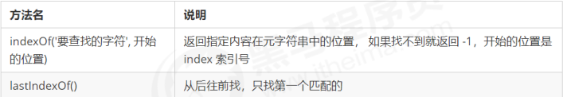

# JS基本概念

客户端脚本语言

与之相对应的是后端（服务器端脚本语言）

从语言特性上讲，JS是一个基于原型继承的语言

### JS 引擎机制

1. JSON格式的语法（ + - {} [] 等）是引擎直接解释，效率高。

   （使用`String() Array()`等会调用构造器(Builder或Buffer)再解释，多加一层对象包裹）

2. 使用正则表达式，写的速度更快。

3. 尽可能的少定义、使用全局变量

js 是单线程。所有的任务需要排队处理，当前任务结束，才能执行下一个任务

1. 所有同步任务都会在主线程上形成一个 执行栈
2. 在主线程外有一个 task queue ，只要异步任务有了运行结果，就在 task queue 中放置一个事件，进入等待状态等待状态
3. 当前执行栈所有同步任务执行结束后，系统会读取 task queue，这些异步任务结束等待状态，进入执行栈，开始执行
4. 主线程不断重复第三步
5. 

### 组成

ECMAScript，由ECMA-262定义，提供核心语言功能

语法、类型、语句、关键字、保留字、操作符、对象。

### 联入

```html
<script type=”text/javascript”>     </script>
<script type=”text/javascript” src=”ecma.js”> </script>
```

属性：async 异步脚本，立即下载，不影响其他加载，加载顺序不一定

```html
<script type=”text/javascript” src=”url” async=”async></script>
<!-- type 默认载入，可以不写 -->
```

defer 延迟脚本，立即下载，延迟到页面加载和显示后执行，加载顺序不一定

```html
   <script type=”text/javascript” src=”url” defer></script>
```

### 注释

- //开头，用于一行代码上
- /*……*/多行，用于函数或一段代码上
- /**……*/，用于系统

一般放在页面内容后面，</body>之前，按先后执行

浏览器在不支持或不启用脚本时用<noscript></noscript>可以包含除<script>的所有HTML元素

### 兼容XHTML

```js
   <script type=”text/javascript”>
    //<![CDATA[
    …]
    //]]>
  </script>
```

### 兼容老版本浏览器

```html
<script>
	<!-- js 代码 -->
</script>
```

防止老版本浏览器把JavaScript源代码当作页面内容显示出来

## 语法

代码块用“{ }“包裹，代码用” ；“分割

\+ - * / 前后加空格

使用代码块 

```js
    if （test） {
    test = false;
    }
```

### 标识符

指开发人员为变量、属性、函数、参数取的名字。

第一个字符是：字母，下划线 _，美元字符 $。 后面可以有数字 一般采取驼峰式

不能用：关键字、保留字、true、false、null、undefined

1. 关键字

   |            |      |         |          |           |         |        |
   | ---------- | ---- | ------- | -------- | --------- | ------- | ------ |
   | break      | case | catch   | continue | debugger* | default | delete |
   | do         | else | finally | for      | function  | if      | in     |
   | instanceof | new  | return  | switch   | this      | throw   | try    |
   | trpeof     | var  | void    | while    | with      |         |        |

2. 保留字

   |          |           |         |             |           |           |
   | -------- | --------- | ------- | ----------- | --------- | --------- |
   | abstract | boolean   | byte    | char        | class     | const     |
   | enum     | export    | extends | final       | float     | goto      |
   | int      | interface | long    | native      | package   | private   |
   | short    | static    | super   | synchroized | throws    | transient |
   | let      | yield     |         | eval        | arguments |           |


### 严格模式

“use strict” 切换为严格模式

```js
    function doSomething() {
    “use strict”;
    //函数体
    }
```

### JS 异常

语法错误，代码块无法加载

```js
   var a=19;
    document.write(a;
```

运行错误，错误代码后的内容不显示，不影响其他代码块，ps:不影响其他script标签里的内容。其他script标签内容可以引用错误代码后的内容

## 输出消息的五种方法

模态对话框：在用户单击“OK”按钮之前，页面上是不能进行其他任何操作的

- **window.alert()** 弹出对话框（父对象是 window 时 可以省略）
- **confirm()** 弹出带取消对话框，用于if
- **prompt()** 接受用户信息
- **console.log()** 在网页中控台输出消息，同行输出多个用 `,` 隔开
- **document.write()** 在页面输出消息，可输入HTML标签，加载后用会覆盖页面

## 作用域

JavaScript（es6前）中的作用域有两种：

- 全局作用域

  - 作用于所有代码执行的环境(整个 script 标签内部)或者一个独立的 js 文件。

  - 严格模式需要在函数外声明变量

    省略var操作符会创建全局变量，只要调用过一次，就可以在函数外访问。会因为变量不会马上有定义导致不必要的混乱。未声明在严格模式中会抛出 ReferenceError 错误

    ```js
        var text = "1";   // 全局变量
    	function test() {
            message = "hi"; // 全局变量
        }
        Test ();
    ```

- 局部作用域（函数作用域）

  - 在函数内定义的变量属于该函数中的局部变量。函数退出后就会被销毁，节省内存空间

    形参实际上是局部变量

    ```js
        function test() {
            var message = "hi"; // 局部变量
        }
        Test ();  
    ```

作用域链：在内部函数可以访问外部函数变量的这种机制，用链式查找决定哪些数据能被内部函数访问

采取就近原则的方式来查找变量最终的值。


## 预解析

- 预解析：在当前作用域下, JS 代码执行之前，浏览器会默认把带有 var 和 function 声明的变量在内存中
  进行提前声明或者定义。
- 代码执行： 从上到下执行JS语句。

变量提升： _变量的声明会被提升到当前作用域的最上面，变量的赋值不会提升。_

```js
console.log(num); // 结果是 undefined
var num = 10; 

// 等同于
var num;
consoloe.log(num);
num = 10;
```

函数提升：_函数的声明会被提升到当前作用域的最上面，但是不会调用函数。_

```js
fn();
function fn() {
console.log('打印');
}

// 等同于
function fn() {
console.log('打印');
}
fn();
```

特殊情况：

1. 变量，函数同名，函数优先级高，覆盖变量
2. 同名变量，第一个生效
3. 同名函数，后面覆盖前面

## 变量(保存一个值)

在 __stack（栈）__内存中开辟一个空间存放变量值，名字就叫变量名。

```js
// 改变变量值是新开辟一个空间存放值，名字也指向它，原空间的值是不可变的
var str = '';
for (var i = 0; i < 100000; i++) {
 str += i;
}
console.log(str); // 在大量拼接字符串时，会有效率问题，因为需要不断开辟空间
```

### var 操作符

```
声明： `var mess`在 环境/上下文 中指定一个变量的名字。有var和变量名

初始化： `var mess=1,age=3;`给一个声明后尚未初始化的变量一个有意义的初始值。有var,变量名和值

赋值： `mess=1;mess=2;`销毁一个变量原来的值，并赋予一个新值，相当于改变了一个变量的状态。有变量名和值
```

注意：**应注意区分初始化和赋值，在初始化之前不允许对变量进行赋值操作（意思就是声明的时候就要初始化，赋值就要销毁原来的变量）,变量初始化之后不改变数据类型**

定义多个变量，用逗号隔开

```js
var message = “hi”,
    found = false,
    age = 29;
```

### 特殊情况

| 情况                       | 说明             | 结果      |
| -------------------------- | ---------------- | --------- |
| var are; console.log(are); | 不初始化         | undefined |
| console.log(are);          | 不声明，不初始化 | 报错      |
| are = 10; console.log(are) | 不声明           | 10        |

定义多个变量，用逗号隔开

```js
    var message = “hi”,
        found = false,
        age = 29;
```

## 数据类型

JavaScript 是一种弱类型或者说动态语言。这意味着不用提前声明变量的类型，在程序运行过程中，类型会
被自动确定 

**返回数据类型**

*typeof()* 返回数据类型:`typeof(...) / typeof ...`

### 区别

- 简单类型：在存储时变量中存储的是值本身，因此叫做值类型
- 复杂类型：在存储时变量中存储的仅仅是地址（引用），因此叫做引用类型。

堆栈空间分配区别：（JavaScript中实际上没有堆栈的概念）

1. 栈（操作系统）：由操作系统自动分配释放存放函数的参数值、局部变量的值等。其操作方式类似于数据结构中的栈；**简单数据类型存放到栈里面**
2. 堆（操作系统）：存储复杂类型(对象)，一般由程序员分配释放，若程序员不释放，由垃圾回收机制回收。**复杂数据类型存放到堆里面**

- 值类型变量的数据直接存放在变量（栈空间）中

- 引用类型变量（栈空间）里存放的是地址，真正的对象实例存放在堆空间中

  ```js
  function Person(name) {
      this.name = name;
  }
  
  function f1(x) { // x = p 
      x.name = "张学友";  // 3.把堆里的 name 改为“张学友”，   
  }
  
  var p = new Person("刘德华");
  // 1.在堆里存放函数，同时在栈里生成一个地址指向这个堆，p变量指向这个地址
  console.log(p.name);    // 1.此时 name 是“刘德华”
  f1(p); // 2.x = p = Person；把 p 在栈里的地址（Person）赋值给 x ，指向堆里同一个对象
  console.log(p.name);    // 4.因为 x、p 指向同一地址，所以 name 一起改变 \u
  ```

  ```js
  var a = {
      name = "mu";
  }
  var b = a;
  a.name = "mumu";
  console.log(b); //b 和 a 指向同一个地址 b = a
  
  a = {
      name = "haha";
  }
  // a 整个对象改变，因为复杂数据类型的大小具有不确定性，所以开辟一个新的内存块储存对象，
  
  console.log(b); // 因为内存块不同，b 不变
  ```

### 简单数据类型

| 简单数据类型 | 说明                                                 | 默认值    |
| ------------ | ---------------------------------------------------- | --------- |
| undefined    | 变量未初始化：`var x;`，或者接受的函数没有明确返回值 | undefined |
| null         | 值为空：`var x=null;`                                | null      |
| boolean      | 布尔值类型：true、false，等价于 0 和 1               | false     |
| number       | 数字型：包括整数和浮点数                             | 0         |
| string       | 字符串                                               | ""        |

如果变量用于保存对象，将变量初始化为null

#### boolean

```js
var x=true;   var x=false;
```

#### number

浮点数：最高精确小数点后17位，（注意：不要测试特定的浮点数值`0.1+0.2 == 0.3`）

```js
var x=2;
```

进制： 十进制，八进制（前面加0，严格模式下无效），十六进制（前面加0x）

八进制：标准模式下，变量为数字，看作八进制；变量为**字符串，忽略前导 0 **，看作十进制。

科学记数法：3.125e+5 = 312500 / 0.000003 = 3e-6（符合为正数时可省略）

- 最大值和最小值

  ```
  conlose.log(Number.MAX_VALUE); // 1.7976931348623157e+308
  console.log(Number.MIN_VALUE); // 5e-324
  ```

- 无穷大：Infinity

- 非数值：NaN ，（不等于任何值），`IsNaN() `判断是不是非数值

#### string

```js
var x="2";
x = x+”4”;         //输出”24”
```

转义字符

| 代码 | \ '    | \ "    | \ &  | \\   | \n     | \r     | \t            | \b     | \f     |
| ---- | ------ | ------ | ---- | ---- | ------ | ------ | ------------- | ------ | ------ |
| 输出 | 单引号 | 双引号 | 和号 | 斜杠 | 换行符 | 回车符 | 制表符（Tab） | 退格符 | 换页符 |

#### 类型转换

- boolean()   
  | 数据类型  | 结果为 ture             | 结果为 false |
  | --------- | ----------------------- | ------------ |
  | string    | 非空字符串              | 空字符串     |
  | number    | 任何非0数值，包括无穷大 | 0和NaN       |
  | Object    | 任何对象                | null         |
  | undefined | N/A（不适用）           | undefined    |

- string

  - 数字转字符串**不用声明转换前的进制**，会自动识别
  - 转换前先转换为十进制

  1. .toString()    

     用来转换数字，后面可以写转换后的基数（进制），

     不支持null和undefined

     注意：`.toString`前面不能直接写10进制数字，八进制和十六进制或者变量等可以

     ```js
     var num = 1;
     alert(num.toString(10));
     ```

  2. String()

     几乎所有值都可以 ,有toString()方法，调用该方法, 

     Null返回”null”,undefined返回”undefined”

     ```js
     var num = 1;
     alert(String(num));
     ```

  3. "+" 拼接字符串

     ```js
     var num = 1;
     alert(num + "");
     // 效率最高，但是不支持 Symbol('123') 类型转换
     ```

- numer

  string 转 number 默认忽略前导 0

  处理整数字符串转换为 10 进制数字

  1. Number()

     | undefined | null | boolean,true and false | number               | string                                                       | 对象                                                 |
     | --------- | ---- | ---------------------- | -------------------- | ------------------------------------------------------------ | ---------------------------------------------------- |
     | NaN       | 0    | 1 and 0                | 不变（识别进制写法） | 纯数字转化为数值，（保留符号-+及小数） 。包含其他字符，转化为NaN 。空字符串和空格转化为0 | 调用valueOf()方法，如果结果是NaN，调用toString()方法 |

  2. parseInt() （重点）

     ，非数字转换为NaN，不识别空字符串

     从第一个字符（首位是空格时会忽略）开始到第一个非数字字符结束，（认识符号，不认识小数，认识整数格式（各种进制）） 。空字符串和第一个字符非数字的字符串返回NaN

     ```js
     var str = "0x329382";
     alert(parseInt(str, 16));  // 后一个参数为被转换前的基数（进制）
     // 没有字母转换（包括没有16进制写法），不带基数速度最快
     ```

  3. parseFloat()（重点）

     和parseInt()类似，区别：1 识别有效浮点数字字符，2 只解析10进制

  4. （ - * / ）隐式转换

     ```js
     var str = 12;
     str -= 0;
     // 速度和 Number 差不多
     ```

### 复杂数据类型

引用值heap（堆）

**判断对象类型**

instanceof 运算符

```js
var arr = [1, 23];
console.log(arr instanceof Array); // true
```

#### new

使用`new`操作符可以创建引用类型，

基本类型和引用类型的区别：

- 基本类型在执行代码的**瞬间**会创建基本包装类型，方法执行完毕，对象被立即销毁，（不能为正在运行的基本类型添加属性和方法）

  ```js
  var s1 = "some text";
  alert(s1.substring(0)); //some text
  s1.color = "red";
  alert(s1.color);    //undefined
  ```

- 引用类型在执行流离开当前作用域前**一直保存**在内存中

  ```js
  var s2 = new String("another text");
  s2.color = 'blue';
  alert(s2.color);    //blue
  ```

#### Object

对象有时候被叫做关联数组

`typeof Object` 返回的是 function 

对象：是一组无序的相关属性和方法的集合，所有的事物都是对象，例如字符串、数值、数组、
函数等。

- 属性：事物的特征，在对象中用属性来表示（常用名词），属性包含一个键（名）和一个值
- 方法：事物的行为，在对象中用方法来表示（常用动词），是储存对象属性的函数
  - javascript的方法可以分为三类：
    1. 类方法
    2. 对象方法
    3. 原型方法

对象分三种：自定义对象 、内置对象、 浏览器对象（前面两种对象是JS 基础 内容，属于 ECMAScript； 第三个浏览器对象属于JS 独有的）

##### 自定义对象

1. 创建对象

   1. new Object()  在初始化大数组时，性能更加优异

      ```js
      var o = new Object ();  // new操作符后面跟创建的对象类型的名称，
      com.name = "x8";
      com.play = function() {
          alert("看电影");
      }
      //使用 new 会调用构造器，多加一层对象包裹，但是更符合对象化继承的概念
      ```

   2. 字面量 

      ```js
      var star = {
          name: 'pink',
          sayHi: function() {
              alert('大家好啊~');
          }
      }
      
      }  // 可以直接写属性和方法，用“:”连接属性和值，
      ```

   3. 构造函数创建
      对象的属性和方法封装成的函数叫构造函数，用来初始化对象，这个过程叫做`对象实例化`

      ```js
      function Person(name, age, sex) {
          this.name = name;  // 2. this指向对象   3. 给对象添加属性和方法 
          this.age = age;
          this.sex = sex;
          this.sayHi = function() {
          alert('Hi！我的名字叫：' + this.name + '，年龄：' + this.age + '，性别：' + this.sex);
          }
      }  // 4. 返回对象 不需要return
      var bigbai = new Person('大白', 100, '男');  // 1. 创建空对象
      var smallbai = new Person('小白', 21, '男');
      console.log(bigbai.name);
      console.log(smallbai.name);
      ```

      - 构造函数约定首字母大写。
      - 函数内的属性和方法前面需要添加 this ，表示当前对象的属性和方法。
      - 构造函数中不需要 return 返回结果。
      - 必须用 new 来调用构造函数，来创建对象

2. 调用

   - 属性调用：

     1. 对象 . 属性

        ```js
        console.log(star.name); // 调用 name 属性
        ```

     2. 对象 [ ' 属性 ' ]

        ```js
        console.log(star['name']); // 括号里的属性名是字符串必须加引号
        ```

   - 方法调用：

     对象 . 方法名 ();   `star.sayHi(); `          方法名后面要加括号

3. 特殊情况

   Object有的属性和方法会存在更具体的对象里

   - **.constructor**：保存着用于创建当前对象的函数。对于前面的例子而言，构造函数   （constructor）就是 Object()。
   - **.hasOwnProperty(propertyName)**：用于检查给定的属性在当前对象实例中（而不是在实例的原型中）是否存在。其中，作为参数的属性名（propertyName）必须以字符串形式指定（例如：   o.hasOwnProperty("name")）。
   - **.isPrototypeOf(object)**：用于检查传入的对象是否是传入对象的原型
   - **.propertyIsEnumerable(propertyName)**：用于检查给定的属性是否能够使用 for-in 语句来枚举。   与 hasOwnProperty()方法一样，作为参数的属性名必须以字符 串形式指定。
   - **.toLocaleString()**：返回对象的字符串表示，该字符串与执行环境的地区对应。
   - **.toString()**：返回对象的字符串表示。
   - **.valueOf()**：返回对象的字符串、数值或布尔值表示。通常与 toString()方法的返回值 相同。

##### 内置对象

Math、Date、Array、基本包装类型

1. Math

   Math 不是构造器，它的属性和方法都是静态的。

   ```js
   Math.PI() // 圆周率
   Math.floor() // 向下取整
   Math.ceil() // 向上取整
   Math.round() // 四舍五入版 就近取整 
   Math.abs() // 绝对值
   Math.max()/Math.min() // 求最大和最小值
   Math.random() // 随机数
   
   // 这些方法必须带 “()"，否则得到的是函数本身而非结果
   ```

   四舍五入：注意：-0.5 结果是 -0，0.5 结果是 1

   随机数：[0，1) === 左闭右开区间。即从0（包含0）到...1但不包括1（排除1）。

   ```js
   // 两个数之间的随机数
   function getRandomArbitrary(min, max) {
       return Math.floor(Math.random() * (max - min)) + min // 不包含最大值
       return Math.floor(Math.random() * (max - min + 1)) + min // 包含这两个数
   }
   ```

2. Date

   日期是构造函数，需要实例化

   Date 对象是基于1970年1月1日（世界标准时间）起的毫秒数(1000ms = 1s)

   ```js
   var now = new Date(); // 不写参数，就返回当前时间；写参数就返回输入的时间
   ```

   基本方法：

   **获取指定时间的时间戳：**

   ```js
   // 实例化Date对象
   var now = new Date("2020-6-22 00:00:00");
   // 1. 用于获取对象的原始值的2种方法
   console.log(now.valueOf())
   console.log(now.getTime())
   // 2. 简单写可以这么做 (最常用)
   var now = + new Date();
   // 3. HTML5中提供的方法，有兼容性问题
   var now = Date.now();
   ```

   **时间戳转换小时，会比本地时间早八小时（相差八个时区）**

   ```js
    $.renderDateTime = function (jsondate) {
       var timeStamp = parseInt(jsondate.replace(/\D/igm, ""));
       timeStamp = timeStamp - 8 * 60 * 60 * 1000; //（本地时间）东八区减去8小时
       var date = new Date(timeStamp);
   
       var year = date.getFullYear();
       var month = date.getMonth() + 1;
       var day = date.getDate();
       var hour = date.getHours();
       var minute = date.getMinutes();
       var second = date.getSeconds();
       return year
           + "-" + (month < 10 ? "0" + month : month)
           + "-" + (day < 10 ? "0" + day : day)
           + " " + (hour < 10 ? "0" + hour : hour)
           + ":" + (minute < 10 ? "0" + minute : minute)
           + ":" + (second < 10 ? "0" + second : second);
   };
   
   链接：https://juejin.im/post/5caee550e51d456e3b70185b
   来源：掘金
   ```

   

3. Array

   保存多个值

   **创建：**

   1. 利用 new Array 创建

      ```js
      var 数组名 = new Array(varlue, value1) ； // A 要大写，值可以直接写在小括号里
      var arr = new Array(); // 创建一个新的空数组
      ```

   2. 利用数组字面量创建数组（常用）

      ```js
      //1. 使用数组字面量方式创建空的数组
      var 数组名 = []；
      //2. 使用数组字面量方式创建带初始值的数组
      var 数组名 = ['小白','小黑','大黄','瑞奇'];
      ```

   索引 (下标) ：用来访问数组元素的序号（数组下标从 0 开始）。数组可以通过索引来访问、设置、   修改对应的数组元素，

   访问：我们可以通过“数组名[索引]”的形式来获取数组中的元素

   ```js
   // 定义数组
   var arrStus = [1,2,3];
   // 获取数组中的第2个元素
   alert(arrStus[1]); 
   ```

   数组的长度：“数组名.length”

   ```js
   var arrStus = [1,2,3];
   alert(arrStus.length); // 3
   ```

   **新增数组元素：**

   1. 修改数组索引新增数组元素（ 常用）

      - 可以通过修改数组索引的方式追加数组元素
      - 不能直接给数组名赋值，否则会覆盖掉以前的数据

      ```js
      var arr = ['red', 'green', 'blue', 'pink'];
      arr[4] = 'hotpink';
      console.log(arr);
      ```

   2. 修改 length 长度新增数组元素

      ```js
      var arr = ['red', 'green', 'blue', 'pink'];
      arr.length = 7;  // 索引号是 4，5，6 的空间没有给值，就是声明变量未给值，默认值就是    undefined。
      ```

   **基本方法**

   - **修改数组元素**   
   - **索引查找：**
   - **转换为字符串**
   - **数组排序：**
   - **截取数组：**

   关于返回值：push() 的返回值的意思是：`console.log(arr.push(3,2));`

   **判断是否为数组：**

   ```js
   Array.isArray(arr) // H5新增 Array.isArray() 可以检测 iframes，优于 instanceof
   ```

   **遍历数组用 `for` 循环**

4. 基本包装类型

   把简单的数据类型包装成复杂数据类型，

   - String

     ```js
     var str = "hi!";
     // 1. 把简单数据类型包装成 临时复杂数据类型
     var temp = new String("hi!");
     // 2. 把临时变量的值给 str
     str = temp;
     // 3. 销毁这个临时变量
     temp = null;
     ```

     基本方法：

     - 查找索引

     - 查找字符（重点）<a href="https://tool.oschina.net/commons?type=4">ASCII 编码对照表</a>           

     - 字符串操作方法（重点）

     - replace()方法

       ```js
       // 于在字符串中用一些字符替换另一些字符
       replace(被替换的字符串， 要替换为的字符串)；
       ```

     -  split()方法

       ```js
       // 以将字符串切分为数组。在切分完毕之后，返回的是一个新数组
       var str = 'a,b,c,d';
       console.log(str.split(',')); // 返回的是一个数组 [a, b, c, d]
       ```

     - 其他

       ```js
       toUpperCase() //转换大写 
       toLowerCase() //转换小写
       ```

   - Number

   - boolean

##### 浏览器对象

- 

##### 对象化

可以不使用`new`实现对象化，比如使用`function`作为一个基类：

```js
function foo () {  //没有对象化
  var name = 'name'
}
foo.prototype.getName = function () { console.log(1) }
var t = foo()  // undefined，不是想要继承getName方法的对象
```

解决方法：

1. ```js
   // 在 function 中添加代码
   function foo()
   {
      // 如果用户没有使用new进行调用 则静默调用new
      if ( !(this instanceof foo) )
         return new foo();
   
      // 构造函数逻辑如下...
   }
   ```

2. ```js
   // 更通用代码
   function foo()
   {
      // 如果用户没有使用new进行调用 则静默调用new
      if ( !(this instanceof arguments.callee) )  // 在这里不再使用foo来判定，而是通过callee来进行
      throw new Error("作为函数调用的构造函数");
   }
   ```

#### 函数

函数：就是封装了一段可被重复调用执行的代码块

函数在使用时分为两步：声明函数和调用函数。

声明：使用 `function` （必须小写）关键字来声明，后跟一组参数以及函数体

通常我们将函数名命名为**动词**

```js
function functionName(arg0, arg1,...,argN) {
 statements
} 
```

示例：

```js
function sayHi(name, message) {
 alert("Hello " + name + "," + message);
}
        sayHi("Nicholas", "how are you today?");
```

调用函数：functionName();

- 形参
  - 在函数名称后面的小括号中添加一些参数
- 实参
  - 在调用该函数时，传递的相应的参数

**注意：不要忘记添加小括号**

没有函数签名的概念,在 ECMAScript 中定义了两个名字相同的函数，则该名字只属于后定义的函数

##### 参数

它是当前函数的一个内置对象，存储了传递的所有实参。

通过 arguments 对象来访问这个参数数组，从而获取传递给函数的每一个参数

- 具有 length 属性
- 按索引方式储存数据
- 不具有数组的 push , pop 等方法

1. arguments 对象的长度是由传入的参数个数决定的，不是由定义函数时的 命名参数 的个数决定的
2. 没有传递值的命名参数将自动被赋予 undefined 值
3. ECMAScript 中的所有参数传递的都是值，不可能通过引用传递参数。
4. 重写 arguments 的值会导致语法错误

##### 调用

```js
  var a = 1;
    function b(){
        console.log(a);
    }
    b(); // 调用函数
```

##### return

函数在任何时候都可以通过 return 语句后跟要返回的值来实现返回值

示例：

```js
var result = 0;
function sum(num1, num2) {
    console.log(num1 + num2);
    return num1 + num2;  // return 语句之后结束大括号之前的任何代码 都永远不会执行
}
console.log(sum(5, 10)); // 调用函数并输出函数值，未指定返回值的函数,返回的是 undefined 值
```

##### 匿名函数

```js
// 这是函数表达式写法，匿名函数后面跟分号结束
var fn = function(){...}；
// 匿名函数调用必须写到函数体下面
fn();
```

##### 基本点

```js
  var a = 1;
    function b(){
        a = 2;  // 把函数变量a()重新赋值成数字变量，因为 a() 是局部变量,所以 a 也是局部变量
        console.log(a);
        //有函数，a不变；没函数，a变2
        function a(){};
    }
    b();// 调用函数，会输出函数的 模态对话框
    console.log(b()); // 1. 调用函数，会输出函数的模态对话框。2. 输出函数结果为 undifinde 。因为函数没有返回值，?:如果后面没有（）会输出这个函数的代码
    console.log(a);//输出1
```

## 操作符

用于操作数据值：算术操作符、位操作符、关系操作符、相等操作符

### 一元操作符

只能操作一个值

#### 递增、递减

```js
++age;     age=age+1
age--;     age=age-1
```

**前置**

```js
Var age=34;
Var dse=2
Var cde = --age + dse      //等于35
Var esd = age + dse       //等于35
```

**后置**

```js
Var age=34;
Var dse=2
Var cde= age-- + dse      //等于36
Var esd = age + dse       //等于35
```

#### 一元加、减

```js
var num = 25;
num = +num;      //仍然是25
var num = 25;
num = -num;      //值为-25
```

其他数据类型运用Number()转化为数值变量，如数字值或NaN

### 位操作符

数值以64位格式储存。位操作符将64位转换位32位操作，再将值转换为64位。NaN和Infinity会被转化成0，非数值用Number()函数转换

有符号整数：前31位表示数值，第32位为符号位，0为正，1为负

无符号整数：32位数值，只有正数。

正数用纯二进制格式，负数用二进制补码:1 求绝对值 2 求反码 3 加1

1. 按位非(NOT)

   由波浪线（~）表示，结果是返回数值的反码。一位操作数

   ```js
   var num1=25;
   var num2=~num1;         //输出-26
   ```

   本质：操作数的负值减1。

2. 按位与(AND)

   由和号字符表示(&)。两位操作数

   将两个数的每一位对齐，同为1时返回1，否则返回0。

3. 按位或(OR)

   由竖线符号表示（|）。两位操作数

   至少有一位是1，返回1，否则返回零

4. 按位异或(XOR)

   由一个插入符号表示（^）。两位操作数

   只有一位是1，返回1，两位都是1或0，返回0

5. 左移

   由两个小于号表示（<<），一位操作数

   所有位向左移动指定位数，不会影响符号位，空白用0填充。

6. 有符号右移

   由两个大于号表示（>>）,一位操作数

   所有位向右移动指定位数，不会影响符号位，空白用0填充。

7. 无符号右移

   由三个大于号表示（>>>）

   所有位向右移动指定位数，（包括符号位），空白用0填充。

### 布尔操作符

#### 逻辑非

(NOT)：由一个叹号（!）表示，将操作数转换成布尔值，再对其求反。

1. 对象，返回false
2. 空字符串，返回true
3. 非空字符串，返回false
4. 数值0，返回true
5. 非0数值（包括Infinity），返回false
6. null，返回true
7. NaN，返回true
8. undefined，返回true

```js
alert(!false);      //true
```

同时使用两个逻辑非操作符，相当于模拟Boolean()转型函数行为。

```js
alert(!!false);     //false
```

#### 逻辑与

(AND)：由两个和号(&&)表示，有两个操作数。

同为true,返回true；否则返回false。

有一个数不是布尔值，结果不一定返回布尔值

1. 第一个操作数是对象，返回第二个操作数
2. 第二个操作数是对象，只有在第一个操作数值为true时返回对象
3. 两个操作数都是对象，返回第二个操作数
4. 有一个null，返回null
5. 有一个NaN，返回NaN
6. 有一个undefined，返回undefined

属于**短路操作**

#### 逻辑或

(OR)：由两个竖线符号表示（||），有两个操作数

同为false，返回false，否则返回true。

有一个数不是布尔值，结果不一定返回布尔值

1. 第一个操作数是对象，返回第一个操作数
2. 第一个操作数结果为false，返回第二个操作数
3. 两个都是对象，返回第一个操作数
4. 两个都是null，返回null
5. 两个都是NaN，返回NaN
6. 两个都是undefined，返回undefined

属于**短路操作**

#### 短路操作

短路运算的原理：当有多个表达式（值）时,左边的表达式值可以确定结果时,就不再继续运算右边的表达式的值;

- 逻辑与

  1. 语法：表达式1 && 表达式2
  2. 如果第一个表达式为真，则返回 表达式2
  3. 否则返回 表达式1

  ```js
  console.log( 123 && 456 ); // 456
  ```

- 逻辑或

  1. 语法：表达式1 || 表达式2
  2. 如果第一个表达式为真，则返回 表达式1
  3. 否则返回 表达式2

  ```js
  console.log( 123 || 456 || 789 ); // 123
  ```

### 乘性操作符

#### 乘法

由一个星号表示(*),计算两个数值的乘积。

1. 超过表示**范围**用Infinity或-Infinity
2. 有一个是NaN，结果是NaN
3. Infinity与0相乘，结果是NaN
4. Infinity与非0相乘，结果是Infinity
5. Infinity与Infinity相乘，结果是Infinity
6. 如果有操作数不是数值，则调用Number()

#### 除法

由一个斜线符号表示(/)

1. 超过表示范围用Infinity或-Infinity
2. 有一个是NaN，结果是NaN
3. Infinity被Infinity除，结果是NAN
4. 非0的有限数被0除，结果是Infinity
5. 0被0除，结果是NaN
6. Infinity被任何非0数值除，结果是Infinity
7. 如果有操作数不是数值，则调用Number()

#### 求模

（余数）由一个百分号表示(%)

1. 都是数值正常计算
2. 被除数是Infinity，除数是有限数值，结果是NaN
3. 被除数是有限大，除数是0，结果是NaN
4. Infinity被Infinity除，结果是NaN
5. 被除数是有限大，除数是Infinity，结果是被除数
6. 被除数是0，结果是0
7. 有一个不是数值，调用Number()

### 加性操作符

"(",")"括号可以改变算术顺序

#### 加法

1. 两个都是数值，有一个是NaN，结果是NaN
2. Infinity加Infinity，结果是Infinity
3. \- Infinity加 - Infinity，结果是 - infinity
4. INfinity加 - Infinity，结果是NaN
5. 0加0，结果是0
6. \- 0加 - 0，结果是 - 0
7. 0加 - 0，结果是0
8. 两个都是字符串，就拼接起来
9. 有一个操作数是字符串，将另一个操作数转换成字符串

#### 减法

1. 有一个是NaN，返回NaN
2. Infinity减Infinity，结果是NaN
3. \- Infinity减 - Infinity，结果是NaN
4. Infinity减 - Infinity，结果是Infinity
5. \- Infinity减Infinity，结果是 - Infinity
6. 0-0，结果是0
7. 0-(-0），结果是0
8. -0-(0)，结果是0
9. 有一个是其他类型，调用Number()函数
10. 有一个是对象，调用对象的valueOf()方法，如果没有，调用toString()方法

### 关系操作符

**"<" ">" "<=" ">="**

1. 两个数都是字符串，比较两个字符串每个字符的字符编码值，位置越靠后越大
2. 只有一个是数值，将另一个转换为数值
3. 有一个是对象，先调用valueOf()方法，没有则调用toString()方法
4. 有一个是布尔值，先转化为数值

### 相等操作符

#### == 和 !=

（比较前强制转型）

1. 有一个操作数是布尔值，比较前转换为数值
2. 有一个是字符串，另一个是数值，先将字符串转换为数值
3. 有一个是对象，另一个不是，先调用valueOf()

比较中

1. 不能将null和undefined转换为其他值
2. null和undefined是相等的
3. 有一个是NaN，相等返回false，不相等返回true
4. 两个都是对象，是同一个对象，返回true，否则返回false

__*不要直接判断两个浮点数是否相等*__

#### ===和 !==

在比较之前不转换操作数

### 条件操作符

也叫三元运算符

```js
var max = (num1 > num2) ? num1 : num2;
```

如果 num1 大于 num2（关 系表达式返回 true），则将 num1 的值赋给 max；如果 num1 小于或等于 num2（关系表达式返回 false）， 则将 num2 的值赋给 max。

### 赋值操作符

由等于号表示(=)

复合赋值操作。使用它们不会带来任何性能的提升。

```js
var num = 10;
num = num + 10;
var num = 10;
num += 10; 
```

1. *=
2. /=
3. %=
4. +=
5. -=
6. <<=
7. \>>=
8. \>>>=

### 逗号操作符

用于声明多个变量

```js
var num1=1, num2=2, num3=3;
```

用于赋值，会返回表达式中的最后一项

```js
var num = (5, 1, 4, 8, 0); // num 的值为 0
```

### 优先级

从最高（21）到最低（1）优先顺序排列

| 优先顺序 | 操作员类型                                                   | 关联性 | 操作符           |
| :------- | :----------------------------------------------------------- | :----- | :--------------- |
| 21       | [`圆括号`](https://developer.mozilla.org/en-US/docs/Web/JavaScript/Reference/Operators/Grouping) | 不适用 | `( … )`          |
| 20       | [`属性访问器`](https://developer.mozilla.org/en-US/docs/Web/JavaScript/Reference/Operators/Property_Accessors#Dot_notation) | 左到右 | `… . …`          |
|          | [`需计算的属性访问器`](https://developer.mozilla.org/zh-CN/docs/Web/JavaScript/Reference/Operators/Property_Accessors#%E6%8B%AC%E5%8F%B7%E8%A1%A8%E7%A4%BA%E6%B3%95) | 左到右 | `… [ … ]`        |
|          | [`new`](https://developer.mozilla.org/en-US/docs/Web/JavaScript/Reference/Operators/new) （带有参数列表） | 不适用 | `new … ( … )`    |
|          | [`函数调用`](https://developer.mozilla.org/en-US/docs/Web/JavaScript/Guide/Functions) | 左到右 | `… ( … )`        |
|          | [可选链接](https://developer.mozilla.org/en-US/docs/Web/JavaScript/Reference/Operators/Optional_chaining) | 左到右 | `?.`             |
| 19       | [`new`](https://developer.mozilla.org/en-US/docs/Web/JavaScript/Reference/Operators/new) （没有参数列表） | 右到左 | `new …`          |
| 18       | [后缀增量](https://developer.mozilla.org/en-US/docs/Web/JavaScript/Reference/Operators/Arithmetic_Operators#Increment) | 不适用 | `… ++`           |
|          | [后缀递减](https://developer.mozilla.org/en-US/docs/Web/JavaScript/Reference/Operators/Arithmetic_Operators#Decrement) |        | `… --`           |
| 17       | [`逻辑非`](https://developer.mozilla.org/en-US/docs/Web/JavaScript/Reference/Operators/Logical_Operators#Logical_NOT) | 右到左 | `! …`            |
|          | [按位非](https://developer.mozilla.org/en-US/docs/Web/JavaScript/Reference/Operators/Bitwise_Operators#Bitwise_NOT) |        | `~ …`            |
|          | [一元加](https://developer.mozilla.org/en-US/docs/Web/JavaScript/Reference/Operators/Arithmetic_Operators#Unary_plus) |        | `+ …`            |
|          | [一元减](https://developer.mozilla.org/en-US/docs/Web/JavaScript/Reference/Operators/Arithmetic_Operators#Unary_negation) |        | `- …`            |
|          | [前缀增量](https://developer.mozilla.org/en-US/docs/Web/JavaScript/Reference/Operators/Arithmetic_Operators#Increment) |        | `++ …`           |
|          | [前缀递减](https://developer.mozilla.org/en-US/docs/Web/JavaScript/Reference/Operators/Arithmetic_Operators#Decrement) |        | `-- …`           |
|          | [`typeof`](https://developer.mozilla.org/en-US/docs/Web/JavaScript/Reference/Operators/typeof) |        | `typeof …`       |
|          | [`void`](https://developer.mozilla.org/en-US/docs/Web/JavaScript/Reference/Operators/void) |        | `void …`         |
|          | [`delete`](https://developer.mozilla.org/en-US/docs/Web/JavaScript/Reference/Operators/delete) |        | `delete …`       |
|          | [`await`](https://developer.mozilla.org/en-US/docs/Web/JavaScript/Reference/Operators/await) |        | `await …`        |
| 16       | [求幂](https://developer.mozilla.org/en-US/docs/Web/JavaScript/Reference/Operators/Arithmetic_Operators#Exponentiation) | 右到左 | `… ** …`         |
| 15       | [乘法](https://developer.mozilla.org/en-US/docs/Web/JavaScript/Reference/Operators/Arithmetic_Operators#Multiplication) | 左到右 | `… * …`          |
|          | [除](https://developer.mozilla.org/en-US/docs/Web/JavaScript/Reference/Operators/Arithmetic_Operators#Division) |        | `… / …`          |
|          | [余](https://developer.mozilla.org/en-US/docs/Web/JavaScript/Reference/Operators/Arithmetic_Operators#Remainder) |        | `… % …`          |
| 14       | [加法](https://developer.mozilla.org/en-US/docs/Web/JavaScript/Reference/Operators/Arithmetic_Operators#Addition) | 左到右 | `… + …`          |
|          | [减法](https://developer.mozilla.org/en-US/docs/Web/JavaScript/Reference/Operators/Arithmetic_Operators#Subtraction) |        | `… - …`          |
| 13       | [按位左移](https://developer.mozilla.org/en-US/docs/Web/JavaScript/Reference/Operators/Bitwise_Operators) | 左到右 | `… << …`         |
|          | [按位右移](https://developer.mozilla.org/en-US/docs/Web/JavaScript/Reference/Operators/Bitwise_Operators) |        | `… >> …`         |
|          | [按位无符号右移](https://developer.mozilla.org/en-US/docs/Web/JavaScript/Reference/Operators/Bitwise_Operators) |        | `… >>> …`        |
| 12       | [少于](https://developer.mozilla.org/en-US/docs/Web/JavaScript/Reference/Operators/Comparison_Operators#Less_than_operator) | 左到右 | `… < …`          |
|          | [小于或等于](https://developer.mozilla.org/en-US/docs/Web/JavaScript/Reference/Operators/Comparison_Operators#Less_than__or_equal_operator) |        | `… <= …`         |
|          | [大于](https://developer.mozilla.org/en-US/docs/Web/JavaScript/Reference/Operators/Comparison_Operators#Greater_than_operator) |        | `… > …`          |
|          | [大于等于](https://developer.mozilla.org/en-US/docs/Web/JavaScript/Reference/Operators/Comparison_Operators#Greater_than_or_equal_operator) |        | `… >= …`         |
|          | [`in`](https://developer.mozilla.org/en-US/docs/Web/JavaScript/Reference/Operators/in) |        | `… in …`         |
|          | [`instanceof`](https://developer.mozilla.org/en-US/docs/Web/JavaScript/Reference/Operators/instanceof) |        | `… instanceof …` |
| 11       | [等于](https://developer.mozilla.org/en-US/docs/Web/JavaScript/Reference/Operators/Comparison_Operators#Equality) | 左到右 | `… == …`         |
|          | [不等于](https://developer.mozilla.org/en-US/docs/Web/JavaScript/Reference/Operators/Comparison_Operators#Inequality) |        | `… != …`         |
|          | [全等于](https://developer.mozilla.org/en-US/docs/Web/JavaScript/Reference/Operators/Comparison_Operators#Identity) |        | `… === …`        |
|          | [不全等](https://developer.mozilla.org/en-US/docs/Web/JavaScript/Reference/Operators/Comparison_Operators#Nonidentity) |        | `… !== …`        |
| 10       | [按位与](https://developer.mozilla.org/en-US/docs/Web/JavaScript/Reference/Operators/Bitwise_Operators#Bitwise_AND) | 左到右 | `… & …`          |
| 9        | [按位异或](https://developer.mozilla.org/en-US/docs/Web/JavaScript/Reference/Operators/Bitwise_Operators#Bitwise_XOR) | 左到右 | `… ^ …`          |
| 8        | [按位或](https://developer.mozilla.org/en-US/docs/Web/JavaScript/Reference/Operators/Bitwise_Operators#Bitwise_OR) | 左到右 | `… | …`          |
| 7        | [空位合并运算符](https://developer.mozilla.org/en-US/docs/Web/JavaScript/Reference/Operators/Nullish_coalescing_operator) | 左到右 | `… ?? …`         |
| 6        | [逻辑与](https://developer.mozilla.org/en-US/docs/Web/JavaScript/Reference/Operators/Logical_Operators#Logical_AND) | 左到右 | `… && …`         |
| 5        | [逻辑或](https://developer.mozilla.org/en-US/docs/Web/JavaScript/Reference/Operators/Logical_Operators#Logical_OR) | 左到右 | `… || …`         |
| 4        | [有条件的](https://developer.mozilla.org/en-US/docs/Web/JavaScript/Reference/Operators/Conditional_Operator) | 右到左 | `… ? … : …`      |
| 3        | [赋值](https://developer.mozilla.org/en-US/docs/Web/JavaScript/Reference/Operators/Assignment_Operators) | 右到左 | `… = …`          |
|          |                                                              |        | `… += …`         |
|          |                                                              |        | `… -= …`         |
|          |                                                              |        | `… **= …`        |
|          |                                                              |        | `… *= …`         |
|          |                                                              |        | `… /= …`         |
|          |                                                              |        | `… %= …`         |
|          |                                                              |        | `… <<= …`        |
|          |                                                              |        | `… >>= …`        |
|          |                                                              |        | `… >>>= …`       |
|          |                                                              |        | `… &= …`         |
|          |                                                              |        | `… ^= …`         |
|          |                                                              |        | `… |= …`         |
| 2        | [`yield`](https://developer.mozilla.org/en-US/docs/Web/JavaScript/Reference/Operators/yield) | 右到左 | `yield …`        |
|          | [`yield*`](https://developer.mozilla.org/en-US/docs/Web/JavaScript/Reference/Operators/yield*) |        | `yield* …`       |
| 1        | [展开运算符](https://developer.mozilla.org/zh-CN/docs/Web/JavaScript/Reference/Operators/Spread_operator) | n/a    | `...` …          |
| 0        | [逗号/序列](https://developer.mozilla.org/en-US/docs/Web/JavaScript/Reference/Operators/Comma_Operator) | 左到右 | `… , …`          |

## 流程控制

流程控制语句通常使用一或多个关键字来完成给定任务

有三种结构：**顺序结构**、**分支结构**和**循环结构**


### if 分支语句

常用于范围判断，适用于分支少的语句

```js
if (condition1) statement1 else if (condition2) statement2 else statement3
```

最常用的分支语句，条件可以是任意表达式，自动调用 Boolean()转换函数将这个表达式的结果转换为一个布尔值。结果是true，执行语句1，结果是false，执行语句2。

```js
if (i > 25) {
    alert("Greater than 25.");
} else if (i < 0) {
    alert("Less than 0.");
} else {
    alert("Between 0 and 25, inclusive.");
} 
```

### switch 分支语句

是分支语句，也是在其他语言中普遍使用的一种流控制语句,

一般用于判断确定的值（通常是个变量），适用于分支较多的语句

```js
switch (expression) {
 case value: statement
 break;
 case value: statement
 break;
 case value: statement
 break;
 case value: statement
 break;
 default: statement
} 
```

### do-while 后测试循环语句

是一种后测试循环语句，即只有在循环体中的代码执行之后，才会测试出口条件

```js
do {
    statement
} while (expression); 
var i = 0;
do {
    i += 2;
} while (i < 10);
alert(i); 
```

后测试循环语句最常用于循环体中的代码至少要被执行一次的情形

### while 循环语句

前测试循环语句，也就是说，在循环体内的代码被执行之前，就会对出口条件求值。

**注意：必须要有退出条件，否则会成为死循环**

```js
while(expression) statement
var i = 0;
while (i < 10) {
    i += 2;
} 
```

### for 循环语句

for 语句也是一种前测试循环语句，但它具有在执行循环之前初始化变量和定义循环后要执行的代码的能力，在 for 循环的变量初始化表达式中，也可以不使用 var 关键字。该变量的初始化可以在外部执行

```js
for (initialization; expression; post-loop-expression) statement
var count = 10;
for (var i = 0; i < count; i++){
    alert(i);
}
```

执行过程：初始化变量 》 执行条件表达式（true 继续执行，否则结束循环） 》 执行循环体语句 》 执行操作表达式

这个 for 循环语句与下面的 while 语句的功能相同。使用 while 循环做不到的，使用 for 循环同样也做不到。也就是说，for 循环只是把与循环有关 的代码集中在了一个位置。

```js
var count = 10;
var i = 0;
while (i < count){
    alert(i);
    i++;
}
```

ECMAScript 中不存在块级作用 域，因此在循环内部定义的变量也可以在外部访问到

```js
var count = 10;
for (var i = 0; i < count; i++){
    alert(i);
}
alert(i); //10 
```

#### 断点调试

```
断点调试的流程：
1、浏览器中按 F12--> sources -->找到需要调试的文件-->在程序的某一行设置断点
2、Watch: 监视，通过watch可以监视变量的值的变化，非常的常用。
3、摁下F11，程序单步执行，让程序一行一行的执行，这个时候，观察watch中变量的值的变化。
```

### for-in语句

是一种精准的迭代语句，可以用来枚举（遍历）对象的属性

```js
for (变量 in 对象名) 代码  // 变量一般用“k”或“key”

for (var k in obj) {
	console.log(k); // 这里的 k 是属性名
	console.log(obj[k]); // 这里的 obj[k] 是属性值
}
```

使用 for-in 循环来显示了 BOM 中 window 对象的所有属性。每次执行循环 时，都会将 window 对象中存在的一个属性名赋值给变量 propName。这个过程会一直持续到对象中的 所有属性都被枚举一遍为止。与 for 语句类似，这里控制语句中的 var 操作符也不是必需的。但是， 为了保证使用局部变量，我们推荐上面例子中的这种做法

**在使用 for-in 循环之前，先检测确认该对象的值不是 null 或 undefined**

### label语句

可以在代码中添加标签，以便将来使用

```js
label: statement
start: for (var i=0; i < count; i++) {
    alert(i);
} 
```

定义的 start 标签可以在将来由 break 或 continue 语句引用。加标签的语句一般都 要与 for 语句等循环语句配合使用

### break和continue语句

用于在循环中精确地控制代码的执行。break 语句会立即退出循环， 强制继续执行循环后面的语句。而 continue 语句虽然也是立即跳出本次循环，继续下一次循环

```js
var num = 0;
for (var i=1; i < 10; i++) {
    if (i % 5 == 0) {
        break;
    }
    num++;
}
alert(num); //4
```

for 循环会将变量 i 由 1 递增至 10。在循环体内，有一个 if 语句检查 i 的值是否 可以被 5 整除（使用求模操作符）。如果是，则执行 break 语句退出循环。另一方面，变量 num 从 0 开 始，用于记录循环执行的次数。在执行 break 语句之后，要执行的下一行代码是 alert()函数，结果 显示 4。也就是说，在变量 i 等于 5 时，循环总共执行了 4 次

### with语句

将代码的作用域设置到特定的对象中。

```js
with (expression) statement; 
```

主要是为了简化多次编写同一个对象的工作

```js
var qs = location.search.substring(1);
var hostName = location.hostname;
var url = location.href; 
```

使用 with 语句

```js
with(location){
 var qs = search.substring(1);
 var hostName = hostname;
 var url = href;
} 
```

## DOM

DOM文档对象类型，是对文档及其内容的抽象表述。提供访问和操作网页内容的方法和接口

扩点表示法：`object1.object2.object3`，表示 object3，父对象是 object2

DOM视图、DOM事件、DOM样式、DOM遍历和范围、SVG、MathML、SMIL

BOM浏览器对象类型（也叫 0 级 DOM），提供与浏览器交互的方法和接口

浏览器窗口和框架


window 是 Dom树 中的顶层，有时也被称为“全局对象”，可以省略 window.

body 是 document 的一个子对象。object 后面可以跟属性和方法

## 事件处理器

- 内联事件（过时)：

  ```html
  <input type="text" onClick="alert('你好')" value="Click me">
  ```

- DOM对象的属性的事件处理器

  ```js
  var me = document.getElementById('ai');
  function hello() {
      alert("你好");
  }
  function hei() {
      alert("hei");
  }
  me.onclick = hello;
  me.onclick = hei; // 后面的语句会覆盖前面的代码
  ```

- 使用addEventListener()（ie8+）

  一般用于添加多个事件处理器

  ```js
  me.addEventListener('click', hello);
  /* 第一个参数，注册这个处理器的事件的名称；第二个参数则指定了事件处理函数，我们想要运行该函数以响应被检测到的事件。 */
  me.addEventListener('click', hei);
  ```

  这两个事件处理器都将会执行

### onClick 事件处理器

用户单击这个按钮时，onClick事件被激活（通常称为“被触发”），然后属性中所包含的JavaScript语句将会执行。

### onMouseOver和onMouseOut事件处理器

当鼠标进入页面上被某个元素所占据的区域时，会触发onMouseOver事件。而onMouserOut事件，很显然是在鼠标离开这一区域时触发的。

# 不懂

1. 包装类型
2. 闭包
3. prototype原型对象