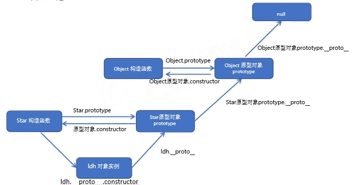

### 面向对象编程

- 面向过程
  - 分析出解决问题所需要的步骤，用函数把这些步骤一步一步实现。使用的时候再一个一个的依
    次调用
  - 优点：性能比面向对象高，适合跟硬件联系很紧密的东西，例如单片机就采用的面向过程编程
  - 缺点：没有面向对象易维护、易复用、易扩展
- 面向对象
  - 把事务分解成为一个个对象，对象解析出自己所需要的步骤。然后由对象之间分工与合作
  - 优点：易维护、易复用、易扩展，由于面向对象有封装、继承、多态性的特性，可以设计出低耦合的系统，使系统 更加灵活、更加易于维护
  - 缺点：性能比面向过程低

每一个对象都是功能中心，具有明确分工。具有灵活、代码可复用、容易维护和开发的优点，更适合多人合作的大型软件项目

面向对象的特性：

- 封装性
- 继承性
- 多态性

面向对象的思维特点：

1. 抽取（抽象）对象共用的属性和方法(封装)成一个类(模板)
2. 对类进行实例化, 获取类的对象

### 类

`class`： 关键字 声明一个类。，之后以这个类来实例化对象

语法：

- 创建类

  - ```js
    class name {
     // class body
    } 
    //类必须使用 new 实例化对象
    var xx = new name();    
    
    // 示例
    class Person {
       constructor(name,age) { // constructor 构造方法或者构造函数
           this.name = name;
           this.age = age;
       }
    } 
    // 创建实例
    var ldh = new Person('刘德华', 18);
    console.log(ldh.name)
    ```

    - constructor() 方法是类的构造函数(默认方法)，如果没有显示定义, 类内部会自动给我们创建一个constructor()
      - 用于传递参数,返回实例对象，通过 new 命令生成对象实例时，自动调用该方法 

- 添加方法

  - ```js
    class Person {
       constructor(name,age) { // constructor 构造方法或者构造函数
           // this 指向实例
           this.name = name;
           this.age = age;
       }
       // 方法之间不能加逗号分隔，不需要添加 function 关键字
       say(song) {
           console.log(this.name + '唱' + song);
       }
    } 
    // 创建实例
    var ldh = new Person('刘德华', 18);
    ldh.say('冰雨');
    ```

- 继承

  - ```js
    class Father {
       constructor(surname) {
           this.surname= surname;
       }
       say() {
           console.log('你的姓是' + this.surname);
       }
    }
    // 子类继承父类的属性和方法
    class Son extends Father{ 
    }
    var damao= new Son('刘');
    damao.say(); 
    ```

- super 关键字

  - ```js
    class Father {
       constructor(surname) {
           this.surname = surname;
       }
       saySurname() {
           console.log('我的姓是' + this.surname);
       }
    }
    // 子类继承父类的属性和方法
    class Son extends Father { 
       constructor(surname, fristname) {
           super(surname); // 调用父类的constructor(surname)
           this.fristname = fristname;
       }
       sayFristname() {
           console.log("我的名字是：" + this.fristname);
       }
    }
    var damao = new Son('刘', "德华");
    damao.saySurname();
    damao.sayFristname(); 
    ```

    - 必须先调用父类的构造方法,在使用子类构造方法

  - ```js
    class Father {
        say() {
            return '我是爸爸';
        }
    }
    class Son extends Father { // 这样子类就继承了父类的属性和方法
        say() {
            // super.say() super 调用父类的方法
            return super.say() + '的儿子';
        }
    }
    var damao = new Son();
    console.log(damao.say());
    ```

注意：

1. 在 ES6 中**类**没有变量提升，所以必须先定义类，才能通过类实例化对象

2. 共有属性和方法一定要加this使用

3. constructor 里面的this指向实例对象, 方法里面的this 指向这个方法的调用者

   - ```js
     class Person {
         constructor(name,age) { // constructor 构造方法或者构造函数
             this.name = name;
             this.age = age;
             this.btn = document.querySelector('button');
             // 这里的 sing 是被 btn 调用的，所以 this 指向 btn
             this.btn.onclick = this.sing; 
         }
         sing() {
             console.log(this);
         }
     } 
     // 创建实例
     var ldh = new Person('刘德华', 18);
     // 这里的 sing 是被 ldh 调用，所以 this 指向 ldh
     ldh.sing();
     ```

### 构造函数

- 相当于 ES6 中的类
- 对象公共的属性和方法封装成的函数叫构造函数
- 用来初始化对象（为对象成员变量赋初始值），这个过程叫做`对象实例化`

注意：

1. 与 new 一起使用
2. 首字母要大写

new 在执行时会做四件事情：

1. 在内存中创建一个新的空对象
2. 让 this 指向这个新的对象
3. 执行构造函数里面的代码，给这个新对象添加属性和方法。
4. 返回这个新对象（所以构造函数里面不需要 return ）。

#### 两大成员

- 实例成员：在构造函数内部创建的对象成员称为实例成员，只能由实例化的对象来访问
- 静态成员：在构造函数本上添加的成员称为静态成员，只能由构造函数本身来访问

```js
function Acss() {
	this.name = 'a';  // 实例成员 b.name
	na = 'c';  // 函数代码  na
}
Acss.na = 'c';  // 静态成员 Acss.na 
var b = new Acss(); // 对象实例化
```

#### prototype

**一般情况下，对象的方法都在构造函数的原型对象中设置**

每一个构造函数都有一个 prototype 对象。这个对象的所有属性和方法，都会被构造函数所拥有
作用：所有对象共享构造函数通过原型分配的函数（原型的方法）

优点：

- 构造函数直接添加方法，实例化会为每个方法开辟一个内存空间（各自指向一个地址）
- 通过原型对象添加方法，会把所有方法指向 prototype 对象的地址（指向同一个地址），节约内存空间

```js
function Acss(a) {
	this.name = a;  // b.name
}
// 方法1
Acss.prototype.name = function() {
    console.log(1999)
}
// 方法2
Acss.prototype = {
    // 让方法重新指向构造函数，如果不加则会指向 prototype 对象
    constructor: Acss;
    name: function() {
        console.log(1999)
    }
}
var b = new Acss(12);
var c = new Acss(14);
// true 方法相同 && 指向同一个地址
console.log(b.num === c.num)
```

- `__proto__`（为了和 prototype 区分，一般读作对象原型）
  - 于为对象成员查找机制提供一个方向
  - 每一个对象都有一个`__proto__`对象
  - 指向构造函数的 prototype 原型对象，
  - 是非标准属性，实际开发中不可以使用这个属性，只是内部指向原型对象 prototype

成员查找机制：

1. 首先查找这个对象自身有没有该属性或方法
2. 没有就查找它的原型（也就是 __proto__指向的 prototype 原型对象）
3. 果还没有就查找原型对象的原型（Object的原型对象）
4. 依此类推一直找到 Object 为止（null）

- constructor
  - 主要用于记录该对象引用于哪个构造函数，它可以让原型对象重新指向原来的构造函数
  - 一般称为构造函数，因为它指回构造函数本身
  - 对象原型（`__proto__`）和构造函数（prototype）原型对象里面都有 constructor 属性



- 原型对象里面放的是方法, 这个方法里面的this 指向的是 这个方法的调用者, 也就是这个实例对象

#### 扩展内置对象

对原来的内置对象进行扩展自定义的方法。比如给数组增加自定义求偶数和的功能

- 数组和字符串内置对象不能给原型对象覆盖操作 方法2，
  - 只能是 方法1 的方式

#### es6前 继承

通过构造函数+原型对象模拟实现继承，被称为组合继承

Function.prototype.call()：调用这个函数, 并且修改函数运行时的 this 指向

与 [`apply()`](https://developer.mozilla.org/zh-CN/docs/Web/JavaScript/Reference/Global_Objects/Function/apply) 方法类似，`call()` 方法接受的是**一个参数列表**，而 `apply()` 方法接受的是**一个包含多个参数的数组** 

- ```js
  // 语法
  fun.call(thisArg, arg1, arg2, ...)
  ```

  - thisArg ：当前调用函数 this 的指向对象
  - arg1，arg2：传递的其他参数

```js
// 父类
 function Person(name, age, sex) {
 this.name = name;
 this.age = age;
 this.sex = sex;
 }
 // 子类
 function Student(name, age, sex, score) {
     // 此时父类的 this 指向子类的 this(父子类的 this 都是 Student)，同时调用这个函数
 Person.call(this, name, age, sex); 
 this.score = score;
 }
 var s1 = new Student('zs', 18, '男', 100);
 console.dir(s1);

```

核心原理：

1. 将子类所共享的方法提取出来，让子类的 prototype 原型对象 = new 父类() 
2. 本质：子类原型对象等于实例化父类，因为父类实例化之后另外开辟空间，就不会影响原来父类原型对象
3. 将子类的 constructor 从新指向子类的构造函数

### 改变函数内部 this 指向

1. call()

2. bind()

   - 调用函数的方式，但是它可以改变函数的 this 指向

     ```js
     fun.apply(thisArg, [argsArray])
     ```

     - argsArray：传递的值，必须包含在数组里面
     - 返回值就是函数的返回值，因为它就是调用函数
     -  主要跟数组有关系，比如使用 Math.max() 求数组的最大值

3. apply()

   - bind() 方法不会调用函数。但是能改变函数内部this 指向

     ```js
     fun.bind(thisArg, arg1, arg2, ...)
     ```

     - thisArg：在 fun 函数运行时指定的 this 值
     - arg1，arg2：传递的其他参数
     - 返回由指定的 this 值和初始化参数改造的原函数拷贝
     - 只是想改变 this 指向，并且不想调用这个函数的时候，可以使用 bind

- 相同点
  1. 都可以改变函数内部的this指向.
- 区别
  1. apply 传递的值，必须包含在数组里面
  2. bind 不会调用函数
- 应用场景
  1. call 经常做继承
  2. apply 经常跟数组有关系. 比如借助于数学对象实现数组最大值最小值
  3. bind 不调用函数,但是还想改变this指向. 比如改变定时器内部的this指向

### ES5中新增的方法

- 数组迭代(遍历)方法：forEach()、map()、filter()、some()、every()；

  1. ```js
     array.forEach(function(currentValue, index, arr))
     ```

     - currentValue：数组当前项的值
     - index：数组当前项的索引
     - arr：数组对象本身
     - 查找所有元素

  2. ```js
     array.filter(function(currentValue, index, arr))
     ```

     - filter() 方法创建一个新的数组，新数组中的元素是通过检查指定数组中符合条件的所有元素,主要用于**筛选数组**
     - 它直接**返回一个新数组**，查找所有元素

  3. ```js
     array.some(function(currentValue, index, arr))
     ```

     - 用于检测数组中的元素是否满足指定条件. 通俗点 查找数组中是否有满足条件的元素
     - 它**返回值是布尔值**, 如果查找到这个元素, 就返回true , 如果查找不到就返回false.
     - 如果找到第一个满足条件的元素,则终止循环. 不在继续查找

- 字符串方法

  1. ```js
     str.trim()
     ```

     - 从一个字符串的两端删除空白字符
     - 不影响原字符串本身，它返回的是一个新的字符串

     

- 对象方法

  1. ```js
     Object.keys(obj)
     ```

     - 返回一个所有元素为字符串的**数组**
     - 效果类似 for…in
     - 输出对象中值大于 2 的 key 的数组

  2. ```js
     Object.defineProperty(obj, prop, descriptor)
     Object.defineProperty(obj, 'name', {value: 1000,})
     ```

     - 定义新属性或修改原有的属性。
     - obj：必需。目标对象
     - prop：必需。需定义或修改的属性的名字
     - descriptor：必需。目标属性所拥有的特性（对象），新增属性默认 false
       1. value: 设置属性的值
       2. writable: 值是否可以重写。true | false
       3. enumerable: 目标属性是否可以被枚举。true | false 
       4. configurable: 目标属性是否可以被删除或是否可以再次修改特性（第三参数） true | false

### 严格模式

严格模式在 IE10 以上版本的浏览器中才会被支持，旧版本浏览器中会被忽略

严格模式对正常区别

1. 消除了 Javascript 语法的一些不合理、不严谨之处，减少了一些怪异行为。
2. 消除代码运行的一些不安全之处，保证代码运行的安全
3. 提高编译器效率，增加运行速度。
4. 禁用了在 ECMAScript 的未来版本中可能会定义的一些语法

```js
// 严格模式可以应用到整个脚本或个别函数中
function fn(){
   'use strict';
   return "这是严格模式。";
}
```

开启严格模式：在脚本或者函数的第一行（所有语句之前）放入`'use strict';`

#### 变化

- 变量
  1. 在正常模式中，如果一个变量没有声明就赋值，默认是全局变量。严格模式禁止这种用法，变量都必须先用 var 命令声明，然后再使用
  2. 严禁删除已经声明变量。例如，delete x; 语法是错误的
- this 指向
  1. 严格模式下全局作用域中函数中的 this 是 undefined
  2. 严格模式下,如果 构造函数不加new调用, 如果给属性赋值则 会报错（构造函数属性前加 this）
- 函数变化
  1. 函数不能有重名的参数
  2. 函数必须声明在顶层.新版本的 JavaScript 会引入“块级作用域”（ ES6 中已引入）。为了与新版本接轨，不允许在非函数的代码块内声明函数。
- [更多严格模式](https://developer.mozilla.org/zh-CN/docs/Web/JavaScript/Reference/Strict_mode)

### 正则表达式

用于匹配字符串中字符组合的模式。在 JavaScript中，正则表达式也是对象。

`正则表通常被用来检索、替换那些符合某个模式（规则）的文本，例如验证表单：用户名表单只能输入英文字
母、数字或者下划线， 昵称输入框中可以输入中文(匹配)。此外，正则表达式还常用于过滤掉页面内容中的一
些敏感词(替换)，或从字符串中获取我们想要的特定部分(提取)等 `

特点：

1. 灵活性、逻辑性和功能性非常的强。
2. 可以迅速地用极简单的方式达到字符串的复杂控制

创建方式

1. ```js
   // 通过调用 RegExp 对象的构造函数创建
   var 变量名 = new RegExp(/表达式/);
   ```

2. ```js
   // 通过字面量创建
   var 变量名 = /表达式/;
   ```

   - // 注释中间放表达式就是正则字面量

测试正则表达式

- 用于检测字符串是否符合该规则，该对象会返回 true 或 false，其参数是测试字符串

  ```js
  regexObj.test(str);
  ```

  1. `regexObj` 是写的正则表达式
  2.  str 我们要测试的文本
  3. 就是检测str文本是否符合我们写的正则表达式规范

 replace 替换:

- 可以实现替换字符串操作，用来替换的参数可以是一个字符串或是一个正则表达式

  ```js
  stringObject.replace(regexp/substr,replacement)
  ```

  - 第一个参数: 被替换的字符串 或者 正则表达式
  - 第二个参数: 替换为的字符串
  - 返回值是一个替换完毕的新字符串

#### 特殊字符

也被称为元字符。可以参考：

- [MDN](https://developer.mozilla.org/zh-CN/docs/Web/JavaScript/Guide/Regular_Expressions)
- jQuery 手册：正则表达式部分
- [正则测试工具](:http://tool.oschina.net/regex)

1. 边界符，用来提示字符所处的位置

   | 边界符 | 说明                       |
   | ------ | -------------------------- |
   | ^      | 匹配行首的文本（以谁开始） |
   | $      | 匹配行尾的文本（以谁结束） |

   - 如果 ^ 和 $ 在一起，表示必须是精确匹配。

2. 字符类：方括号内可供选择的字符，只要匹配其中一个就可以了

   - ```js
     /[abc]/.test('andy') // true 
     ```

     - 后面的字符串只要包含 abc 中任意一个字符，都返回 true

   - ```js
     //  [-] 方括号内部 范围符
     /^[a-z]$/.test(c') // true
     ```

     - 方括号内部加上 - 表示范围，这里表示 a 到 z 26个英文字母都可以

   - ```js
     //  [^] 方括号内部 取反符^ 
     /[^abc]/.test('andy') // false
     ```

     - 方括号内部加上 ^ 表示取反，只要包含方括号内的字符，都返回 false 
     - 边界符写到方括号外面

   - ```js
     /[a-z1-9]/.test('andy') // true
     ```

     - 可以使用字符组合，这里表示包含 a 到 z 的26个英文字母和 1 到 9 的数字都可以

3. 量词符

   | 量词  | 说明            |
   | ----- | --------------- |
   | *     | 重复0次或多次   |
   | +     | 重复1次或多次   |
   | ？    | 重复0次或1次    |
   | {n}   | 重复 n 次       |
   | {n,}  | 重复 n 次或多次 |
   | {n,m} | 重复 n 到 m 次  |

4. 括号总结，用来设定某个模式出现的次数（[在线测试](:https://c.runoob.com/)）

   1. 大括号 量词符. 里面表示重复次数
   2. 中括号 字符集合。匹配方括号中的任意字符
   3. 小括号 表示优先级

5. 预定义类，指某些常见模式的简写方式

   | 预定类 | 说明                                                       |
   | ------ | ---------------------------------------------------------- |
   | \d     | 匹配 0-9 之间的任一数字，相当于 [0-9]                      |
   | \D     | 匹配 0-9 以外的任一数字，相当于` [^0-9]`                   |
   | \w     | 匹配任一 数字 字母 下划线，相当于[A-Za-z0-9]               |
   | \W     | 匹配所有 数字 字母 下划线以外的字符，相当于`[^A-Za-z0-9]`  |
   | \s     | 匹配空格（包括换行符 制表符 空格符），相当于`[\t\r\n\v\f]` |
   | \S     | 匹配非空格字符，相当于`[^\t\r\n\v\f]`                      |

**替换**

- 可以实现替换字符串操作，用来替换的参数可以是一个字符串或是一个正则表达式

  ```js
  stringObject.replace(regexp/substr,replacement)
  // 示例
  text.value.replach(/ande/, '**')  //只能替换一次
  ```

  - 第一个参数: 被替换的字符串 或者 正则表达式
  - 第二个参数: 替换为的字符串
  - 返回值是一个替换完毕的新字符串

**参数**

```js
/表达式/[switch]
// 示例
text.value.replach(/ande/g, '**')  //所有符合条件的都替换掉
```

- g：全局匹配
- i：忽略大小写
- gi：全局匹配 + 忽略大小写

### ES6

目前浏览器的 JavaScript 是 ES5 版本，大多数高版本的浏览器支持 ES6，只实现了 ES6 的部分特性和功能

ES6 实际上是一个泛指，泛指ES2015 及后续的版本

缺点：

1. 变量提升特性增加了程序运行时的不可预测性
2. 语法过于松散，实现相同的功能，不同的人可能会写出不同的代码

#### 新增语法

- let  块级变量

  ```js
  // 声明的变量只在所处于的块级作用域有效
  if (true) {
     let a = 10;
  }
  console.log(a) // a is not defined
  ```

  1. 防止循环变成全局变量

  2. 不存在变量提升

     - ```js
       console.log(a); // a is not defined
       let a = 10;
       ```

  3. 暂时性死区

     - ```js
       var tmp = 123;
       if (true) {
          tmp = 'abc';  // tmp is not defined
          let tmp;
       } 
       ```

       - 在块级作用域中声明一个块级变量，在作用域外声明的所有同名变量无法影响作用域内

  - 经典面试题

    ```js
    let arr = [];
    for (let i = 0; i < 2; i++) {
        arr[i] = function() {
            console.log(i);
        }
    }
    arr[0]();
    arr[1]();
    ```

    1. 每次循环都会产生一个块级作用域
       - 开始声明一个块级变量 i ，从上到下执行完后，这个代码块就结束了。
       - 再循环一次又是一个代码块
    2. 每个块级作用域中的变量都是不同的
    3. 函数执行时输出的是自己父级（循环产生的块级作用域）作用域下的i值

- `const`     声明常量（就是值（内存地址）不能变化的量）

  ```js
  if (true) {
     const a = 10;
  }
  console.log(a) // a is not defined
  ```

  1. 具有块级作用域

  2. 声明常量时必须赋值

  3. 常量赋值后，值不能修改。
  4. 没有变量提升

- 解构赋值

  - ES6中允许从数组中提取值，按照对应位置，对变量赋值。
  - 从数组中或对象中提取值，将提取出来的值赋值给另外的变量

  1. 数组解构

     - ```js
       let [bar, foo] = [1];
       let [foo] = [];
       // bar: 1;   foo: undefined
       ```

     - 如果解构不成功，变量的值为undefined。

  2. 对象解构

     - ```js
       let person = { name: 'zhangsan', age: 20 };
       let { name, age } = person;
       console.log(name); // 'zhangsan'
       console.log(age); // 20
       ```

     - ```js
       let {name: myName, age: myAge} = person; // myName myAge 属于别名
       console.log(myName); // 'zhangsan'
       console.log(myAge); // 20
       ```

- 箭头函数

  ```js
  () => {}
  
  const fn = function(v) {
     return v;
  }
  // 示例
  const fn = v => v;
  ```

  - 小括号里面是形参，如果只有一个参数，可以不写括号

  - 花括号里面是函数代码，如果只有一条语句或表达式，不需要花括号

  - 没有自己的`this`，`arguments`，`super`或`new.target`，不能用作构造函数

    - 通过 `call()` *或* `apply()` 方法调用一个函数时，只能传递参数（不能绑定this）
      - 第一个参数会被忽略。（这种现象对于bind方法同样成立）

    - 箭头函数中不会创建自己的`this,它只会从自己的作用域链的上一层继承this`

      ```js
      const obj =  { name: '张三' }
      
      function fn() {
          console.log(this);    // { name: '张三' }
          return () => {
              console.log(this)  // { name: '张三' }
          }
      }
      const resFn = fn.call(obj);
      resFn();
      ```

- 剩余参数

  ```js
  let students = ['wangwu', 'zhangsan', 'lisi'];
  let [s1, ...s2] = students;
  console.log(s1); // 'wangwu'
  console.log(s2); // ['zhangsan', 'lisi']
  ```

  - 将一个不定数量的参数表示为一个数组

#### 内置对象扩展

- Array

  1. 扩展运算符（展开语法）：将数组或者对象转为用逗号分隔的参数序列

     ```js
     let ary = [1, 2, 3];
     ...ary // 1, 2, 3
     console.log(...ary); // 1 2 3
     console.log(1, 2, 3)
     ```

     - 合并数组

       ```js
       // 相当于：ary1.push(...ary2);
       let ary1 = [1, 2, 3];
       let ary2 = [3, 4, 5];
       let ary3 = [...ary1, ...ary2];
       ```

     - 将类数组或可遍历对象转换为真正的数组

       ```js
       let oDivs = document.getElementsByTagName('div');
       oDivs = [...oDivs];
       ```

  2. `Array.from()`：从一个类似数组或可迭代对象创建一个新的，浅拷贝的数组实例

     ```js
     Array.from(arrayLike[, mapFn[, thisArg]])
     
     // 示例
     let arrayLike = {
        "0": 1,
        "1": 2,
        "length": 2
     }
     let newAry = Array.from(aryLike, item => item *2)
     ```

     - `arrayLike`：想要转换成数组的伪数组对象或可迭代对象
     - `mapFn`：如果指定了该参数，新数组中的每个元素会执行该回调函数  （可选）
     - `thisArg`：执行回调函数 `mapFn` 时 `this` 对象  （可选）

  3. `find()`：找出第一个符合条件的数组成员，如果没有找到返回undefined

     ```js
     let ary = [{
        id: 1,
        name: '张三‘
     }, {
        id: 2,
        name: '李四‘
     }];
     let target = ary.find((item, index) => item.id == 2);
     ```

  4. `findIndex()`：找出第一个符合条件的数组成员的位置，如果没有找到返回-1

     ```js
     let ary = [1, 5, 10, 15];
     let index = ary.findIndex((value, index) => value > 9);
     console.log(index); // 2
     ```

  5. `includes()`：表示某个数组是否包含给定的值，返回布尔值

     ```js
     [1, 2, 3].includes(2) // true
     [1, 2, 3].includes(4) // false
     ```

- String

  1. 模板字面量   \` \` 使用反引号（Tab 键上面）定义

     ```js
     let name = `zhangsan`;
     ```

     1. 保留空格和换行 类似于（pre）

        ```js
        let html = ` <div>
         <span>${result.name}</span>
         <span>${result.age}</span>
         <span>${result.sex}</span>
        </div> `;
        /* <div>
           <span>zhangsan</span>
           <span>20</span>
           <span>男</span>
          </div> */
        ```

     2. 可以包含特定语法（`${expression}`）的占位符

        ```js
        // 相当于 普通字符串的 ‘+’
        var a = 5;
        var b = 10;
        console.log(`Fifteen is ${a + b} and
        not ${2 * a + b}.`);
        // "Fifteen is 15 and
        // not 20."
        ```

        - 占位符中的表达式和周围的文本会一起传递给一个默认函数，该函数负责将所有的部分连接起来

        - 如果一个模板字符串由表达式开头，则该字符串被称为带标签的模板字符串

        - 嵌套模板

          ```js
          // ES5
          var classes = 'header';
          classes += (isLargeScreen() ? '' : item.isCollapsed ? ' icon-expander' : ' icon-collapser');
          
          // ES2015
          const classes = `header ${ isLargeScreen() ? '' : (item.isCollapsed ? 'icon-expander' : 'icon-collapser') }`;
          ```

     3. 在模版字符串内使用反引号（`）时，需要在它前面加转义符（\）

     4. 带标签的模板字符串

        - ```js
          function template(strings, ...keys) {
              // strings 的判定：反引号内表达式前后的值，没有为空字符串，
              console.log(strings)
              // keys 的判断：反引号内的表达式，一个表达式传输一个值
              console.log(...keys)
              return (function(...values) {
              	console.log(values)
                  var dict = values[values.length - 1] || {};     // 对象
                  var result = [strings[0]]; //这是个空字符串数组
          
                  //  key 0 foo     i 0 1 
                  keys.forEach(function(key, i) { // 遍历表达式
                      var value = Number.isInteger(key) ? values[key] : dict[key];
                      result.push(value, strings[i + 1]);
                  });
          
                  return result.join('');
              });
          }
          
          var t2Closure = template `${0} ${'foo'}!`;
          t2Closure('Hello', { foo: 'World' }); // "Hello World!"
          ```

          - 标签函数的第一个参数包含一个字符串值的数组。反引号内表达式前后的值，没有为空字符串
          - 其余参数与表达式相关。一个表达式传输一个值
          - 函数可以返回处理好的的字符串（或者它可以返回完全不同的东西）
          - 用于该标签的函数的名称可以被命名为任何名字

        - 如果该表达式是一个函数，它会在模板字符串处理后被调用，可以用函数解析模板字符串。在函数输出最终结果前，都可以通过该函数来对模板字符串进行操作处理

  2. `startsWith()` 

     ```js
     let str = 'Hello world!';
     str.startsWith('Hello') // true 
     ```

     - 表示参数字符串是否在原字符串的头部，返回布尔值

  3.  `endsWith()`

     ```js
     let str = 'Hello world!';
     str.endsWith('!') // true
     ```

     - 表示参数字符串是否在原字符串的尾部，返回布尔值

  4. `repeat()`

     ```js
     'x'.repeat(3) // "xxx"
     'hello'.repeat(2) // "hellohello"
     ```

     - 将原字符串重复n次，返回一个新字符串

- Set 数据结构

  ```js
  // 初始化（不能直接写值）
  const s = new Set();
  
  // 但是可以接受一个数组作为参数，用来初始化
  const set = new Set([1, 2, 3, 4, 4]);    // set {1, 2, 3, 4}
  ```

  - 类似于数组，成员的值都是唯一的，没有重复的值

  - Set 本身是一个构造函数，用来生成 Set 数据结构

  - 实例方法

    ```js
    const s = new Set();
    s.add(1).add('a').add(3); // 向 set 结构中添加值: 1, 'a', 3    可以是变量
    s.delete('a') // 删除 set 结构中的一个值：'a'
    s.has(1) // 表示 set 结构中是否有1这个值 返回布尔值
    s.clear() // 清除 set 结构中的所有值
    ```

    1. add(value)：添加某个值，返回 Set 结构本身
    2. delete(value)：删除某个值，返回一个布尔值，表示删除是否成功
    3. has(value)：返回一个布尔值，表示该值是否为 Set 的成员
    4. clear()：清除所有成员，没有返回值

  - 遍历

    ```js
    s.forEach(value => console.log(value))
    ```

    - Set 结构的实例与数组一样，也拥有`forEach`方法，用于对每个成员执行某种操作，没有返回值

